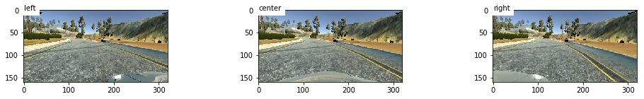
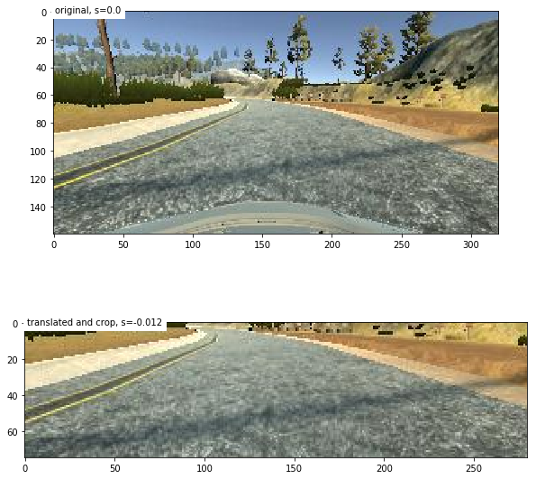
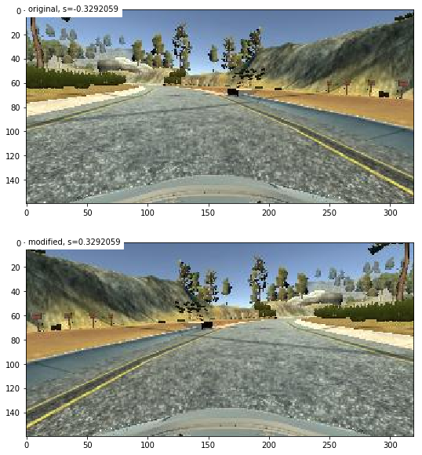
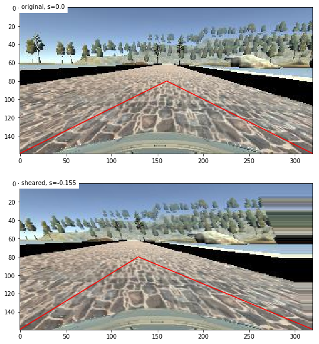
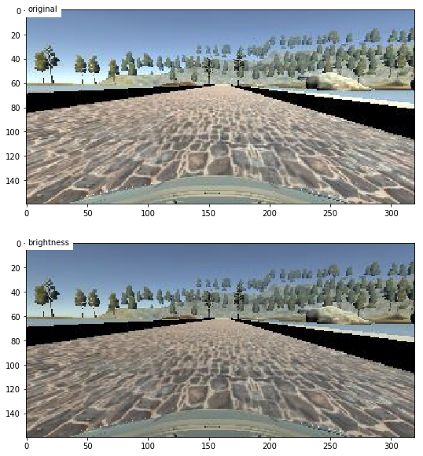

# Behavioral Cloning

The aim of this project is to teach a deep neural network to drive a car (only the steering angle, for now) based on a camera picture of the environment. The network will be trained using data generated by an "expert" human driver. This project will be done in a driving simulator provided by Udacity

#### Note on the code included in this report
The code on this report is executable, and should result in the same results as the model.py and drive.py files attached with this report. It's almost identical, but I may have done some change here and there to make it in the order I wanted on this report or to add some output to show the internal process of some functions. The code I have used to generate the video in the end of this report is the one in model.py and drive.py

Please also note that I'm using Keras 2.x, the API as some small changes.

## Data exploration

Note: I am using data that I have generated myself in the simulator, not the data provided by Udacity. When generating this data, I have done a few laps on the training track in both direction, plus a serie of recovery maneuvers (done by stopping the recording, moving to the side of the track or to a position where the car is not align with the track, restarting the recording and putting the car back aligned and centered on the track)

First, here is a visualization of the data. The file 'driving_log.csv' contains the usefull information. (I have also added a header line to this file so that it's easy to read with pandas, and modified the filepaths from absolute to relative)


```python
TRAINING_FOLDER = './data/'

import pandas as pd

data = pd.read_csv(TRAINING_FOLDER + 'driving_log.csv')
data.head()
```


<div>
<table border="1" class="dataframe">
  <thead>
    <tr style="text-align: right;">
      <th></th>
      <th>center</th>
      <th>left</th>
      <th>right</th>
      <th>steering</th>
      <th>throttle</th>
      <th>brake</th>
      <th>speed</th>
    </tr>
  </thead>
  <tbody>
    <tr>
      <th>0</th>
      <td>IMG/center_2017_04_01_15_20_35_547.jpg</td>
      <td>IMG/left_2017_04_01_15_20_35_547.jpg</td>
      <td>IMG/right_2017_04_01_15_20_35_547.jpg</td>
      <td>-0.329206</td>
      <td>0.815272</td>
      <td>0.0</td>
      <td>15.55847</td>
    </tr>
    <tr>
      <th>1</th>
      <td>IMG/center_2017_04_01_15_20_35_625.jpg</td>
      <td>IMG/left_2017_04_01_15_20_35_625.jpg</td>
      <td>IMG/right_2017_04_01_15_20_35_625.jpg</td>
      <td>-0.261162</td>
      <td>0.756948</td>
      <td>0.0</td>
      <td>16.24937</td>
    </tr>
    <tr>
      <th>2</th>
      <td>IMG/center_2017_04_01_15_20_35_704.jpg</td>
      <td>IMG/left_2017_04_01_15_20_35_704.jpg</td>
      <td>IMG/right_2017_04_01_15_20_35_704.jpg</td>
      <td>-0.173677</td>
      <td>0.650022</td>
      <td>0.0</td>
      <td>16.81819</td>
    </tr>
    <tr>
      <th>3</th>
      <td>IMG/center_2017_04_01_15_20_35_791.jpg</td>
      <td>IMG/left_2017_04_01_15_20_35_791.jpg</td>
      <td>IMG/right_2017_04_01_15_20_35_791.jpg</td>
      <td>-0.144515</td>
      <td>0.543096</td>
      <td>0.0</td>
      <td>17.25924</td>
    </tr>
    <tr>
      <th>4</th>
      <td>IMG/center_2017_04_01_15_20_35_861.jpg</td>
      <td>IMG/left_2017_04_01_15_20_35_861.jpg</td>
      <td>IMG/right_2017_04_01_15_20_35_861.jpg</td>
      <td>-0.134795</td>
      <td>0.543096</td>
      <td>0.0</td>
      <td>17.64949</td>
    </tr>
  </tbody>
</table>
</div>


We see that the data contains three images (left/right/center), the speed of the car, the steering angle, the throttle and the brake. These data can be divided into two type of data, the input and output.

The input data, coming from sensors, are the following:
- the cameras images, and
- the vehicle speed

The output data are the command send to the actuator:
- the steering angle,
- the throttle command, and
- the brake command

In the case of this lab, we only need to control the steering angle, so we can disregard the throttle and brake commands. The current speed can also be discarded, as the steering angle to keep the car on the track should not depend on the speed as long as the car behave in a normal way (when there is no skidding, or over/understeering)

So for your problem, the input used to train the model will be the images, and the output the steering angle.

## General data information

Let's see how many data sample we have, if there is any missing information, and also do some data clean up.


```python
# data cleaning: left and right image have a leading space in front of the file path. Need to be removed
data['left'] = data['left'].str.lstrip()
data['right'] = data['right'].str.lstrip()

# check if there is missing data
missing = sum(data.isnull().sum(axis=0))
if missing > 0:
    print('There are {} missing data'.format(missing))
else:
    print('There is no missing data')
```

    There is no missing data


```python
import re
from datetime import datetime

# length of data
nb_samples = len(data)
print('Number of measurement samples: {}'.format(nb_samples))
```

    Number of measurement samples: 17509


## Image information

Let display some images and some information about them.


```python
def img_path(index, side='center'):
    global TRAINING_FOLDER
    global data
    return '{}{}'.format(TRAINING_FOLDER, data[side][index])

import cv2

img = cv2.imread(img_path(0))
print('The image format is {}'.format(img.shape))
```

    The image format is (160, 320, 3)


```python
left_img = cv2.imread(img_path(0, 'left'))
center_img = cv2.imread(img_path(0))
right_img = cv2.imread(img_path(0, 'right'))

left_img = cv2.cvtColor(left_img, cv2.COLOR_BGR2RGB)
center_img = cv2.cvtColor(center_img, cv2.COLOR_BGR2RGB)
right_img = cv2.cvtColor(right_img, cv2.COLOR_BGR2RGB)

%matplotlib inline
import matplotlib.pyplot as plt

fig = plt.figure(figsize=(14,2))
ax1 = fig.add_subplot(1,3, 1)
ax1.imshow(left_img)
plt.text(1,1,'left', color='k',backgroundcolor='w')

ax2 = fig.add_subplot(1,3, 2)
ax2.imshow(center_img)
plt.text(1,1,'center', color='k',backgroundcolor='w')

ax3 = fig.add_subplot(1,3, 3)
ax3.imshow(right_img)
plt.text(1,1,'right', color='k',backgroundcolor='w')

plt.tight_layout()

```





We see on these image that the bottom of the picture contains a part of the car. It may be necessary to remove the bottom to avoid learning specifically on this part if we use the three images, because if we use images from the three cameras at the same car place to learn, and if we add an offset to the left for the right image (and vice versa) the neural network may learn something like "if I see a part of the car on the right like in the left image, I need to turn to the right", which is undesirable. It's also possible to crop the top of the image, as the 60 top pixel lines shows only data from above the horizon, which is not usefull to drive in this simulation.

## Steering Angle Information

Let's look at the statistic of the steering angle.


```python
import numpy as np

print('Mean steering angle: {:.2f}, Min steering angle: {:.2f}, Max steering angle: {:.2f}'
      .format(np.mean(data['steering']),
              np.min(data['steering']),
              np.max(data['steering'])))
```

    Mean steering angle: -0.01, Min steering angle: -1.00, Max steering angle: 1.00


After this first look, it seems that the data is balanced, with a mean angle at 0 and a min and max aproximatively equal. Let's look at the angle distribution to check it more carefully


```python
import bokeh

from bokeh.models import ColumnDataSource, LabelSet
from bokeh.plotting import figure, show, output_file
from bokeh.io import output_notebook
from bokeh.charts import Histogram
output_notebook()
```


    <div class="bk-root">
        <a href="http://bokeh.pydata.org" target="_blank" class="bk-logo bk-logo-small bk-logo-notebook"></a>
        <span id="260d3184-d86a-4ee0-85cd-e8c0fb03456b">Loading BokehJS ...</span>
    </div>


```python
p = Histogram(
           data, 'steering', bins=50, density=True,
           title="Steering angle distribution (percentage)")
show(p)

```


    <div class="bk-root">
        <div class="bk-plotdiv" id="6d506814-8135-4955-b126-b695e6cd011a"></div>
    </div>
<script type="text/javascript">
  
  (function(global) {
    function now() {
      return new Date();
    }
  
    var force = false;
  
    if (typeof (window._bokeh_onload_callbacks) === "undefined" || force === true) {
      window._bokeh_onload_callbacks = [];
      window._bokeh_is_loading = undefined;
    }
  
  
    
    if (typeof (window._bokeh_timeout) === "undefined" || force === true) {
      window._bokeh_timeout = Date.now() + 0;
      window._bokeh_failed_load = false;
    }
  
    var NB_LOAD_WARNING = {'data': {'text/html':
       "<div style='background-color: #fdd'>\n"+
       "<p>\n"+
       "BokehJS does not appear to have successfully loaded. If loading BokehJS from CDN, this \n"+
       "may be due to a slow or bad network connection. Possible fixes:\n"+
       "</p>\n"+
       "<ul>\n"+
       "<li>re-rerun `output_notebook()` to attempt to load from CDN again, or</li>\n"+
       "<li>use INLINE resources instead, as so:</li>\n"+
       "</ul>\n"+
       "<code>\n"+
       "from bokeh.resources import INLINE\n"+
       "output_notebook(resources=INLINE)\n"+
       "</code>\n"+
       "</div>"}};
  
    function display_loaded() {
      if (window.Bokeh !== undefined) {
        document.getElementById("6d506814-8135-4955-b126-b695e6cd011a").textContent = "BokehJS successfully loaded.";
      } else if (Date.now() < window._bokeh_timeout) {
        setTimeout(display_loaded, 100)
      }
    }
  
    function run_callbacks() {
      window._bokeh_onload_callbacks.forEach(function(callback) { callback() });
      delete window._bokeh_onload_callbacks
      console.info("Bokeh: all callbacks have finished");
    }
  
    function load_libs(js_urls, callback) {
      window._bokeh_onload_callbacks.push(callback);
      if (window._bokeh_is_loading > 0) {
        console.log("Bokeh: BokehJS is being loaded, scheduling callback at", now());
        return null;
      }
      if (js_urls == null || js_urls.length === 0) {
        run_callbacks();
        return null;
      }
      console.log("Bokeh: BokehJS not loaded, scheduling load and callback at", now());
      window._bokeh_is_loading = js_urls.length;
      for (var i = 0; i < js_urls.length; i++) {
        var url = js_urls[i];
        var s = document.createElement('script');
        s.src = url;
        s.async = false;
        s.onreadystatechange = s.onload = function() {
          window._bokeh_is_loading--;
          if (window._bokeh_is_loading === 0) {
            console.log("Bokeh: all BokehJS libraries loaded");
            run_callbacks()
          }
        };
        s.onerror = function() {
          console.warn("failed to load library " + url);
        };
        console.log("Bokeh: injecting script tag for BokehJS library: ", url);
        document.getElementsByTagName("head")[0].appendChild(s);
      }
    };var element = document.getElementById("6d506814-8135-4955-b126-b695e6cd011a");
    if (element == null) {
      console.log("Bokeh: ERROR: autoload.js configured with elementid '6d506814-8135-4955-b126-b695e6cd011a' but no matching script tag was found. ")
      return false;
    }
  
    var js_urls = [];
  
    var inline_js = [
      function(Bokeh) {
        (function() {
          var fn = function() {
            var docs_json = {"b0e33b98-d587-4374-b32f-64d5911993da":{"roots":{"references":[{"attributes":{"callback":null,"column_names":["x","y","width","height","color","fill_alpha","line_color","line_alpha","label"],"data":{"chart_index":["(-0.039980, 0.000019]"],"color":["#f22c40"],"fill_alpha":[0.8],"height":[12.91931372153608],"label":["(-0.039980, 0.000019]"],"line_alpha":[1.0],"line_color":["black"],"width":[0.039999246000000044],"x":["-0.0199805"],"y":[6.45965686076804]}},"id":"ab38f50e-64c8-44da-b6a2-2478bca45c94","type":"ColumnDataSource"},{"attributes":{"data_source":{"id":"6d7cb232-ffb6-44cc-9f47-5473f60c723f","type":"ColumnDataSource"},"glyph":{"id":"a54a0ef6-ef1f-44ee-ae89-0bc0c608b566","type":"Rect"},"hover_glyph":null,"nonselection_glyph":null,"selection_glyph":null},"id":"8f3ca117-67ef-4a2a-8850-4586497ae12e","type":"GlyphRenderer"},{"attributes":{"data_source":{"id":"ab38f50e-64c8-44da-b6a2-2478bca45c94","type":"ColumnDataSource"},"glyph":{"id":"fecf689f-31a0-4f34-a2b1-5bf4af5b5848","type":"Rect"},"hover_glyph":null,"nonselection_glyph":null,"selection_glyph":null},"id":"3f1a0c5b-9d27-4d8c-b362-5c8431e243d9","type":"GlyphRenderer"},{"attributes":{"callback":null,"column_names":["x","y","width","height","color","fill_alpha","line_color","line_alpha","label"],"data":{"chart_index":["(0.120017, 0.160016]"],"color":["#f22c40"],"fill_alpha":[0.8],"height":[0.7881809432236866],"label":["(0.120017, 0.160016]"],"line_alpha":[1.0],"line_color":["black"],"width":[0.039999246000000044],"x":["0.1400165"],"y":[0.3940904716118433]}},"id":"83aa6138-9ac5-4fcd-8236-26e10aa6c5ed","type":"ColumnDataSource"},{"attributes":{"fill_alpha":{"field":"fill_alpha"},"fill_color":{"field":"color"},"height":{"field":"height","units":"data"},"line_color":{"field":"line_color"},"width":{"field":"width","units":"data"},"x":{"field":"x"},"y":{"field":"y"}},"id":"edc16ad6-de66-45dc-8b49-d1f369a0361a","type":"Rect"},{"attributes":{"callback":null,"column_names":["x","y","width","height","color","fill_alpha","line_color","line_alpha","label"],"data":{"chart_index":["(0.080017, 0.120017]"],"color":["#f22c40"],"fill_alpha":[0.8],"height":[0.7938923993340031],"label":["(0.080017, 0.120017]"],"line_alpha":[1.0],"line_color":["black"],"width":[0.039999246000000044],"x":["0.100017"],"y":[0.39694619966700156]}},"id":"1050b43e-a088-4dc6-b87a-4baca3c27385","type":"ColumnDataSource"},{"attributes":{"data_source":{"id":"1050b43e-a088-4dc6-b87a-4baca3c27385","type":"ColumnDataSource"},"glyph":{"id":"edc16ad6-de66-45dc-8b49-d1f369a0361a","type":"Rect"},"hover_glyph":null,"nonselection_glyph":null,"selection_glyph":null},"id":"1b8785c1-ad5a-4975-af58-79835f3e9195","type":"GlyphRenderer"},{"attributes":{"callback":null,"column_names":["x","y","width","height","color","fill_alpha","line_color","line_alpha","label"],"data":{"chart_index":["(0.160016, 0.200015]"],"color":["#f22c40"],"fill_alpha":[0.8],"height":[0.5354490103421813],"label":["(0.160016, 0.200015]"],"line_alpha":[1.0],"line_color":["black"],"width":[0.03999924599999982],"x":["0.1800155"],"y":[0.26772450517109064]}},"id":"f6a6c510-cec1-4edc-bccf-9de942c75814","type":"ColumnDataSource"},{"attributes":{"fill_alpha":{"field":"fill_alpha"},"fill_color":{"field":"color"},"height":{"field":"height","units":"data"},"line_color":{"field":"line_color"},"width":{"field":"width","units":"data"},"x":{"field":"x"},"y":{"field":"y"}},"id":"8b542759-68ca-4755-b5e0-1510f79f4178","type":"Rect"},{"attributes":{"data_source":{"id":"121324a2-faef-41e3-981a-e3aee702f042","type":"ColumnDataSource"},"glyph":{"id":"ae4edf8a-dc0d-4a38-8e6a-b152dac32cfa","type":"Rect"},"hover_glyph":null,"nonselection_glyph":null,"selection_glyph":null},"id":"3c186dc1-f62f-463b-9908-fed4f708b841","type":"GlyphRenderer"},{"attributes":{"data_source":{"id":"83aa6138-9ac5-4fcd-8236-26e10aa6c5ed","type":"ColumnDataSource"},"glyph":{"id":"8b542759-68ca-4755-b5e0-1510f79f4178","type":"Rect"},"hover_glyph":null,"nonselection_glyph":null,"selection_glyph":null},"id":"3f2a844f-21cc-4877-ba72-0722de742fec","type":"GlyphRenderer"},{"attributes":{"callback":null,"column_names":["x","y","width","height","color","fill_alpha","line_color","line_alpha","label"],"data":{"chart_index":["(0.200015, 0.240014]"],"color":["#f22c40"],"fill_alpha":[0.8],"height":[0.4397821204943758],"label":["(0.200015, 0.240014]"],"line_alpha":[1.0],"line_color":["black"],"width":[0.039999246000000044],"x":["0.2200145"],"y":[0.2198910602471879]}},"id":"e7c6c4a9-f1bb-4776-aa1d-1949cc59beb2","type":"ColumnDataSource"},{"attributes":{"fill_alpha":{"field":"fill_alpha"},"fill_color":{"field":"color"},"height":{"field":"height","units":"data"},"line_color":{"field":"line_color"},"width":{"field":"width","units":"data"},"x":{"field":"x"},"y":{"field":"y"}},"id":"bf378d96-fee9-43fd-9fae-595a822f6ceb","type":"Rect"},{"attributes":{"callback":null,"column_names":["x","y","width","height","color","fill_alpha","line_color","line_alpha","label"],"data":{"chart_index":["(0.640007, 0.680006]"],"color":["#f22c40"],"fill_alpha":[0.8],"height":[0.0271294165240037],"label":["(0.640007, 0.680006]"],"line_alpha":[1.0],"line_color":["black"],"width":[0.039999246000000044],"x":["0.6600064999999999"],"y":[0.01356470826200185]}},"id":"3df8510b-669d-439e-a19c-65486b1c4d02","type":"ColumnDataSource"},{"attributes":{"data_source":{"id":"f6a6c510-cec1-4edc-bccf-9de942c75814","type":"ColumnDataSource"},"glyph":{"id":"bf378d96-fee9-43fd-9fae-595a822f6ceb","type":"Rect"},"hover_glyph":null,"nonselection_glyph":null,"selection_glyph":null},"id":"05830b0a-21f6-408c-ad24-f12cf73a02f5","type":"GlyphRenderer"},{"attributes":{"fill_alpha":{"field":"fill_alpha"},"fill_color":{"field":"color"},"height":{"field":"height","units":"data"},"line_color":{"field":"line_color"},"width":{"field":"width","units":"data"},"x":{"field":"x"},"y":{"field":"y"}},"id":"ae4edf8a-dc0d-4a38-8e6a-b152dac32cfa","type":"Rect"},{"attributes":{"callback":null,"column_names":["x","y","width","height","color","fill_alpha","line_color","line_alpha","label"],"data":{"chart_index":["(0.240014, 0.280014]"],"color":["#f22c40"],"fill_alpha":[0.8],"height":[0.39123474355668497],"label":["(0.240014, 0.280014]"],"line_alpha":[1.0],"line_color":["black"],"width":[0.039999246000000044],"x":["0.26001399999999997"],"y":[0.19561737177834249]}},"id":"576ed824-f189-41e9-9641-46e5bea2327a","type":"ColumnDataSource"},{"attributes":{"fill_alpha":{"field":"fill_alpha"},"fill_color":{"field":"color"},"height":{"field":"height","units":"data"},"line_color":{"field":"line_color"},"width":{"field":"width","units":"data"},"x":{"field":"x"},"y":{"field":"y"}},"id":"e559fd72-cdba-4815-9fc6-bfcc85612281","type":"Rect"},{"attributes":{"callback":null,"column_names":["x","y","width","height","color","fill_alpha","line_color","line_alpha","label"],"data":{"chart_index":["(0.400011, 0.440011]"],"color":["#f22c40"],"fill_alpha":[0.8],"height":[0.07282106540653625],"label":["(0.400011, 0.440011]"],"line_alpha":[1.0],"line_color":["black"],"width":[0.039999246000000044],"x":["0.420011"],"y":[0.03641053270326813]}},"id":"44a876e2-700a-45fb-9a67-4dfa3557e752","type":"ColumnDataSource"},{"attributes":{"data_source":{"id":"e7c6c4a9-f1bb-4776-aa1d-1949cc59beb2","type":"ColumnDataSource"},"glyph":{"id":"e559fd72-cdba-4815-9fc6-bfcc85612281","type":"Rect"},"hover_glyph":null,"nonselection_glyph":null,"selection_glyph":null},"id":"2b0b2d7c-39f8-40ca-a4ff-fb7d71fedef1","type":"GlyphRenderer"},{"attributes":{"callback":null,"column_names":["x","y","width","height","color","fill_alpha","line_color","line_alpha","label"],"data":{"chart_index":["(0.280014, 0.320013]"],"color":["#f22c40"],"fill_alpha":[0.8],"height":[0.3098464939846739],"label":["(0.280014, 0.320013]"],"line_alpha":[1.0],"line_color":["black"],"width":[0.039999246000000044],"x":["0.3000135"],"y":[0.15492324699233695]}},"id":"e4d04677-ebdc-4191-a1c3-3c0e9f007be0","type":"ColumnDataSource"},{"attributes":{"fill_alpha":{"field":"fill_alpha"},"fill_color":{"field":"color"},"height":{"field":"height","units":"data"},"line_color":{"field":"line_color"},"width":{"field":"width","units":"data"},"x":{"field":"x"},"y":{"field":"y"}},"id":"7452dbb5-0557-4ff8-9369-3a92fb7817bc","type":"Rect"},{"attributes":{"data_source":{"id":"576ed824-f189-41e9-9641-46e5bea2327a","type":"ColumnDataSource"},"glyph":{"id":"7452dbb5-0557-4ff8-9369-3a92fb7817bc","type":"Rect"},"hover_glyph":null,"nonselection_glyph":null,"selection_glyph":null},"id":"6c70b0dc-0f21-40e1-8581-54d44063919f","type":"GlyphRenderer"},{"attributes":{"fill_alpha":{"field":"fill_alpha"},"fill_color":{"field":"color"},"height":{"field":"height","units":"data"},"line_color":{"field":"line_color"},"width":{"field":"width","units":"data"},"x":{"field":"x"},"y":{"field":"y"}},"id":"31357dcb-f255-49b2-ab67-f46c04a63350","type":"Rect"},{"attributes":{"callback":null,"column_names":["x","y","width","height","color","fill_alpha","line_color","line_alpha","label"],"data":{"chart_index":["(0.360012, 0.400011]"],"color":["#f22c40"],"fill_alpha":[0.8],"height":[0.055686697075586856],"label":["(0.360012, 0.400011]"],"line_alpha":[1.0],"line_color":["black"],"width":[0.03999924599999982],"x":["0.3800115"],"y":[0.027843348537793428]}},"id":"121324a2-faef-41e3-981a-e3aee702f042","type":"ColumnDataSource"},{"attributes":{"fill_alpha":{"field":"fill_alpha"},"fill_color":{"field":"color"},"height":{"field":"height","units":"data"},"line_color":{"field":"line_color"},"width":{"field":"width","units":"data"},"x":{"field":"x"},"y":{"field":"y"}},"id":"c416e3cd-a817-45d0-b113-66dc50ca6124","type":"Rect"},{"attributes":{"data_source":{"id":"1dee59e3-410f-4356-8d72-81dd6512c1bb","type":"ColumnDataSource"},"glyph":{"id":"6ee2c190-f7d2-4e56-9222-c61952583bce","type":"Rect"},"hover_glyph":null,"nonselection_glyph":null,"selection_glyph":null},"id":"66e3793e-9206-4493-8521-d05c1b6a370a","type":"GlyphRenderer"},{"attributes":{"data_source":{"id":"e4d04677-ebdc-4191-a1c3-3c0e9f007be0","type":"ColumnDataSource"},"glyph":{"id":"c416e3cd-a817-45d0-b113-66dc50ca6124","type":"Rect"},"hover_glyph":null,"nonselection_glyph":null,"selection_glyph":null},"id":"6b7c570b-41c5-406e-955a-a4168e2dcf9f","type":"GlyphRenderer"},{"attributes":{"data_source":{"id":"3df8510b-669d-439e-a19c-65486b1c4d02","type":"ColumnDataSource"},"glyph":{"id":"db760824-f72e-424a-9f9b-b876d79292a8","type":"Rect"},"hover_glyph":null,"nonselection_glyph":null,"selection_glyph":null},"id":"f403a44d-da1e-4450-84b2-7937d352fa07","type":"GlyphRenderer"},{"attributes":{"fill_alpha":{"field":"fill_alpha"},"fill_color":{"field":"color"},"height":{"field":"height","units":"data"},"line_color":{"field":"line_color"},"width":{"field":"width","units":"data"},"x":{"field":"x"},"y":{"field":"y"}},"id":"da3509ec-b6c3-4c99-959d-a4099b56049d","type":"Rect"},{"attributes":{"data_source":{"id":"44a876e2-700a-45fb-9a67-4dfa3557e752","type":"ColumnDataSource"},"glyph":{"id":"da3509ec-b6c3-4c99-959d-a4099b56049d","type":"Rect"},"hover_glyph":null,"nonselection_glyph":null,"selection_glyph":null},"id":"9d42b863-5adf-4b4d-a387-7e89d002fe0a","type":"GlyphRenderer"},{"attributes":{"fill_alpha":{"field":"fill_alpha"},"fill_color":{"field":"color"},"height":{"field":"height","units":"data"},"line_color":{"field":"line_color"},"width":{"field":"width","units":"data"},"x":{"field":"x"},"y":{"field":"y"}},"id":"db760824-f72e-424a-9f9b-b876d79292a8","type":"Rect"},{"attributes":{"fill_alpha":{"field":"fill_alpha"},"fill_color":{"field":"color"},"height":{"field":"height","units":"data"},"line_color":{"field":"line_color"},"width":{"field":"width","units":"data"},"x":{"field":"x"},"y":{"field":"y"}},"id":"a54a0ef6-ef1f-44ee-ae89-0bc0c608b566","type":"Rect"},{"attributes":{"callback":null,"column_names":["x","y","width","height","color","fill_alpha","line_color","line_alpha","label"],"data":{"chart_index":["(0.440011, 0.480010]"],"color":["#f22c40"],"fill_alpha":[0.8],"height":[0.08567184165474855],"label":["(0.440011, 0.480010]"],"line_alpha":[1.0],"line_color":["black"],"width":[0.039999246000000044],"x":["0.4600105"],"y":[0.04283592082737427]}},"id":"6d7cb232-ffb6-44cc-9f47-5473f60c723f","type":"ColumnDataSource"},{"attributes":{"callback":null,"column_names":["x","y","width","height","color","fill_alpha","line_color","line_alpha","label"],"data":{"chart_index":["(-0.599970, -0.559971]"],"color":["#f22c40"],"fill_alpha":[0.8],"height":[0.03426873666189942],"label":["(-0.599970, -0.559971]"],"line_alpha":[1.0],"line_color":["black"],"width":[0.039999246000000044],"x":["-0.5799704999999999"],"y":[0.01713436833094971]}},"id":"3483b55f-c8ee-4b9a-9ff4-4a93d52e7a29","type":"ColumnDataSource"},{"attributes":{"callback":null,"column_names":["x","y","width","height","color","fill_alpha","line_color","line_alpha","label"],"data":{"chart_index":["(-0.879965, -0.839965]"],"color":["#f22c40"],"fill_alpha":[0.8],"height":[0.014278640275791463],"label":["(-0.879965, -0.839965]"],"line_alpha":[1.0],"line_color":["black"],"width":[0.03999924599999993],"x":["-0.859965"],"y":[0.0071393201378957315]}},"id":"991f14f8-a4ad-496e-8d98-94cc5f5443f2","type":"ColumnDataSource"},{"attributes":{"callback":null,"column_names":["x","y","width","height","color","fill_alpha","line_color","line_alpha","label"],"data":{"chart_index":["(-0.919964, -0.879965]"],"color":["#f22c40"],"fill_alpha":[0.8],"height":[0.021417960413687136],"label":["(-0.919964, -0.879965]"],"line_alpha":[1.0],"line_color":["black"],"width":[0.039999246000000044],"x":["-0.8999645000000001"],"y":[0.010708980206843568]}},"id":"49fc45ff-94d2-40b3-bb4b-c13a4bbfa9ad","type":"ColumnDataSource"},{"attributes":{"data_source":{"id":"49fc45ff-94d2-40b3-bb4b-c13a4bbfa9ad","type":"ColumnDataSource"},"glyph":{"id":"434d9703-c4e2-4cac-bb04-e7277cdbb16b","type":"Rect"},"hover_glyph":null,"nonselection_glyph":null,"selection_glyph":null},"id":"3c782ca2-9062-45e0-85ec-a08556a159fd","type":"GlyphRenderer"},{"attributes":{"callback":null,"column_names":["x","y","width","height","color","fill_alpha","line_color","line_alpha","label"],"data":{"chart_index":["(-0.839965, -0.799966]"],"color":["#f22c40"],"fill_alpha":[0.8],"height":[0.015706504303370564],"label":["(-0.839965, -0.799966]"],"line_alpha":[1.0],"line_color":["black"],"width":[0.039999246000000044],"x":["-0.8199654999999999"],"y":[0.007853252151685282]}},"id":"09b38fe4-58f8-492f-8918-e1294c8ec364","type":"ColumnDataSource"},{"attributes":{"fill_alpha":{"field":"fill_alpha"},"fill_color":{"field":"color"},"height":{"field":"height","units":"data"},"line_color":{"field":"line_color"},"width":{"field":"width","units":"data"},"x":{"field":"x"},"y":{"field":"y"}},"id":"79abd841-1c5c-4108-9654-da63bcae9d92","type":"Rect"},{"attributes":{"data_source":{"id":"991f14f8-a4ad-496e-8d98-94cc5f5443f2","type":"ColumnDataSource"},"glyph":{"id":"79abd841-1c5c-4108-9654-da63bcae9d92","type":"Rect"},"hover_glyph":null,"nonselection_glyph":null,"selection_glyph":null},"id":"24552260-2132-435d-814f-c247fb9bc491","type":"GlyphRenderer"},{"attributes":{"data_source":{"id":"3483b55f-c8ee-4b9a-9ff4-4a93d52e7a29","type":"ColumnDataSource"},"glyph":{"id":"77ede2a7-6232-406e-b831-e87fccbfe5f2","type":"Rect"},"hover_glyph":null,"nonselection_glyph":null,"selection_glyph":null},"id":"12fe6ebc-e56b-45c5-8f82-3bd6bea33a50","type":"GlyphRenderer"},{"attributes":{"callback":null,"column_names":["x","y","width","height","color","fill_alpha","line_color","line_alpha","label"],"data":{"chart_index":["(-0.799966, -0.759967]"],"color":["#f22c40"],"fill_alpha":[0.8],"height":[0.014278640275791423],"label":["(-0.799966, -0.759967]"],"line_alpha":[1.0],"line_color":["black"],"width":[0.039999246000000044],"x":["-0.7799665"],"y":[0.0071393201378957116]}},"id":"819db2ab-511f-483c-96a2-cf0c4491077a","type":"ColumnDataSource"},{"attributes":{"fill_alpha":{"field":"fill_alpha"},"fill_color":{"field":"color"},"height":{"field":"height","units":"data"},"line_color":{"field":"line_color"},"width":{"field":"width","units":"data"},"x":{"field":"x"},"y":{"field":"y"}},"id":"2665d2fe-0a65-40b6-acc7-045b00c9eb16","type":"Rect"},{"attributes":{"data_source":{"id":"09b38fe4-58f8-492f-8918-e1294c8ec364","type":"ColumnDataSource"},"glyph":{"id":"2665d2fe-0a65-40b6-acc7-045b00c9eb16","type":"Rect"},"hover_glyph":null,"nonselection_glyph":null,"selection_glyph":null},"id":"89987fca-3017-4abe-8f7a-09e8d35081ed","type":"GlyphRenderer"},{"attributes":{"data_source":{"id":"7a570c0f-ce6d-47d3-b5af-885dfe633521","type":"ColumnDataSource"},"glyph":{"id":"afdb175b-0f44-4052-ad8c-5f4c83069208","type":"Rect"},"hover_glyph":null,"nonselection_glyph":null,"selection_glyph":null},"id":"95583ea1-462d-4124-87ef-6856bf3cdbcd","type":"GlyphRenderer"},{"attributes":{"callback":null,"column_names":["x","y","width","height","color","fill_alpha","line_color","line_alpha","label"],"data":{"chart_index":["(-0.759967, -0.719968]"],"color":["#f22c40"],"fill_alpha":[0.8],"height":[0.01999009638610799],"label":["(-0.759967, -0.719968]"],"line_alpha":[1.0],"line_color":["black"],"width":[0.039999246000000044],"x":["-0.7399675"],"y":[0.009995048193053996]}},"id":"2d112731-f478-47fd-b7db-f9e41e1bd802","type":"ColumnDataSource"},{"attributes":{"fill_alpha":{"field":"fill_alpha"},"fill_color":{"field":"color"},"height":{"field":"height","units":"data"},"line_color":{"field":"line_color"},"width":{"field":"width","units":"data"},"x":{"field":"x"},"y":{"field":"y"}},"id":"7e715698-da13-458d-807f-2bf1301caf01","type":"Rect"},{"attributes":{"fill_alpha":{"field":"fill_alpha"},"fill_color":{"field":"color"},"height":{"field":"height","units":"data"},"line_color":{"field":"line_color"},"width":{"field":"width","units":"data"},"x":{"field":"x"},"y":{"field":"y"}},"id":"77ede2a7-6232-406e-b831-e87fccbfe5f2","type":"Rect"},{"attributes":{"data_source":{"id":"819db2ab-511f-483c-96a2-cf0c4491077a","type":"ColumnDataSource"},"glyph":{"id":"7e715698-da13-458d-807f-2bf1301caf01","type":"Rect"},"hover_glyph":null,"nonselection_glyph":null,"selection_glyph":null},"id":"b499a32a-2475-4c8c-b58f-999e04dcbcd1","type":"GlyphRenderer"},{"attributes":{"callback":null,"column_names":["x","y","width","height","color","fill_alpha","line_color","line_alpha","label"],"data":{"chart_index":["(-0.559971, -0.519971]"],"color":["#f22c40"],"fill_alpha":[0.8],"height":[0.029985144579161987],"label":["(-0.559971, -0.519971]"],"line_alpha":[1.0],"line_color":["black"],"width":[0.039999246000000044],"x":["-0.539971"],"y":[0.014992572289580994]}},"id":"2f9e23f2-07f0-4e12-b69c-b8bf05270fbf","type":"ColumnDataSource"},{"attributes":{"callback":null,"column_names":["x","y","width","height","color","fill_alpha","line_color","line_alpha","label"],"data":{"chart_index":["(-0.719968, -0.679968]"],"color":["#f22c40"],"fill_alpha":[0.8],"height":[0.039980192772216094],"label":["(-0.719968, -0.679968]"],"line_alpha":[1.0],"line_color":["black"],"width":[0.03999924599999993],"x":["-0.699968"],"y":[0.019990096386108047]}},"id":"a1bf6021-4b59-4f61-91d9-d55e00144e50","type":"ColumnDataSource"},{"attributes":{"fill_alpha":{"field":"fill_alpha"},"fill_color":{"field":"color"},"height":{"field":"height","units":"data"},"line_color":{"field":"line_color"},"width":{"field":"width","units":"data"},"x":{"field":"x"},"y":{"field":"y"}},"id":"f885d726-7a58-4278-8b93-7ac0f2d44b57","type":"Rect"},{"attributes":{"data_source":{"id":"2d112731-f478-47fd-b7db-f9e41e1bd802","type":"ColumnDataSource"},"glyph":{"id":"f885d726-7a58-4278-8b93-7ac0f2d44b57","type":"Rect"},"hover_glyph":null,"nonselection_glyph":null,"selection_glyph":null},"id":"873665c1-d372-4e1c-b224-4392b40930e9","type":"GlyphRenderer"},{"attributes":{"callback":null,"column_names":["x","y","width","height","color","fill_alpha","line_color","line_alpha","label"],"data":{"chart_index":["(-0.679968, -0.639969]"],"color":["#f22c40"],"fill_alpha":[0.8],"height":[0.027129416524003778],"label":["(-0.679968, -0.639969]"],"line_alpha":[1.0],"line_color":["black"],"width":[0.03999924599999993],"x":["-0.6599685"],"y":[0.013564708262001889]}},"id":"5ddfd1d8-884c-42a7-8da9-5cd4df5e5a24","type":"ColumnDataSource"},{"attributes":{"fill_alpha":{"field":"fill_alpha"},"fill_color":{"field":"color"},"height":{"field":"height","units":"data"},"line_color":{"field":"line_color"},"width":{"field":"width","units":"data"},"x":{"field":"x"},"y":{"field":"y"}},"id":"52161766-2a22-49ea-af0b-d9076a90cc70","type":"Rect"},{"attributes":{"fill_alpha":{"field":"fill_alpha"},"fill_color":{"field":"color"},"height":{"field":"height","units":"data"},"line_color":{"field":"line_color"},"width":{"field":"width","units":"data"},"x":{"field":"x"},"y":{"field":"y"}},"id":"333c884c-b830-469c-8c43-645a93f1ce16","type":"Rect"},{"attributes":{"data_source":{"id":"a1bf6021-4b59-4f61-91d9-d55e00144e50","type":"ColumnDataSource"},"glyph":{"id":"52161766-2a22-49ea-af0b-d9076a90cc70","type":"Rect"},"hover_glyph":null,"nonselection_glyph":null,"selection_glyph":null},"id":"e85a8057-d1c7-40da-b7c5-4532bcb43e1e","type":"GlyphRenderer"},{"attributes":{"data_source":{"id":"7de6efcb-6a1e-43a4-aeaf-65db2c06c7a1","type":"ColumnDataSource"},"glyph":{"id":"05ad7c21-ef91-4a89-b504-0f02f202ad6f","type":"Rect"},"hover_glyph":null,"nonselection_glyph":null,"selection_glyph":null},"id":"d120bef5-1c9b-49cd-b464-f3e9d074273b","type":"GlyphRenderer"},{"attributes":{"fill_alpha":{"field":"fill_alpha"},"fill_color":{"field":"color"},"height":{"field":"height","units":"data"},"line_color":{"field":"line_color"},"width":{"field":"width","units":"data"},"x":{"field":"x"},"y":{"field":"y"}},"id":"811a592e-f60c-4e21-8e50-2fbc48018b12","type":"Rect"},{"attributes":{"data_source":{"id":"5ddfd1d8-884c-42a7-8da9-5cd4df5e5a24","type":"ColumnDataSource"},"glyph":{"id":"811a592e-f60c-4e21-8e50-2fbc48018b12","type":"Rect"},"hover_glyph":null,"nonselection_glyph":null,"selection_glyph":null},"id":"b01ce2c3-95f8-42dc-93f3-f228f2f73a54","type":"GlyphRenderer"},{"attributes":{"fill_alpha":{"field":"fill_alpha"},"fill_color":{"field":"color"},"height":{"field":"height","units":"data"},"line_color":{"field":"line_color"},"width":{"field":"width","units":"data"},"x":{"field":"x"},"y":{"field":"y"}},"id":"05ad7c21-ef91-4a89-b504-0f02f202ad6f","type":"Rect"},{"attributes":{"fill_alpha":{"field":"fill_alpha"},"fill_color":{"field":"color"},"height":{"field":"height","units":"data"},"line_color":{"field":"line_color"},"width":{"field":"width","units":"data"},"x":{"field":"x"},"y":{"field":"y"}},"id":"eb5400ec-be9a-4024-a3de-fb96b6d0029e","type":"Rect"},{"attributes":{"callback":null,"column_names":["x","y","width","height","color","fill_alpha","line_color","line_alpha","label"],"data":{"chart_index":["(-0.519971, -0.479972]"],"color":["#f22c40"],"fill_alpha":[0.8],"height":[0.04854737693769097],"label":["(-0.519971, -0.479972]"],"line_alpha":[1.0],"line_color":["black"],"width":[0.03999924599999993],"x":["-0.4999715"],"y":[0.024273688468845485]}},"id":"37ee3bca-28ab-4655-9def-3e54c08f3af3","type":"ColumnDataSource"},{"attributes":{"callback":null,"column_names":["x","y","width","height","color","fill_alpha","line_color","line_alpha","label"],"data":{"chart_index":["(-0.319975, -0.279976]"],"color":["#f22c40"],"fill_alpha":[0.8],"height":[0.22417465232992598],"label":["(-0.319975, -0.279976]"],"line_alpha":[1.0],"line_color":["black"],"width":[0.03999924599999993],"x":["-0.2999755"],"y":[0.11208732616496299]}},"id":"7a570c0f-ce6d-47d3-b5af-885dfe633521","type":"ColumnDataSource"},{"attributes":{"data_source":{"id":"2f9e23f2-07f0-4e12-b69c-b8bf05270fbf","type":"ColumnDataSource"},"glyph":{"id":"eb5400ec-be9a-4024-a3de-fb96b6d0029e","type":"Rect"},"hover_glyph":null,"nonselection_glyph":null,"selection_glyph":null},"id":"e393e912-3afd-41f2-abd2-8ef019422b51","type":"GlyphRenderer"},{"attributes":{"callback":null,"column_names":["x","y","width","height","color","fill_alpha","line_color","line_alpha","label"],"data":{"chart_index":["(0.320013, 0.360012]"],"color":["#f22c40"],"fill_alpha":[0.8],"height":[0.14278640275791424],"label":["(0.320013, 0.360012]"],"line_alpha":[1.0],"line_color":["black"],"width":[0.039999246000000044],"x":["0.3400125"],"y":[0.07139320137895712]}},"id":"1dee59e3-410f-4356-8d72-81dd6512c1bb","type":"ColumnDataSource"},{"attributes":{"fill_alpha":{"field":"fill_alpha"},"fill_color":{"field":"color"},"height":{"field":"height","units":"data"},"line_color":{"field":"line_color"},"width":{"field":"width","units":"data"},"x":{"field":"x"},"y":{"field":"y"}},"id":"349da4ec-25f0-4afe-b935-5b9d67994bd9","type":"Rect"},{"attributes":{"fill_alpha":{"field":"fill_alpha"},"fill_color":{"field":"color"},"height":{"field":"height","units":"data"},"line_color":{"field":"line_color"},"width":{"field":"width","units":"data"},"x":{"field":"x"},"y":{"field":"y"}},"id":"b70f1250-5311-459b-a6b9-add1c4c23669","type":"Rect"},{"attributes":{"fill_alpha":{"field":"fill_alpha"},"fill_color":{"field":"color"},"height":{"field":"height","units":"data"},"line_color":{"field":"line_color"},"width":{"field":"width","units":"data"},"x":{"field":"x"},"y":{"field":"y"}},"id":"afdb175b-0f44-4052-ad8c-5f4c83069208","type":"Rect"},{"attributes":{"data_source":{"id":"37ee3bca-28ab-4655-9def-3e54c08f3af3","type":"ColumnDataSource"},"glyph":{"id":"b70f1250-5311-459b-a6b9-add1c4c23669","type":"Rect"},"hover_glyph":null,"nonselection_glyph":null,"selection_glyph":null},"id":"b71ffc19-6289-4ec5-9436-5c07a3ef2df7","type":"GlyphRenderer"},{"attributes":{"callback":null,"column_names":["x","y","width","height","color","fill_alpha","line_color","line_alpha","label"],"data":{"chart_index":["(-0.199977, -0.159978]"],"color":["#f22c40"],"fill_alpha":[0.8],"height":[0.6068422117211355],"label":["(-0.199977, -0.159978]"],"line_alpha":[1.0],"line_color":["black"],"width":[0.039999246000000044],"x":["-0.1799775"],"y":[0.30342110586056775]}},"id":"f9ea4243-10ec-44f0-8f1d-527ca2bfb34c","type":"ColumnDataSource"},{"attributes":{"callback":null,"column_names":["x","y","width","height","color","fill_alpha","line_color","line_alpha","label"],"data":{"chart_index":["(-0.479972, -0.439973]"],"color":["#f22c40"],"fill_alpha":[0.8],"height":[0.0813882495720111],"label":["(-0.479972, -0.439973]"],"line_alpha":[1.0],"line_color":["black"],"width":[0.039999246000000044],"x":["-0.4599725"],"y":[0.04069412478600555]}},"id":"e99b73e5-f8b7-4ca3-86aa-e1c8ebe4d147","type":"ColumnDataSource"},{"attributes":{"callback":null,"column_names":["x","y","width","height","color","fill_alpha","line_color","line_alpha","label"],"data":{"chart_index":["(-0.439973, -0.399974]"],"color":["#f22c40"],"fill_alpha":[0.8],"height":[0.06996533735137817],"label":["(-0.439973, -0.399974]"],"line_alpha":[1.0],"line_color":["black"],"width":[0.03999924599999993],"x":["-0.4199735"],"y":[0.03498266867568908]}},"id":"10a94c1e-6c5e-490e-8389-685c4c2bccfa","type":"ColumnDataSource"},{"attributes":{"data_source":{"id":"e99b73e5-f8b7-4ca3-86aa-e1c8ebe4d147","type":"ColumnDataSource"},"glyph":{"id":"349da4ec-25f0-4afe-b935-5b9d67994bd9","type":"Rect"},"hover_glyph":null,"nonselection_glyph":null,"selection_glyph":null},"id":"8d7921f2-3da1-4ff2-b14b-1060313ed18e","type":"GlyphRenderer"},{"attributes":{"callback":null,"column_names":["x","y","width","height","color","fill_alpha","line_color","line_alpha","label"],"data":{"chart_index":["(-0.399974, -0.359974]"],"color":["#f22c40"],"fill_alpha":[0.8],"height":[0.11994057831664795],"label":["(-0.399974, -0.359974]"],"line_alpha":[1.0],"line_color":["black"],"width":[0.039999246000000044],"x":["-0.37997400000000003"],"y":[0.059970289158323975]}},"id":"03e7bcb9-fdc0-45b4-8999-32585a080e5d","type":"ColumnDataSource"},{"attributes":{"fill_alpha":{"field":"fill_alpha"},"fill_color":{"field":"color"},"height":{"field":"height","units":"data"},"line_color":{"field":"line_color"},"width":{"field":"width","units":"data"},"x":{"field":"x"},"y":{"field":"y"}},"id":"e605584c-ba60-4d8b-8977-51fe106ff07d","type":"Rect"},{"attributes":{"data_source":{"id":"10a94c1e-6c5e-490e-8389-685c4c2bccfa","type":"ColumnDataSource"},"glyph":{"id":"e605584c-ba60-4d8b-8977-51fe106ff07d","type":"Rect"},"hover_glyph":null,"nonselection_glyph":null,"selection_glyph":null},"id":"b659092d-ec30-4677-a434-1ddf9d80e357","type":"GlyphRenderer"},{"attributes":{"fill_alpha":{"field":"fill_alpha"},"fill_color":{"field":"color"},"height":{"field":"height","units":"data"},"line_color":{"field":"line_color"},"width":{"field":"width","units":"data"},"x":{"field":"x"},"y":{"field":"y"}},"id":"6ee2c190-f7d2-4e56-9222-c61952583bce","type":"Rect"},{"attributes":{"callback":null,"column_names":["x","y","width","height","color","fill_alpha","line_color","line_alpha","label"],"data":{"chart_index":["(-0.359974, -0.319975]"],"color":["#f22c40"],"fill_alpha":[0.8],"height":[0.15563717900612653],"label":["(-0.359974, -0.319975]"],"line_alpha":[1.0],"line_color":["black"],"width":[0.039999246000000044],"x":["-0.3399745"],"y":[0.07781858950306327]}},"id":"4eafd995-db8d-4715-8ddf-ec77dd8e563e","type":"ColumnDataSource"},{"attributes":{"fill_alpha":{"field":"fill_alpha"},"fill_color":{"field":"color"},"height":{"field":"height","units":"data"},"line_color":{"field":"line_color"},"width":{"field":"width","units":"data"},"x":{"field":"x"},"y":{"field":"y"}},"id":"83d328aa-a6a5-424f-9625-f0b54f7ae3c0","type":"Rect"},{"attributes":{"data_source":{"id":"9f5396a1-15d9-4204-9c69-0aba42693acd","type":"ColumnDataSource"},"glyph":{"id":"333c884c-b830-469c-8c43-645a93f1ce16","type":"Rect"},"hover_glyph":null,"nonselection_glyph":null,"selection_glyph":null},"id":"b45c7b6c-455b-4499-bc19-48d9de80fda6","type":"GlyphRenderer"},{"attributes":{"data_source":{"id":"03e7bcb9-fdc0-45b4-8999-32585a080e5d","type":"ColumnDataSource"},"glyph":{"id":"83d328aa-a6a5-424f-9625-f0b54f7ae3c0","type":"Rect"},"hover_glyph":null,"nonselection_glyph":null,"selection_glyph":null},"id":"ea2c3b4c-bd6b-416a-9b48-591d992ef145","type":"GlyphRenderer"},{"attributes":{"callback":null,"column_names":["x","y","width","height","color","fill_alpha","line_color","line_alpha","label"],"data":{"chart_index":["(-0.239977, -0.199977]"],"color":["#f22c40"],"fill_alpha":[0.8],"height":[0.41550843202553156],"label":["(-0.239977, -0.199977]"],"line_alpha":[1.0],"line_color":["black"],"width":[0.03999924599999993],"x":["-0.21997699999999998"],"y":[0.20775421601276578]}},"id":"cd4244a9-398c-4684-a1b7-98259ca36963","type":"ColumnDataSource"},{"attributes":{"fill_alpha":{"field":"fill_alpha"},"fill_color":{"field":"color"},"height":{"field":"height","units":"data"},"line_color":{"field":"line_color"},"width":{"field":"width","units":"data"},"x":{"field":"x"},"y":{"field":"y"}},"id":"f2d8d466-c274-4be6-aaee-847fc7716eea","type":"Rect"},{"attributes":{"callback":null,"column_names":["x","y","width","height","color","fill_alpha","line_color","line_alpha","label"],"data":{"chart_index":["(-0.279976, -0.239977]"],"color":["#f22c40"],"fill_alpha":[0.8],"height":[0.3555381428672065],"label":["(-0.279976, -0.239977]"],"line_alpha":[1.0],"line_color":["black"],"width":[0.039999246000000044],"x":["-0.2599765"],"y":[0.17776907143360324]}},"id":"9f5396a1-15d9-4204-9c69-0aba42693acd","type":"ColumnDataSource"},{"attributes":{"data_source":{"id":"4eafd995-db8d-4715-8ddf-ec77dd8e563e","type":"ColumnDataSource"},"glyph":{"id":"f2d8d466-c274-4be6-aaee-847fc7716eea","type":"Rect"},"hover_glyph":null,"nonselection_glyph":null,"selection_glyph":null},"id":"b8ee95d2-49f8-4c59-848e-4fefc25f29aa","type":"GlyphRenderer"},{"attributes":{"fill_alpha":{"field":"fill_alpha"},"fill_color":{"field":"color"},"height":{"field":"height","units":"data"},"line_color":{"field":"line_color"},"width":{"field":"width","units":"data"},"x":{"field":"x"},"y":{"field":"y"}},"id":"79e67f2b-d20e-4696-a795-96cdbf1a9ca1","type":"Rect"},{"attributes":{"fill_alpha":{"field":"fill_alpha"},"fill_color":{"field":"color"},"height":{"field":"height","units":"data"},"line_color":{"field":"line_color"},"width":{"field":"width","units":"data"},"x":{"field":"x"},"y":{"field":"y"}},"id":"6184e655-71e2-471d-b459-c3cded397ce8","type":"Rect"},{"attributes":{"fill_alpha":{"field":"fill_alpha"},"fill_color":{"field":"color"},"height":{"field":"height","units":"data"},"line_color":{"field":"line_color"},"width":{"field":"width","units":"data"},"x":{"field":"x"},"y":{"field":"y"}},"id":"d2ec14f0-e572-4704-96f8-a5b3d8ad98df","type":"Rect"},{"attributes":{"data_source":{"id":"cd4244a9-398c-4684-a1b7-98259ca36963","type":"ColumnDataSource"},"glyph":{"id":"6184e655-71e2-471d-b459-c3cded397ce8","type":"Rect"},"hover_glyph":null,"nonselection_glyph":null,"selection_glyph":null},"id":"cc6e63e3-418d-437d-9fea-02a46f07905c","type":"GlyphRenderer"},{"attributes":{"callback":null,"column_names":["x","y","width","height","color","fill_alpha","line_color","line_alpha","label"],"data":{"chart_index":["(-0.159978, -0.119979]"],"color":["#f22c40"],"fill_alpha":[0.8],"height":[0.9837983150020292],"label":["(-0.159978, -0.119979]"],"line_alpha":[1.0],"line_color":["black"],"width":[0.039999246000000044],"x":["-0.1399785"],"y":[0.4918991575010146]}},"id":"71dc2a23-08cc-426d-981c-072350588baf","type":"ColumnDataSource"},{"attributes":{"fill_alpha":{"field":"fill_alpha"},"fill_color":{"field":"color"},"height":{"field":"height","units":"data"},"line_color":{"field":"line_color"},"width":{"field":"width","units":"data"},"x":{"field":"x"},"y":{"field":"y"}},"id":"7f65a603-a22f-4f71-849f-ef154df70fa9","type":"Rect"},{"attributes":{"callback":null,"column_names":["x","y","width","height","color","fill_alpha","line_color","line_alpha","label"],"data":{"chart_index":["(0.040018, 0.080017]"],"color":["#f22c40"],"fill_alpha":[0.8],"height":[0.862429872657802],"label":["(0.040018, 0.080017]"],"line_alpha":[1.0],"line_color":["black"],"width":[0.039999246000000044],"x":["0.0600175"],"y":[0.431214936328901]}},"id":"c665ab08-ede9-47ae-aeb1-8d941f3e8c1d","type":"ColumnDataSource"},{"attributes":{"data_source":{"id":"f9ea4243-10ec-44f0-8f1d-527ca2bfb34c","type":"ColumnDataSource"},"glyph":{"id":"7f65a603-a22f-4f71-849f-ef154df70fa9","type":"Rect"},"hover_glyph":null,"nonselection_glyph":null,"selection_glyph":null},"id":"92d203a6-8623-4fee-b3d8-58162ca60a84","type":"GlyphRenderer"},{"attributes":{"data_source":{"id":"f4d22c59-44ad-476c-9d00-1fb4a4d57355","type":"ColumnDataSource"},"glyph":{"id":"98a4b8d4-7c57-47c0-81f0-b2e86ebbbb21","type":"Rect"},"hover_glyph":null,"nonselection_glyph":null,"selection_glyph":null},"id":"4abd4672-b7c0-418e-923a-18f0207a02fe","type":"GlyphRenderer"},{"attributes":{"callback":null,"column_names":["x","y","width","height","color","fill_alpha","line_color","line_alpha","label"],"data":{"chart_index":["(-0.119979, -0.079980]"],"color":["#f22c40"],"fill_alpha":[0.8],"height":[1.5021129570132619],"label":["(-0.119979, -0.079980]"],"line_alpha":[1.0],"line_color":["black"],"width":[0.03999924599999993],"x":["-0.0999795"],"y":[0.7510564785066309]}},"id":"655f0c42-99a2-49ce-bcf8-de64aaf5dc4e","type":"ColumnDataSource"},{"attributes":{"fill_alpha":{"field":"fill_alpha"},"fill_color":{"field":"color"},"height":{"field":"height","units":"data"},"line_color":{"field":"line_color"},"width":{"field":"width","units":"data"},"x":{"field":"x"},"y":{"field":"y"}},"id":"0d7ae817-e049-49a0-bca7-02f5fda97334","type":"Rect"},{"attributes":{"data_source":{"id":"c665ab08-ede9-47ae-aeb1-8d941f3e8c1d","type":"ColumnDataSource"},"glyph":{"id":"d2ec14f0-e572-4704-96f8-a5b3d8ad98df","type":"Rect"},"hover_glyph":null,"nonselection_glyph":null,"selection_glyph":null},"id":"7fe0111a-72d6-4015-8b6c-77d1d2b8a3d3","type":"GlyphRenderer"},{"attributes":{"data_source":{"id":"71dc2a23-08cc-426d-981c-072350588baf","type":"ColumnDataSource"},"glyph":{"id":"0d7ae817-e049-49a0-bca7-02f5fda97334","type":"Rect"},"hover_glyph":null,"nonselection_glyph":null,"selection_glyph":null},"id":"04447b7b-3da4-47d6-9903-a7ffa0a5d25a","type":"GlyphRenderer"},{"attributes":{"callback":null,"column_names":["x","y","width","height","color","fill_alpha","line_color","line_alpha","label"],"data":{"chart_index":["(0.000019, 0.040018]"],"color":["#f22c40"],"fill_alpha":[0.8],"height":[0.878136376961175],"label":["(0.000019, 0.040018]"],"line_alpha":[1.0],"line_color":["black"],"width":[0.03999924599999993],"x":["0.020018499999999998"],"y":[0.4390681884805875]}},"id":"f4d22c59-44ad-476c-9d00-1fb4a4d57355","type":"ColumnDataSource"},{"attributes":{"callback":null,"column_names":["x","y","width","height","color","fill_alpha","line_color","line_alpha","label"],"data":{"chart_index":["(-0.079980, -0.039980]"],"color":["#f22c40"],"fill_alpha":[0.8],"height":[1.4778392685444124],"label":["(-0.079980, -0.039980]"],"line_alpha":[1.0],"line_color":["black"],"width":[0.039999246000000044],"x":["-0.05998"],"y":[0.7389196342722062]}},"id":"e721238c-ade1-4164-b1fe-c844df72278a","type":"ColumnDataSource"},{"attributes":{"fill_alpha":{"field":"fill_alpha"},"fill_color":{"field":"color"},"height":{"field":"height","units":"data"},"line_color":{"field":"line_color"},"width":{"field":"width","units":"data"},"x":{"field":"x"},"y":{"field":"y"}},"id":"44274c8e-6911-4aa9-8e69-4c11391cc54c","type":"Rect"},{"attributes":{"callback":null,"column_names":["x","y","width","height","color","fill_alpha","line_color","line_alpha","label"],"data":{"chart_index":["(0.960001, 1.000000]"],"color":["#f22c40"],"fill_alpha":[0.8],"height":[0.019990096386108106],"label":["(0.960001, 1.000000]"],"line_alpha":[1.0],"line_color":["black"],"width":[0.03999924599999982],"x":["0.9800005"],"y":[0.009995048193054053]}},"id":"4e69b617-d485-4003-bfb6-865426a880cb","type":"ColumnDataSource"},{"attributes":{"data_source":{"id":"655f0c42-99a2-49ce-bcf8-de64aaf5dc4e","type":"ColumnDataSource"},"glyph":{"id":"44274c8e-6911-4aa9-8e69-4c11391cc54c","type":"Rect"},"hover_glyph":null,"nonselection_glyph":null,"selection_glyph":null},"id":"facd377c-cb64-4934-9eaa-21b80b989d6c","type":"GlyphRenderer"},{"attributes":{"fill_alpha":{"field":"fill_alpha"},"fill_color":{"field":"color"},"height":{"field":"height","units":"data"},"line_color":{"field":"line_color"},"width":{"field":"width","units":"data"},"x":{"field":"x"},"y":{"field":"y"}},"id":"fecf689f-31a0-4f34-a2b1-5bf4af5b5848","type":"Rect"},{"attributes":{"fill_alpha":{"field":"fill_alpha"},"fill_color":{"field":"color"},"height":{"field":"height","units":"data"},"line_color":{"field":"line_color"},"width":{"field":"width","units":"data"},"x":{"field":"x"},"y":{"field":"y"}},"id":"347bcb58-2198-4daa-99bf-996f92a5fc84","type":"Rect"},{"attributes":{"fill_alpha":{"field":"fill_alpha"},"fill_color":{"field":"color"},"height":{"field":"height","units":"data"},"line_color":{"field":"line_color"},"width":{"field":"width","units":"data"},"x":{"field":"x"},"y":{"field":"y"}},"id":"98a4b8d4-7c57-47c0-81f0-b2e86ebbbb21","type":"Rect"},{"attributes":{"data_source":{"id":"e721238c-ade1-4164-b1fe-c844df72278a","type":"ColumnDataSource"},"glyph":{"id":"347bcb58-2198-4daa-99bf-996f92a5fc84","type":"Rect"},"hover_glyph":null,"nonselection_glyph":null,"selection_glyph":null},"id":"066261e3-be1a-4be5-bce0-f2568a2317fc","type":"GlyphRenderer"},{"attributes":{"callback":null,"column_names":["x","y","width","height","color","fill_alpha","line_color","line_alpha","label"],"data":{"chart_index":["(0.480010, 0.520009]"],"color":["#f22c40"],"fill_alpha":[0.8],"height":[0.0471195129101117],"label":["(0.480010, 0.520009]"],"line_alpha":[1.0],"line_color":["black"],"width":[0.039999246000000044],"x":["0.5000095"],"y":[0.02355975645505585]}},"id":"71be01ba-ff16-4ece-b11a-e1a5eecebd06","type":"ColumnDataSource"},{"attributes":{"callback":null,"column_names":["x","y","width","height","color","fill_alpha","line_color","line_alpha","label"],"data":{"chart_index":["(0.800004, 0.840003]"],"color":["#f22c40"],"fill_alpha":[0.8],"height":[0.02141796041368725],"label":["(0.800004, 0.840003]"],"line_alpha":[1.0],"line_color":["black"],"width":[0.03999924599999982],"x":["0.8200035000000001"],"y":[0.010708980206843625]}},"id":"8d5e6e70-087b-4079-b7b4-00cb62dcf3ae","type":"ColumnDataSource"},{"attributes":{},"id":"cad5b9fd-f099-4b5f-807f-f3661b61d367","type":"BasicTicker"},{"attributes":{"callback":null,"column_names":["x","y","width","height","color","fill_alpha","line_color","line_alpha","label"],"data":{"chart_index":["(0.520009, 0.560008]"],"color":["#f22c40"],"fill_alpha":[0.8],"height":[0.044263784854953414],"label":["(0.520009, 0.560008]"],"line_alpha":[1.0],"line_color":["black"],"width":[0.039999246000000044],"x":["0.5400085"],"y":[0.022131892427476707]}},"id":"45bfeb0b-7691-4bc0-93cc-a1956139747e","type":"ColumnDataSource"},{"attributes":{"fill_alpha":{"field":"fill_alpha"},"fill_color":{"field":"color"},"height":{"field":"height","units":"data"},"line_color":{"field":"line_color"},"width":{"field":"width","units":"data"},"x":{"field":"x"},"y":{"field":"y"}},"id":"27f1093d-7785-4c1f-8350-134028e8f67f","type":"Rect"},{"attributes":{"data_source":{"id":"71be01ba-ff16-4ece-b11a-e1a5eecebd06","type":"ColumnDataSource"},"glyph":{"id":"27f1093d-7785-4c1f-8350-134028e8f67f","type":"Rect"},"hover_glyph":null,"nonselection_glyph":null,"selection_glyph":null},"id":"fc6f85b8-75e5-4442-9c86-3603a575fffb","type":"GlyphRenderer"},{"attributes":{"callback":null,"column_names":["x","y","width","height","color","fill_alpha","line_color","line_alpha","label"],"data":{"chart_index":["(0.560008, 0.600008]"],"color":["#f22c40"],"fill_alpha":[0.8],"height":[0.06425388124106177],"label":["(0.560008, 0.600008]"],"line_alpha":[1.0],"line_color":["black"],"width":[0.03999924599999982],"x":["0.580008"],"y":[0.03212694062053088]}},"id":"babcdbab-9931-4620-8aa3-b3888ba8cbc9","type":"ColumnDataSource"},{"attributes":{"fill_alpha":{"field":"fill_alpha"},"fill_color":{"field":"color"},"height":{"field":"height","units":"data"},"line_color":{"field":"line_color"},"width":{"field":"width","units":"data"},"x":{"field":"x"},"y":{"field":"y"}},"id":"43aa25f6-0d4c-4047-aef2-d3660cd8df15","type":"Rect"},{"attributes":{"dimension":1,"plot":{"id":"f4ac631f-c286-491c-8ab0-3deb1266501a","subtype":"Chart","type":"Plot"},"ticker":{"id":"cad5b9fd-f099-4b5f-807f-f3661b61d367","type":"BasicTicker"}},"id":"375d0bbf-3ecc-410b-ac5c-143cda92999b","type":"Grid"},{"attributes":{"data_source":{"id":"45bfeb0b-7691-4bc0-93cc-a1956139747e","type":"ColumnDataSource"},"glyph":{"id":"43aa25f6-0d4c-4047-aef2-d3660cd8df15","type":"Rect"},"hover_glyph":null,"nonselection_glyph":null,"selection_glyph":null},"id":"be07237a-3068-423c-8051-d13775a6f37a","type":"GlyphRenderer"},{"attributes":{"data_source":{"id":"e1e94dc3-8b85-4a95-9fd8-644307534b2a","type":"ColumnDataSource"},"glyph":{"id":"79e67f2b-d20e-4696-a795-96cdbf1a9ca1","type":"Rect"},"hover_glyph":null,"nonselection_glyph":null,"selection_glyph":null},"id":"a191f65c-e64e-4c89-b3a8-9452f3ffce9e","type":"GlyphRenderer"},{"attributes":{"callback":null,"column_names":["x","y","width","height","color","fill_alpha","line_color","line_alpha","label"],"data":{"chart_index":["(0.680006, 0.720005]"],"color":["#f22c40"],"fill_alpha":[0.8],"height":[0.01713436833094971],"label":["(0.680006, 0.720005]"],"line_alpha":[1.0],"line_color":["black"],"width":[0.039999246000000044],"x":["0.7000055000000001"],"y":[0.008567184165474855]}},"id":"2dc397b2-ca3c-46bf-9bbc-7a756ef32e31","type":"ColumnDataSource"},{"attributes":{},"id":"31ac27f6-712c-45e2-bfec-4b09adbad94a","type":"BasicTickFormatter"},{"attributes":{"callback":null,"column_names":["x","y","width","height","color","fill_alpha","line_color","line_alpha","label"],"data":{"chart_index":["(0.600008, 0.640007]"],"color":["#f22c40"],"fill_alpha":[0.8],"height":[0.0471195129101117],"label":["(0.600008, 0.640007]"],"line_alpha":[1.0],"line_color":["black"],"width":[0.039999246000000044],"x":["0.6200075"],"y":[0.02355975645505585]}},"id":"a6a3f88d-8a0c-4e43-ac7c-f4ba4c657825","type":"ColumnDataSource"},{"attributes":{"fill_alpha":{"field":"fill_alpha"},"fill_color":{"field":"color"},"height":{"field":"height","units":"data"},"line_color":{"field":"line_color"},"width":{"field":"width","units":"data"},"x":{"field":"x"},"y":{"field":"y"}},"id":"ae615273-08e1-4aae-8880-bc1ee1ebb547","type":"Rect"},{"attributes":{"data_source":{"id":"babcdbab-9931-4620-8aa3-b3888ba8cbc9","type":"ColumnDataSource"},"glyph":{"id":"ae615273-08e1-4aae-8880-bc1ee1ebb547","type":"Rect"},"hover_glyph":null,"nonselection_glyph":null,"selection_glyph":null},"id":"50ebf0f0-05fa-4856-850b-db05d67c8e38","type":"GlyphRenderer"},{"attributes":{"callback":null,"column_names":["x","y","width","height","color","fill_alpha","line_color","line_alpha","label"],"data":{"chart_index":["(0.720005, 0.760005]"],"color":["#f22c40"],"fill_alpha":[0.8],"height":[0.01713436833094971],"label":["(0.720005, 0.760005]"],"line_alpha":[1.0],"line_color":["black"],"width":[0.039999246000000044],"x":["0.740005"],"y":[0.008567184165474855]}},"id":"e1e94dc3-8b85-4a95-9fd8-644307534b2a","type":"ColumnDataSource"},{"attributes":{"callback":null,"column_names":["x","y","width","height","color","fill_alpha","line_color","line_alpha","label"],"data":{"chart_index":["(0.760005, 0.800004]"],"color":["#f22c40"],"fill_alpha":[0.8],"height":[0.01285077624821228],"label":["(0.760005, 0.800004]"],"line_alpha":[1.0],"line_color":["black"],"width":[0.039999246000000044],"x":["0.7800045"],"y":[0.00642538812410614]}},"id":"29b6a2e1-9b88-4d6d-8158-42535b0c32f2","type":"ColumnDataSource"},{"attributes":{"fill_alpha":{"field":"fill_alpha"},"fill_color":{"field":"color"},"height":{"field":"height","units":"data"},"line_color":{"field":"line_color"},"width":{"field":"width","units":"data"},"x":{"field":"x"},"y":{"field":"y"}},"id":"6177bcfc-e646-4c35-9e67-152c91504071","type":"Rect"},{"attributes":{"data_source":{"id":"a6a3f88d-8a0c-4e43-ac7c-f4ba4c657825","type":"ColumnDataSource"},"glyph":{"id":"6177bcfc-e646-4c35-9e67-152c91504071","type":"Rect"},"hover_glyph":null,"nonselection_glyph":null,"selection_glyph":null},"id":"f9bc0887-fcab-4700-ac7d-3e2b3119edb2","type":"GlyphRenderer"},{"attributes":{"fill_alpha":{"field":"fill_alpha"},"fill_color":{"field":"color"},"height":{"field":"height","units":"data"},"line_color":{"field":"line_color"},"width":{"field":"width","units":"data"},"x":{"field":"x"},"y":{"field":"y"}},"id":"f7ad9a39-e961-475f-b6de-6e5b2b988530","type":"Rect"},{"attributes":{"fill_alpha":{"field":"fill_alpha"},"fill_color":{"field":"color"},"height":{"field":"height","units":"data"},"line_color":{"field":"line_color"},"width":{"field":"width","units":"data"},"x":{"field":"x"},"y":{"field":"y"}},"id":"fe503f26-59fa-4eb8-9769-0176a5e57afb","type":"Rect"},{"attributes":{"data_source":{"id":"29b6a2e1-9b88-4d6d-8158-42535b0c32f2","type":"ColumnDataSource"},"glyph":{"id":"f7ad9a39-e961-475f-b6de-6e5b2b988530","type":"Rect"},"hover_glyph":null,"nonselection_glyph":null,"selection_glyph":null},"id":"e63b4859-d623-464c-aa95-5c12bb6106a8","type":"GlyphRenderer"},{"attributes":{"data_source":{"id":"2dc397b2-ca3c-46bf-9bbc-7a756ef32e31","type":"ColumnDataSource"},"glyph":{"id":"31357dcb-f255-49b2-ab67-f46c04a63350","type":"Rect"},"hover_glyph":null,"nonselection_glyph":null,"selection_glyph":null},"id":"ef93a347-3bcb-42be-a5ee-90ade5c3891b","type":"GlyphRenderer"},{"attributes":{},"id":"2001c720-8ce6-4641-b828-3540a5009f19","type":"BasicTicker"},{"attributes":{},"id":"d200173f-13d8-46d3-b984-f7f76785031b","type":"ToolEvents"},{"attributes":{"callback":null,"column_names":["x","y","width","height","color","fill_alpha","line_color","line_alpha","label"],"data":{"chart_index":["(0.840003, 0.880002]"],"color":["#f22c40"],"fill_alpha":[0.8],"height":[0.021417960413687136],"label":["(0.840003, 0.880002]"],"line_alpha":[1.0],"line_color":["black"],"width":[0.039999246000000044],"x":["0.8600025"],"y":[0.010708980206843568]}},"id":"70fcd95a-33bf-4775-bcee-695cc32643ab","type":"ColumnDataSource"},{"attributes":{"below":[{"id":"e2f4c22d-1089-4c23-a073-84f7cf47915d","type":"LinearAxis"}],"css_classes":null,"left":[{"id":"04198d6c-9f0b-4711-b707-aa5250e51429","type":"LinearAxis"}],"renderers":[{"id":"61b5c277-ce70-4a1e-9320-9e92bf5f8ef9","type":"BoxAnnotation"},{"id":"6ae57109-1a4c-49d2-9b13-78cd57b756e1","type":"GlyphRenderer"},{"id":"f93f6180-a14b-4834-8983-a9735e69300a","type":"GlyphRenderer"},{"id":"3c782ca2-9062-45e0-85ec-a08556a159fd","type":"GlyphRenderer"},{"id":"24552260-2132-435d-814f-c247fb9bc491","type":"GlyphRenderer"},{"id":"89987fca-3017-4abe-8f7a-09e8d35081ed","type":"GlyphRenderer"},{"id":"b499a32a-2475-4c8c-b58f-999e04dcbcd1","type":"GlyphRenderer"},{"id":"873665c1-d372-4e1c-b224-4392b40930e9","type":"GlyphRenderer"},{"id":"e85a8057-d1c7-40da-b7c5-4532bcb43e1e","type":"GlyphRenderer"},{"id":"b01ce2c3-95f8-42dc-93f3-f228f2f73a54","type":"GlyphRenderer"},{"id":"d120bef5-1c9b-49cd-b464-f3e9d074273b","type":"GlyphRenderer"},{"id":"12fe6ebc-e56b-45c5-8f82-3bd6bea33a50","type":"GlyphRenderer"},{"id":"e393e912-3afd-41f2-abd2-8ef019422b51","type":"GlyphRenderer"},{"id":"b71ffc19-6289-4ec5-9436-5c07a3ef2df7","type":"GlyphRenderer"},{"id":"8d7921f2-3da1-4ff2-b14b-1060313ed18e","type":"GlyphRenderer"},{"id":"b659092d-ec30-4677-a434-1ddf9d80e357","type":"GlyphRenderer"},{"id":"ea2c3b4c-bd6b-416a-9b48-591d992ef145","type":"GlyphRenderer"},{"id":"b8ee95d2-49f8-4c59-848e-4fefc25f29aa","type":"GlyphRenderer"},{"id":"95583ea1-462d-4124-87ef-6856bf3cdbcd","type":"GlyphRenderer"},{"id":"b45c7b6c-455b-4499-bc19-48d9de80fda6","type":"GlyphRenderer"},{"id":"cc6e63e3-418d-437d-9fea-02a46f07905c","type":"GlyphRenderer"},{"id":"92d203a6-8623-4fee-b3d8-58162ca60a84","type":"GlyphRenderer"},{"id":"04447b7b-3da4-47d6-9903-a7ffa0a5d25a","type":"GlyphRenderer"},{"id":"facd377c-cb64-4934-9eaa-21b80b989d6c","type":"GlyphRenderer"},{"id":"066261e3-be1a-4be5-bce0-f2568a2317fc","type":"GlyphRenderer"},{"id":"3f1a0c5b-9d27-4d8c-b362-5c8431e243d9","type":"GlyphRenderer"},{"id":"4abd4672-b7c0-418e-923a-18f0207a02fe","type":"GlyphRenderer"},{"id":"7fe0111a-72d6-4015-8b6c-77d1d2b8a3d3","type":"GlyphRenderer"},{"id":"1b8785c1-ad5a-4975-af58-79835f3e9195","type":"GlyphRenderer"},{"id":"3f2a844f-21cc-4877-ba72-0722de742fec","type":"GlyphRenderer"},{"id":"05830b0a-21f6-408c-ad24-f12cf73a02f5","type":"GlyphRenderer"},{"id":"2b0b2d7c-39f8-40ca-a4ff-fb7d71fedef1","type":"GlyphRenderer"},{"id":"6c70b0dc-0f21-40e1-8581-54d44063919f","type":"GlyphRenderer"},{"id":"6b7c570b-41c5-406e-955a-a4168e2dcf9f","type":"GlyphRenderer"},{"id":"66e3793e-9206-4493-8521-d05c1b6a370a","type":"GlyphRenderer"},{"id":"3c186dc1-f62f-463b-9908-fed4f708b841","type":"GlyphRenderer"},{"id":"9d42b863-5adf-4b4d-a387-7e89d002fe0a","type":"GlyphRenderer"},{"id":"8f3ca117-67ef-4a2a-8850-4586497ae12e","type":"GlyphRenderer"},{"id":"fc6f85b8-75e5-4442-9c86-3603a575fffb","type":"GlyphRenderer"},{"id":"be07237a-3068-423c-8051-d13775a6f37a","type":"GlyphRenderer"},{"id":"50ebf0f0-05fa-4856-850b-db05d67c8e38","type":"GlyphRenderer"},{"id":"f9bc0887-fcab-4700-ac7d-3e2b3119edb2","type":"GlyphRenderer"},{"id":"f403a44d-da1e-4450-84b2-7937d352fa07","type":"GlyphRenderer"},{"id":"ef93a347-3bcb-42be-a5ee-90ade5c3891b","type":"GlyphRenderer"},{"id":"a191f65c-e64e-4c89-b3a8-9452f3ffce9e","type":"GlyphRenderer"},{"id":"e63b4859-d623-464c-aa95-5c12bb6106a8","type":"GlyphRenderer"},{"id":"8d1b4afc-aebb-4b5e-a252-4d5a082122dc","type":"GlyphRenderer"},{"id":"d9edd499-6c7b-4924-8df6-a25ff6d55793","type":"GlyphRenderer"},{"id":"70679766-8e12-4d68-a51b-7376ed4944bc","type":"GlyphRenderer"},{"id":"da7e79d1-441f-4559-8859-beb53ece36f6","type":"GlyphRenderer"},{"id":"b212206d-e8a9-4a86-aff4-39a1a9953595","type":"GlyphRenderer"},{"id":"4871ec34-014d-44e0-8710-21d833efc267","type":"Legend"},{"id":"e2f4c22d-1089-4c23-a073-84f7cf47915d","type":"LinearAxis"},{"id":"04198d6c-9f0b-4711-b707-aa5250e51429","type":"LinearAxis"},{"id":"375d0bbf-3ecc-410b-ac5c-143cda92999b","type":"Grid"}],"title":{"id":"a642b753-438b-489f-bfe4-d937718774d0","type":"Title"},"tool_events":{"id":"d200173f-13d8-46d3-b984-f7f76785031b","type":"ToolEvents"},"toolbar":{"id":"5138bcd9-3cfd-48a0-91ff-a878ce182e90","type":"Toolbar"},"x_mapper_type":"auto","x_range":{"id":"97e39672-a468-4a3f-a4ae-90e96a5ec96e","type":"Range1d"},"y_mapper_type":"auto","y_range":{"id":"455d0983-f94b-4d78-8ca0-211337c9e622","type":"Range1d"}},"id":"f4ac631f-c286-491c-8ab0-3deb1266501a","subtype":"Chart","type":"Plot"},{"attributes":{"fill_alpha":{"field":"fill_alpha"},"fill_color":{"field":"color"},"height":{"field":"height","units":"data"},"line_color":{"field":"line_color"},"width":{"field":"width","units":"data"},"x":{"field":"x"},"y":{"field":"y"}},"id":"eb17dbe6-0056-4e91-a01d-6c67d4abd2b9","type":"Rect"},{"attributes":{"callback":null,"end":14.211245093689689},"id":"455d0983-f94b-4d78-8ca0-211337c9e622","type":"Range1d"},{"attributes":{"callback":null,"end":1.000001073,"start":-0.9999630730000001},"id":"97e39672-a468-4a3f-a4ae-90e96a5ec96e","type":"Range1d"},{"attributes":{"data_source":{"id":"8d5e6e70-087b-4079-b7b4-00cb62dcf3ae","type":"ColumnDataSource"},"glyph":{"id":"eb17dbe6-0056-4e91-a01d-6c67d4abd2b9","type":"Rect"},"hover_glyph":null,"nonselection_glyph":null,"selection_glyph":null},"id":"8d1b4afc-aebb-4b5e-a252-4d5a082122dc","type":"GlyphRenderer"},{"attributes":{"plot":null,"text":"Steering angle distribution (percentage)"},"id":"a642b753-438b-489f-bfe4-d937718774d0","type":"Title"},{"attributes":{"active_drag":"auto","active_scroll":"auto","active_tap":"auto","tools":[{"id":"f6c69539-c571-4c81-89a1-b219bc3550f8","type":"PanTool"},{"id":"028eeef6-317c-463e-8dbe-ad7a4a13f32c","type":"WheelZoomTool"},{"id":"fc4e4a5d-3c72-4664-b683-2d5aafff3bc8","type":"BoxZoomTool"},{"id":"50656a74-4c68-4520-8b95-399c1c457fdd","type":"SaveTool"},{"id":"2768dbb7-0715-431e-9db3-343aa3fe1acf","type":"ResetTool"},{"id":"1858f943-fd42-40a7-b57f-3372b4aa2ab8","type":"HelpTool"}]},"id":"5138bcd9-3cfd-48a0-91ff-a878ce182e90","type":"Toolbar"},{"attributes":{"axis_label":"steering","formatter":{"id":"31ac27f6-712c-45e2-bfec-4b09adbad94a","type":"BasicTickFormatter"},"plot":{"id":"f4ac631f-c286-491c-8ab0-3deb1266501a","subtype":"Chart","type":"Plot"},"ticker":{"id":"2001c720-8ce6-4641-b828-3540a5009f19","type":"BasicTicker"}},"id":"e2f4c22d-1089-4c23-a073-84f7cf47915d","type":"LinearAxis"},{"attributes":{"callback":null,"column_names":["x","y","width","height","color","fill_alpha","line_color","line_alpha","label"],"data":{"chart_index":["[-0.999962, -0.959963]"],"color":["#f22c40"],"fill_alpha":[0.8],"height":[0.06568174526864054],"label":["[-0.999962, -0.959963]"],"line_alpha":[1.0],"line_color":["black"],"width":[0.039999246000000044],"x":["-0.9799625000000001"],"y":[0.03284087263432027]}},"id":"cd94636b-02c2-4e06-926d-79a8355886bc","type":"ColumnDataSource"},{"attributes":{"bottom_units":"screen","fill_alpha":{"value":0.5},"fill_color":{"value":"lightgrey"},"left_units":"screen","level":"overlay","line_alpha":{"value":1.0},"line_color":{"value":"black"},"line_dash":[4,4],"line_width":{"value":2},"plot":null,"render_mode":"css","right_units":"screen","top_units":"screen"},"id":"61b5c277-ce70-4a1e-9320-9e92bf5f8ef9","type":"BoxAnnotation"},{"attributes":{"fill_alpha":{"field":"fill_alpha"},"fill_color":{"field":"color"},"height":{"field":"height","units":"data"},"line_color":{"field":"line_color"},"width":{"field":"width","units":"data"},"x":{"field":"x"},"y":{"field":"y"}},"id":"434d9703-c4e2-4cac-bb04-e7277cdbb16b","type":"Rect"},{"attributes":{"callback":null,"column_names":["x","y","width","height","color","fill_alpha","line_color","line_alpha","label"],"data":{"chart_index":["(0.880002, 0.920002]"],"color":["#f22c40"],"fill_alpha":[0.8],"height":[0.01285077624821228],"label":["(0.880002, 0.920002]"],"line_alpha":[1.0],"line_color":["black"],"width":[0.039999246000000044],"x":["0.900002"],"y":[0.00642538812410614]}},"id":"f4859cf6-ed8b-49ac-8b80-f9f83d52098a","type":"ColumnDataSource"},{"attributes":{"fill_alpha":{"field":"fill_alpha"},"fill_color":{"field":"color"},"height":{"field":"height","units":"data"},"line_color":{"field":"line_color"},"width":{"field":"width","units":"data"},"x":{"field":"x"},"y":{"field":"y"}},"id":"f7fef37c-8016-4477-ac5f-ab26b1d7ede2","type":"Rect"},{"attributes":{"data_source":{"id":"4e69b617-d485-4003-bfb6-865426a880cb","type":"ColumnDataSource"},"glyph":{"id":"fe503f26-59fa-4eb8-9769-0176a5e57afb","type":"Rect"},"hover_glyph":null,"nonselection_glyph":null,"selection_glyph":null},"id":"b212206d-e8a9-4a86-aff4-39a1a9953595","type":"GlyphRenderer"},{"attributes":{"location":"top_left","plot":{"id":"f4ac631f-c286-491c-8ab0-3deb1266501a","subtype":"Chart","type":"Plot"}},"id":"4871ec34-014d-44e0-8710-21d833efc267","type":"Legend"},{"attributes":{"plot":{"id":"f4ac631f-c286-491c-8ab0-3deb1266501a","subtype":"Chart","type":"Plot"}},"id":"f6c69539-c571-4c81-89a1-b219bc3550f8","type":"PanTool"},{"attributes":{"callback":null,"column_names":["x","y","width","height","color","fill_alpha","line_color","line_alpha","label"],"data":{"chart_index":["(-0.639969, -0.599970]"],"color":["#f22c40"],"fill_alpha":[0.8],"height":[0.028557280551582846],"label":["(-0.639969, -0.599970]"],"line_alpha":[1.0],"line_color":["black"],"width":[0.039999246000000044],"x":["-0.6199695000000001"],"y":[0.014278640275791423]}},"id":"7de6efcb-6a1e-43a4-aeaf-65db2c06c7a1","type":"ColumnDataSource"},{"attributes":{"data_source":{"id":"70fcd95a-33bf-4775-bcee-695cc32643ab","type":"ColumnDataSource"},"glyph":{"id":"f7fef37c-8016-4477-ac5f-ab26b1d7ede2","type":"Rect"},"hover_glyph":null,"nonselection_glyph":null,"selection_glyph":null},"id":"d9edd499-6c7b-4924-8df6-a25ff6d55793","type":"GlyphRenderer"},{"attributes":{"plot":{"id":"f4ac631f-c286-491c-8ab0-3deb1266501a","subtype":"Chart","type":"Plot"}},"id":"028eeef6-317c-463e-8dbe-ad7a4a13f32c","type":"WheelZoomTool"},{"attributes":{"overlay":{"id":"61b5c277-ce70-4a1e-9320-9e92bf5f8ef9","type":"BoxAnnotation"},"plot":{"id":"f4ac631f-c286-491c-8ab0-3deb1266501a","subtype":"Chart","type":"Plot"}},"id":"fc4e4a5d-3c72-4664-b683-2d5aafff3bc8","type":"BoxZoomTool"},{"attributes":{"plot":{"id":"f4ac631f-c286-491c-8ab0-3deb1266501a","subtype":"Chart","type":"Plot"}},"id":"50656a74-4c68-4520-8b95-399c1c457fdd","type":"SaveTool"},{"attributes":{"fill_alpha":{"field":"fill_alpha"},"fill_color":{"field":"color"},"height":{"field":"height","units":"data"},"line_color":{"field":"line_color"},"width":{"field":"width","units":"data"},"x":{"field":"x"},"y":{"field":"y"}},"id":"85918338-efbf-4bb7-b147-201b82ec4209","type":"Rect"},{"attributes":{"data_source":{"id":"e10c631b-6203-4895-8b75-a000990836fc","type":"ColumnDataSource"},"glyph":{"id":"939f1c62-2521-42b0-8acb-8e25a3fa9433","type":"Rect"},"hover_glyph":null,"nonselection_glyph":null,"selection_glyph":null},"id":"da7e79d1-441f-4559-8859-beb53ece36f6","type":"GlyphRenderer"},{"attributes":{"plot":{"id":"f4ac631f-c286-491c-8ab0-3deb1266501a","subtype":"Chart","type":"Plot"}},"id":"2768dbb7-0715-431e-9db3-343aa3fe1acf","type":"ResetTool"},{"attributes":{"fill_alpha":{"field":"fill_alpha"},"fill_color":{"field":"color"},"height":{"field":"height","units":"data"},"line_color":{"field":"line_color"},"width":{"field":"width","units":"data"},"x":{"field":"x"},"y":{"field":"y"}},"id":"f1ffa870-24c5-476a-8130-d8c18ec6b682","type":"Rect"},{"attributes":{"plot":{"id":"f4ac631f-c286-491c-8ab0-3deb1266501a","subtype":"Chart","type":"Plot"}},"id":"1858f943-fd42-40a7-b57f-3372b4aa2ab8","type":"HelpTool"},{"attributes":{"fill_alpha":{"field":"fill_alpha"},"fill_color":{"field":"color"},"height":{"field":"height","units":"data"},"line_color":{"field":"line_color"},"width":{"field":"width","units":"data"},"x":{"field":"x"},"y":{"field":"y"}},"id":"8bb0a83a-ed24-4a06-b0c0-e5f035fdebee","type":"Rect"},{"attributes":{"data_source":{"id":"cd94636b-02c2-4e06-926d-79a8355886bc","type":"ColumnDataSource"},"glyph":{"id":"85918338-efbf-4bb7-b147-201b82ec4209","type":"Rect"},"hover_glyph":null,"nonselection_glyph":null,"selection_glyph":null},"id":"6ae57109-1a4c-49d2-9b13-78cd57b756e1","type":"GlyphRenderer"},{"attributes":{"data_source":{"id":"f4859cf6-ed8b-49ac-8b80-f9f83d52098a","type":"ColumnDataSource"},"glyph":{"id":"8bb0a83a-ed24-4a06-b0c0-e5f035fdebee","type":"Rect"},"hover_glyph":null,"nonselection_glyph":null,"selection_glyph":null},"id":"70679766-8e12-4d68-a51b-7376ed4944bc","type":"GlyphRenderer"},{"attributes":{"callback":null,"column_names":["x","y","width","height","color","fill_alpha","line_color","line_alpha","label"],"data":{"chart_index":["(-0.959963, -0.919964]"],"color":["#f22c40"],"fill_alpha":[0.8],"height":[0.014278640275791463],"label":["(-0.959963, -0.919964]"],"line_alpha":[1.0],"line_color":["black"],"width":[0.03999924599999993],"x":["-0.9399635"],"y":[0.0071393201378957315]}},"id":"81a2fb7c-9518-4597-86bc-73f466823ca5","type":"ColumnDataSource"},{"attributes":{"data_source":{"id":"81a2fb7c-9518-4597-86bc-73f466823ca5","type":"ColumnDataSource"},"glyph":{"id":"f1ffa870-24c5-476a-8130-d8c18ec6b682","type":"Rect"},"hover_glyph":null,"nonselection_glyph":null,"selection_glyph":null},"id":"f93f6180-a14b-4834-8983-a9735e69300a","type":"GlyphRenderer"},{"attributes":{"callback":null,"column_names":["x","y","width","height","color","fill_alpha","line_color","line_alpha","label"],"data":{"chart_index":["(0.920002, 0.960001]"],"color":["#f22c40"],"fill_alpha":[0.8],"height":[0.005711456110316569],"label":["(0.920002, 0.960001]"],"line_alpha":[1.0],"line_color":["black"],"width":[0.039999246000000044],"x":["0.9400014999999999"],"y":[0.0028557280551582847]}},"id":"e10c631b-6203-4895-8b75-a000990836fc","type":"ColumnDataSource"},{"attributes":{},"id":"cdcf3b54-6adf-4bc1-9ed8-bfe02691a6f1","type":"BasicTickFormatter"},{"attributes":{"fill_alpha":{"field":"fill_alpha"},"fill_color":{"field":"color"},"height":{"field":"height","units":"data"},"line_color":{"field":"line_color"},"width":{"field":"width","units":"data"},"x":{"field":"x"},"y":{"field":"y"}},"id":"939f1c62-2521-42b0-8acb-8e25a3fa9433","type":"Rect"},{"attributes":{"axis_label":"Count( Steering )","formatter":{"id":"cdcf3b54-6adf-4bc1-9ed8-bfe02691a6f1","type":"BasicTickFormatter"},"plot":{"id":"f4ac631f-c286-491c-8ab0-3deb1266501a","subtype":"Chart","type":"Plot"},"ticker":{"id":"cad5b9fd-f099-4b5f-807f-f3661b61d367","type":"BasicTicker"}},"id":"04198d6c-9f0b-4711-b707-aa5250e51429","type":"LinearAxis"}],"root_ids":["f4ac631f-c286-491c-8ab0-3deb1266501a"]},"title":"Bokeh Application","version":"0.12.4"}};
            var render_items = [{"docid":"b0e33b98-d587-4374-b32f-64d5911993da","elementid":"6d506814-8135-4955-b126-b695e6cd011a","modelid":"f4ac631f-c286-491c-8ab0-3deb1266501a"}];
            
            Bokeh.embed.embed_items(docs_json, render_items);
          };
          if (document.readyState != "loading") fn();
          else document.addEventListener("DOMContentLoaded", fn);
        })();
      },
      function(Bokeh) {
      }
    ];
  
    function run_inline_js() {
      
      if ((window.Bokeh !== undefined) || (force === true)) {
        for (var i = 0; i < inline_js.length; i++) {
          inline_js[i](window.Bokeh);
        }if (force === true) {
          display_loaded();
        }} else if (Date.now() < window._bokeh_timeout) {
        setTimeout(run_inline_js, 100);
      } else if (!window._bokeh_failed_load) {
        console.log("Bokeh: BokehJS failed to load within specified timeout.");
        window._bokeh_failed_load = true;
      } else if (force !== true) {
        var cell = $(document.getElementById("6d506814-8135-4955-b126-b695e6cd011a")).parents('.cell').data().cell;
        cell.output_area.append_execute_result(NB_LOAD_WARNING)
      }
  
    }
  
    if (window._bokeh_is_loading === 0) {
      console.log("Bokeh: BokehJS loaded, going straight to plotting");
      run_inline_js();
    } else {
      load_libs(js_urls, function() {
        console.log("Bokeh: BokehJS plotting callback run at", now());
        run_inline_js();
      });
    }
  }(this));
</script>


We see that the distribution of steering angle is largely dominated by very small steering angles. This is expected, as when we drive, most of the time we drive in a straight line with very small correction. We need to take this into account when generating the network training data. We need to keep some small angle data, but not keep that huge peak of data.

# Data augmentation

There are several methods that can be used to augment the data to increase the model robustness and at the same time improve the data distribution towards an uniform distribution for all angles.

I will use the following possibilities (the ideas about these come from the Udacity classrooms, slack and some medium articles):
- use left and right camera in addition to the center
- small image shift
- mirror the images horizontally
- shear the images to transform straight roads to curved roads
- image modification (example: changing brightness)

### Using left and right camera

The advantage of using the two other cameras is that we will get more 'recovery' data. As seen in the histogram above, the existing data is mainly data giving an angle steering of 0. By using the two other cameras, we will artificially add image where the action is to steer back to the ideal position. One of the problem of this method is that it introduce a new parameter to compute/evaluate, that is the offset to the target steering angle.

The effect of using these image on the dataset distribution is shown in the following histogram (with the offset angle currently set to 0.12, This parameter has been set by trial and error. As for other parameters below, they could be also learned by using a grid search or a random search and keeping the value that gives the best validation loss)


```python
CAM_ANGLE_OFFSET = .12
steering_left_center_right = pd.concat([data['steering']-CAM_ANGLE_OFFSET, data['steering'], data['steering']+CAM_ANGLE_OFFSET])

p = Histogram(
           steering_left_center_right, density=True, bins=40,
           title="Steering angle distribution with left and right cam added")
show(p)
```


    <div class="bk-root">
        <div class="bk-plotdiv" id="24c8c591-d8be-4d59-b4e6-0aded8ade7c5"></div>
    </div>
<script type="text/javascript">
  
  (function(global) {
    function now() {
      return new Date();
    }
  
    var force = false;
  
    if (typeof (window._bokeh_onload_callbacks) === "undefined" || force === true) {
      window._bokeh_onload_callbacks = [];
      window._bokeh_is_loading = undefined;
    }
  
  
    
    if (typeof (window._bokeh_timeout) === "undefined" || force === true) {
      window._bokeh_timeout = Date.now() + 0;
      window._bokeh_failed_load = false;
    }
  
    var NB_LOAD_WARNING = {'data': {'text/html':
       "<div style='background-color: #fdd'>\n"+
       "<p>\n"+
       "BokehJS does not appear to have successfully loaded. If loading BokehJS from CDN, this \n"+
       "may be due to a slow or bad network connection. Possible fixes:\n"+
       "</p>\n"+
       "<ul>\n"+
       "<li>re-rerun `output_notebook()` to attempt to load from CDN again, or</li>\n"+
       "<li>use INLINE resources instead, as so:</li>\n"+
       "</ul>\n"+
       "<code>\n"+
       "from bokeh.resources import INLINE\n"+
       "output_notebook(resources=INLINE)\n"+
       "</code>\n"+
       "</div>"}};
  
    function display_loaded() {
      if (window.Bokeh !== undefined) {
        document.getElementById("24c8c591-d8be-4d59-b4e6-0aded8ade7c5").textContent = "BokehJS successfully loaded.";
      } else if (Date.now() < window._bokeh_timeout) {
        setTimeout(display_loaded, 100)
      }
    }
  
    function run_callbacks() {
      window._bokeh_onload_callbacks.forEach(function(callback) { callback() });
      delete window._bokeh_onload_callbacks
      console.info("Bokeh: all callbacks have finished");
    }
  
    function load_libs(js_urls, callback) {
      window._bokeh_onload_callbacks.push(callback);
      if (window._bokeh_is_loading > 0) {
        console.log("Bokeh: BokehJS is being loaded, scheduling callback at", now());
        return null;
      }
      if (js_urls == null || js_urls.length === 0) {
        run_callbacks();
        return null;
      }
      console.log("Bokeh: BokehJS not loaded, scheduling load and callback at", now());
      window._bokeh_is_loading = js_urls.length;
      for (var i = 0; i < js_urls.length; i++) {
        var url = js_urls[i];
        var s = document.createElement('script');
        s.src = url;
        s.async = false;
        s.onreadystatechange = s.onload = function() {
          window._bokeh_is_loading--;
          if (window._bokeh_is_loading === 0) {
            console.log("Bokeh: all BokehJS libraries loaded");
            run_callbacks()
          }
        };
        s.onerror = function() {
          console.warn("failed to load library " + url);
        };
        console.log("Bokeh: injecting script tag for BokehJS library: ", url);
        document.getElementsByTagName("head")[0].appendChild(s);
      }
    };var element = document.getElementById("24c8c591-d8be-4d59-b4e6-0aded8ade7c5");
    if (element == null) {
      console.log("Bokeh: ERROR: autoload.js configured with elementid '24c8c591-d8be-4d59-b4e6-0aded8ade7c5' but no matching script tag was found. ")
      return false;
    }
  
    var js_urls = [];
  
    var inline_js = [
      function(Bokeh) {
        (function() {
          var fn = function() {
            var docs_json = {"0771f0be-d344-4c07-8d49-e7dc82bbe4e1":{"roots":{"references":[{"attributes":{"callback":null,"column_names":["x","y","width","height","color","fill_alpha","line_color","line_alpha","label"],"data":{"chart_index":["(-1.063963, -1.007964]"],"color":["#f22c40"],"fill_alpha":[0.8],"height":[0.00679933877978678],"label":["(-1.063963, -1.007964]"],"line_alpha":[1.0],"line_color":["black"],"width":[0.055999057500000005],"x":["-1.0359635"],"y":[0.00339966938989339]}},"id":"f3c2139a-91f9-47a6-8f23-4cede5ef7aaa","type":"ColumnDataSource"},{"attributes":{"callback":null,"column_names":["x","y","width","height","color","fill_alpha","line_color","line_alpha","label"],"data":{"chart_index":["(-0.727969, -0.671970]"],"color":["#f22c40"],"fill_alpha":[0.8],"height":[0.0322968592039872],"label":["(-0.727969, -0.671970]"],"line_alpha":[1.0],"line_color":["black"],"width":[0.055999057500000005],"x":["-0.6999694999999999"],"y":[0.0161484296019936]}},"id":"f8454d3a-d444-41c0-b8a5-11710b3b916e","type":"ColumnDataSource"},{"attributes":{"callback":null,"column_names":["x","y","width","height","color","fill_alpha","line_color","line_alpha","label"],"data":{"chart_index":["[-1.119962, -1.063963]"],"color":["#f22c40"],"fill_alpha":[0.8],"height":[0.015978446132498932],"label":["[-1.119962, -1.063963]"],"line_alpha":[1.0],"line_color":["black"],"width":[0.055999057500000005],"x":["-1.0919625"],"y":[0.007989223066249466]}},"id":"ecdb8fc6-2252-4722-b667-cf2535c61c69","type":"ColumnDataSource"},{"attributes":{"data_source":{"id":"ecdb8fc6-2252-4722-b667-cf2535c61c69","type":"ColumnDataSource"},"glyph":{"id":"04d61c05-3adf-424e-ae70-0ac229c24ec8","type":"Rect"},"hover_glyph":null,"nonselection_glyph":null,"selection_glyph":null},"id":"946de401-853c-4cbd-b5df-36df57bc7739","type":"GlyphRenderer"},{"attributes":{"callback":null,"column_names":["x","y","width","height","color","fill_alpha","line_color","line_alpha","label"],"data":{"chart_index":["(-1.007964, -0.951965]"],"color":["#f22c40"],"fill_alpha":[0.8],"height":[0.020398016339360336],"label":["(-1.007964, -0.951965]"],"line_alpha":[1.0],"line_color":["black"],"width":[0.055999057500000005],"x":["-0.9799645"],"y":[0.010199008169680168]}},"id":"2c7c5e7e-232c-4dab-8b75-2d668d35957b","type":"ColumnDataSource"},{"attributes":{"fill_alpha":{"field":"fill_alpha"},"fill_color":{"field":"color"},"height":{"field":"height","units":"data"},"line_color":{"field":"line_color"},"width":{"field":"width","units":"data"},"x":{"field":"x"},"y":{"field":"y"}},"id":"4c5904ac-823d-414e-83c8-7a43222f1d4e","type":"Rect"},{"attributes":{"fill_alpha":{"field":"fill_alpha"},"fill_color":{"field":"color"},"height":{"field":"height","units":"data"},"line_color":{"field":"line_color"},"width":{"field":"width","units":"data"},"x":{"field":"x"},"y":{"field":"y"}},"id":"1f427c3e-e8ce-4944-a351-cfe4e867032b","type":"Rect"},{"attributes":{"data_source":{"id":"f3c2139a-91f9-47a6-8f23-4cede5ef7aaa","type":"ColumnDataSource"},"glyph":{"id":"4c5904ac-823d-414e-83c8-7a43222f1d4e","type":"Rect"},"hover_glyph":null,"nonselection_glyph":null,"selection_glyph":null},"id":"93a58776-fbd2-4dc8-96d4-512d0953c209","type":"GlyphRenderer"},{"attributes":{"data_source":{"id":"f8454d3a-d444-41c0-b8a5-11710b3b916e","type":"ColumnDataSource"},"glyph":{"id":"a828d7cf-3757-4f1a-85e4-1a0d8ca6b7c2","type":"Rect"},"hover_glyph":null,"nonselection_glyph":null,"selection_glyph":null},"id":"bde699c8-c453-412e-9cdc-a459f294262a","type":"GlyphRenderer"},{"attributes":{"callback":null,"column_names":["x","y","width","height","color","fill_alpha","line_color","line_alpha","label"],"data":{"chart_index":["(-0.951965, -0.895966]"],"color":["#f22c40"],"fill_alpha":[0.8],"height":[0.01325871062058422],"label":["(-0.951965, -0.895966]"],"line_alpha":[1.0],"line_color":["black"],"width":[0.055999057500000005],"x":["-0.9239655"],"y":[0.00662935531029211]}},"id":"5d8c39ea-124c-4ce6-9781-a50d1926621f","type":"ColumnDataSource"},{"attributes":{"fill_alpha":{"field":"fill_alpha"},"fill_color":{"field":"color"},"height":{"field":"height","units":"data"},"line_color":{"field":"line_color"},"width":{"field":"width","units":"data"},"x":{"field":"x"},"y":{"field":"y"}},"id":"25c098b0-8f4b-469a-a7d8-8599714b28c8","type":"Rect"},{"attributes":{"data_source":{"id":"2c7c5e7e-232c-4dab-8b75-2d668d35957b","type":"ColumnDataSource"},"glyph":{"id":"25c098b0-8f4b-469a-a7d8-8599714b28c8","type":"Rect"},"hover_glyph":null,"nonselection_glyph":null,"selection_glyph":null},"id":"13389df4-c7f6-4e26-b911-1b0579bad1fa","type":"GlyphRenderer"},{"attributes":{"callback":null,"column_names":["x","y","width","height","color","fill_alpha","line_color","line_alpha","label"],"data":{"chart_index":["(-0.895966, -0.839967]"],"color":["#f22c40"],"fill_alpha":[0.8],"height":[0.0261774543021791],"label":["(-0.895966, -0.839967]"],"line_alpha":[1.0],"line_color":["black"],"width":[0.055999057500000005],"x":["-0.8679665000000001"],"y":[0.01308872715108955]}},"id":"cf491ae8-02ad-440d-84e4-a2a1bc9b43c4","type":"ColumnDataSource"},{"attributes":{"fill_alpha":{"field":"fill_alpha"},"fill_color":{"field":"color"},"height":{"field":"height","units":"data"},"line_color":{"field":"line_color"},"width":{"field":"width","units":"data"},"x":{"field":"x"},"y":{"field":"y"}},"id":"9ddbf31a-7b3b-46c1-8d0a-a6278e7ef0ae","type":"Rect"},{"attributes":{"fill_alpha":{"field":"fill_alpha"},"fill_color":{"field":"color"},"height":{"field":"height","units":"data"},"line_color":{"field":"line_color"},"width":{"field":"width","units":"data"},"x":{"field":"x"},"y":{"field":"y"}},"id":"a828d7cf-3757-4f1a-85e4-1a0d8ca6b7c2","type":"Rect"},{"attributes":{"data_source":{"id":"5d8c39ea-124c-4ce6-9781-a50d1926621f","type":"ColumnDataSource"},"glyph":{"id":"9ddbf31a-7b3b-46c1-8d0a-a6278e7ef0ae","type":"Rect"},"hover_glyph":null,"nonselection_glyph":null,"selection_glyph":null},"id":"8c5cf8c9-a429-4310-9159-9a7611419654","type":"GlyphRenderer"},{"attributes":{"callback":null,"column_names":["x","y","width","height","color","fill_alpha","line_color","line_alpha","label"],"data":{"chart_index":["(-0.671970, -0.615971]"],"color":["#f22c40"],"fill_alpha":[0.8],"height":[0.021077950217339016],"label":["(-0.671970, -0.615971]"],"line_alpha":[1.0],"line_color":["black"],"width":[0.055999057500000005],"x":["-0.6439705"],"y":[0.010538975108669508]}},"id":"4d693a7f-3faf-4dee-9317-713556c80ab6","type":"ColumnDataSource"},{"attributes":{"callback":null,"column_names":["x","y","width","height","color","fill_alpha","line_color","line_alpha","label"],"data":{"chart_index":["(-0.839967, -0.783968]"],"color":["#f22c40"],"fill_alpha":[0.8],"height":[0.02311775185127505],"label":["(-0.839967, -0.783968]"],"line_alpha":[1.0],"line_color":["black"],"width":[0.055999057500000005],"x":["-0.8119675"],"y":[0.011558875925637525]}},"id":"65abb21c-8d4f-450b-add4-e592a9bafa93","type":"ColumnDataSource"},{"attributes":{"fill_alpha":{"field":"fill_alpha"},"fill_color":{"field":"color"},"height":{"field":"height","units":"data"},"line_color":{"field":"line_color"},"width":{"field":"width","units":"data"},"x":{"field":"x"},"y":{"field":"y"}},"id":"94dede02-9a06-4cae-9866-0039dce5f4f5","type":"Rect"},{"attributes":{"callback":null,"end":1.1200009787500003,"start":-1.1199629787499998},"id":"9e706c0a-cc92-497b-b512-83f64718fd60","type":"Range1d"},{"attributes":{"data_source":{"id":"cf491ae8-02ad-440d-84e4-a2a1bc9b43c4","type":"ColumnDataSource"},"glyph":{"id":"94dede02-9a06-4cae-9866-0039dce5f4f5","type":"Rect"},"hover_glyph":null,"nonselection_glyph":null,"selection_glyph":null},"id":"567b79f4-b3f3-4b26-a333-f27230081b11","type":"GlyphRenderer"},{"attributes":{"callback":null,"column_names":["x","y","width","height","color","fill_alpha","line_color","line_alpha","label"],"data":{"chart_index":["(-0.783968, -0.727969]"],"color":["#f22c40"],"fill_alpha":[0.8],"height":[0.020058049400370998],"label":["(-0.783968, -0.727969]"],"line_alpha":[1.0],"line_color":["black"],"width":[0.055999057500000005],"x":["-0.7559685"],"y":[0.010029024700185499]}},"id":"aee10bc9-9d3a-4b16-b686-8891c77e48ed","type":"ColumnDataSource"},{"attributes":{"fill_alpha":{"field":"fill_alpha"},"fill_color":{"field":"color"},"height":{"field":"height","units":"data"},"line_color":{"field":"line_color"},"width":{"field":"width","units":"data"},"x":{"field":"x"},"y":{"field":"y"}},"id":"8e658d79-d542-4e72-94b5-c77511febcd5","type":"Rect"},{"attributes":{"data_source":{"id":"e053868f-12b9-4637-9e00-577066fc5793","type":"ColumnDataSource"},"glyph":{"id":"a17d806d-437e-4376-9279-6f424ed35792","type":"Rect"},"hover_glyph":null,"nonselection_glyph":null,"selection_glyph":null},"id":"03498edf-9fc8-4029-9e96-89439614d847","type":"GlyphRenderer"},{"attributes":{},"id":"dbd1c522-fadc-4beb-bef9-b04acc4e7a44","type":"ToolEvents"},{"attributes":{"below":[{"id":"4132b95e-4047-4bfa-84de-0912765f522f","type":"LinearAxis"}],"css_classes":null,"left":[{"id":"66de429f-1b89-44f0-b525-5c9cccde794d","type":"LinearAxis"}],"renderers":[{"id":"12050bf4-6714-49e0-9c51-28c9dc105e75","type":"BoxAnnotation"},{"id":"946de401-853c-4cbd-b5df-36df57bc7739","type":"GlyphRenderer"},{"id":"93a58776-fbd2-4dc8-96d4-512d0953c209","type":"GlyphRenderer"},{"id":"13389df4-c7f6-4e26-b911-1b0579bad1fa","type":"GlyphRenderer"},{"id":"8c5cf8c9-a429-4310-9159-9a7611419654","type":"GlyphRenderer"},{"id":"567b79f4-b3f3-4b26-a333-f27230081b11","type":"GlyphRenderer"},{"id":"4af559fd-84fa-4eb8-ab7f-89625d13e31f","type":"GlyphRenderer"},{"id":"02902381-d52f-4efc-95ed-0b0c02ab1bba","type":"GlyphRenderer"},{"id":"bde699c8-c453-412e-9cdc-a459f294262a","type":"GlyphRenderer"},{"id":"72701f66-c2b4-4ab9-864a-98f17f236d0b","type":"GlyphRenderer"},{"id":"8121e303-e9f2-4169-bf3c-99af17e7c7f7","type":"GlyphRenderer"},{"id":"7aab893e-d32d-4802-9acd-31c9a4d96b37","type":"GlyphRenderer"},{"id":"4c2dddba-e324-4a6d-a7a7-f67ec0116e23","type":"GlyphRenderer"},{"id":"7b4cb9f8-4357-4c67-91c1-d96c65c48409","type":"GlyphRenderer"},{"id":"a6513aca-0612-401c-a8dd-86fef6bb8756","type":"GlyphRenderer"},{"id":"03498edf-9fc8-4029-9e96-89439614d847","type":"GlyphRenderer"},{"id":"a4418563-b371-41eb-a9ba-085cae94dff7","type":"GlyphRenderer"},{"id":"d74b8ca4-7268-46c4-83a4-0241f1e078cb","type":"GlyphRenderer"},{"id":"af9886d9-d808-4577-bd54-ac8461802f57","type":"GlyphRenderer"},{"id":"97aaf2ca-8ea5-4aca-afdc-8a8c1abdf679","type":"GlyphRenderer"},{"id":"04a8c33b-914a-4a5c-a85f-98ed570309f0","type":"GlyphRenderer"},{"id":"1683d1e4-5846-4eb6-937e-ce3b9677c023","type":"GlyphRenderer"},{"id":"00dc29ba-f99e-412a-aa26-73fa3976a72b","type":"GlyphRenderer"},{"id":"775bac3f-0110-4f5e-b66f-1b45eed499bb","type":"GlyphRenderer"},{"id":"cf27757c-91db-4ddd-9557-85368bd24f5c","type":"GlyphRenderer"},{"id":"07d63b04-afc5-4398-b228-ce43ab824c3f","type":"GlyphRenderer"},{"id":"b15954d9-2541-439c-9845-eedbd86b8434","type":"GlyphRenderer"},{"id":"e0982708-7983-4117-ae31-708b8a36ea6e","type":"GlyphRenderer"},{"id":"b941cdf0-0e35-4cca-8605-5ac66ed32b53","type":"GlyphRenderer"},{"id":"536584e0-ef1d-4f5d-ad3d-909d1d4f7acd","type":"GlyphRenderer"},{"id":"b808225e-47d1-4658-8c4c-b96e23101dd5","type":"GlyphRenderer"},{"id":"8c7fe7f0-a385-474d-b552-97f05f75d942","type":"GlyphRenderer"},{"id":"8a7ca76b-637e-44d2-950d-d7ca67a1f553","type":"GlyphRenderer"},{"id":"ef837854-c882-4deb-9cd6-bce6c0399d4c","type":"GlyphRenderer"},{"id":"333538b9-c8d5-43c0-a684-afbbe5937414","type":"GlyphRenderer"},{"id":"70c670ae-cfb2-400e-81cd-20d7716bc3a3","type":"GlyphRenderer"},{"id":"c15245e0-b29e-41a3-a92d-52c8ec4f503f","type":"GlyphRenderer"},{"id":"0f7dcae9-20d9-4d17-b534-29e5b3e77053","type":"GlyphRenderer"},{"id":"c7159c03-b549-48f2-8b72-23a936cc2a41","type":"GlyphRenderer"},{"id":"01b4ffee-9bd2-488d-9f6f-1b344b396a44","type":"GlyphRenderer"},{"id":"1deaf804-51a2-4c69-a739-cf2b1bbc7487","type":"GlyphRenderer"},{"id":"191519e8-75e1-4fca-b14c-30528f337e27","type":"Legend"},{"id":"4132b95e-4047-4bfa-84de-0912765f522f","type":"LinearAxis"},{"id":"66de429f-1b89-44f0-b525-5c9cccde794d","type":"LinearAxis"},{"id":"44ec3ba7-e89a-4473-b654-0dbeb8f0b985","type":"Grid"}],"title":{"id":"b7fb4ade-ab03-4dfc-9747-0683dd5cd9b1","type":"Title"},"tool_events":{"id":"dbd1c522-fadc-4beb-bef9-b04acc4e7a44","type":"ToolEvents"},"toolbar":{"id":"abeea28f-eb3f-46e3-acf7-064809cd57a5","type":"Toolbar"},"x_mapper_type":"auto","x_range":{"id":"9e706c0a-cc92-497b-b512-83f64718fd60","type":"Range1d"},"y_mapper_type":"auto","y_range":{"id":"5404a027-eb5f-4ef9-8f36-ca5127c36958","type":"Range1d"}},"id":"ec76d901-26a0-4de0-9d4e-805a26559c44","subtype":"Chart","type":"Plot"},{"attributes":{"data_source":{"id":"65abb21c-8d4f-450b-add4-e592a9bafa93","type":"ColumnDataSource"},"glyph":{"id":"8e658d79-d542-4e72-94b5-c77511febcd5","type":"Rect"},"hover_glyph":null,"nonselection_glyph":null,"selection_glyph":null},"id":"4af559fd-84fa-4eb8-ab7f-89625d13e31f","type":"GlyphRenderer"},{"attributes":{"callback":null,"end":4.151744252325606},"id":"5404a027-eb5f-4ef9-8f36-ca5127c36958","type":"Range1d"},{"attributes":{"active_drag":"auto","active_scroll":"auto","active_tap":"auto","tools":[{"id":"de94bc69-70e5-4db3-b5af-fe2093894d89","type":"PanTool"},{"id":"b9f4fb57-de22-4cdc-9e21-4f21cd8c6e9d","type":"WheelZoomTool"},{"id":"4fc2c9d9-05a2-44eb-bdd8-c73fa6ba2af2","type":"BoxZoomTool"},{"id":"05b2dcb6-96a7-4a89-a69f-4603f81e5840","type":"SaveTool"},{"id":"881ecd94-5098-437f-bb9e-df60c6826693","type":"ResetTool"},{"id":"1d04d1ed-e139-4bad-904c-79fd89039c62","type":"HelpTool"}]},"id":"abeea28f-eb3f-46e3-acf7-064809cd57a5","type":"Toolbar"},{"attributes":{"fill_alpha":{"field":"fill_alpha"},"fill_color":{"field":"color"},"height":{"field":"height","units":"data"},"line_color":{"field":"line_color"},"width":{"field":"width","units":"data"},"x":{"field":"x"},"y":{"field":"y"}},"id":"4d330c23-5e8e-4aee-b818-f2e7f4d8f78d","type":"Rect"},{"attributes":{"data_source":{"id":"aee10bc9-9d3a-4b16-b686-8891c77e48ed","type":"ColumnDataSource"},"glyph":{"id":"4d330c23-5e8e-4aee-b818-f2e7f4d8f78d","type":"Rect"},"hover_glyph":null,"nonselection_glyph":null,"selection_glyph":null},"id":"02902381-d52f-4efc-95ed-0b0c02ab1bba","type":"GlyphRenderer"},{"attributes":{"plot":null,"text":"Steering angle distribution with left and right cam added"},"id":"b7fb4ade-ab03-4dfc-9747-0683dd5cd9b1","type":"Title"},{"attributes":{},"id":"c958afb0-1cb6-42dc-9b00-eec16921d2e2","type":"BasicTickFormatter"},{"attributes":{"callback":null,"column_names":["x","y","width","height","color","fill_alpha","line_color","line_alpha","label"],"data":{"chart_index":["(-0.615971, -0.559972]"],"color":["#f22c40"],"fill_alpha":[0.8],"height":[0.04861527227547547],"label":["(-0.615971, -0.559972]"],"line_alpha":[1.0],"line_color":["black"],"width":[0.055999057500000005],"x":["-0.5879715000000001"],"y":[0.024307636137737735]}},"id":"9bf1ac21-899d-4587-8a70-4fae2044dd34","type":"ColumnDataSource"},{"attributes":{"bottom_units":"screen","fill_alpha":{"value":0.5},"fill_color":{"value":"lightgrey"},"left_units":"screen","level":"overlay","line_alpha":{"value":1.0},"line_color":{"value":"black"},"line_dash":[4,4],"line_width":{"value":2},"plot":null,"render_mode":"css","right_units":"screen","top_units":"screen"},"id":"12050bf4-6714-49e0-9c51-28c9dc105e75","type":"BoxAnnotation"},{"attributes":{"fill_alpha":{"field":"fill_alpha"},"fill_color":{"field":"color"},"height":{"field":"height","units":"data"},"line_color":{"field":"line_color"},"width":{"field":"width","units":"data"},"x":{"field":"x"},"y":{"field":"y"}},"id":"25c57400-6927-40b0-8d52-24063db52971","type":"Rect"},{"attributes":{"fill_alpha":{"field":"fill_alpha"},"fill_color":{"field":"color"},"height":{"field":"height","units":"data"},"line_color":{"field":"line_color"},"width":{"field":"width","units":"data"},"x":{"field":"x"},"y":{"field":"y"}},"id":"a17d806d-437e-4376-9279-6f424ed35792","type":"Rect"},{"attributes":{"location":"top_left","plot":{"id":"ec76d901-26a0-4de0-9d4e-805a26559c44","subtype":"Chart","type":"Plot"}},"id":"191519e8-75e1-4fca-b14c-30528f337e27","type":"Legend"},{"attributes":{"data_source":{"id":"4d693a7f-3faf-4dee-9317-713556c80ab6","type":"ColumnDataSource"},"glyph":{"id":"25c57400-6927-40b0-8d52-24063db52971","type":"Rect"},"hover_glyph":null,"nonselection_glyph":null,"selection_glyph":null},"id":"72701f66-c2b4-4ab9-864a-98f17f236d0b","type":"GlyphRenderer"},{"attributes":{"plot":{"id":"ec76d901-26a0-4de0-9d4e-805a26559c44","subtype":"Chart","type":"Plot"}},"id":"b9f4fb57-de22-4cdc-9e21-4f21cd8c6e9d","type":"WheelZoomTool"},{"attributes":{"overlay":{"id":"12050bf4-6714-49e0-9c51-28c9dc105e75","type":"BoxAnnotation"},"plot":{"id":"ec76d901-26a0-4de0-9d4e-805a26559c44","subtype":"Chart","type":"Plot"}},"id":"4fc2c9d9-05a2-44eb-bdd8-c73fa6ba2af2","type":"BoxZoomTool"},{"attributes":{"plot":{"id":"ec76d901-26a0-4de0-9d4e-805a26559c44","subtype":"Chart","type":"Plot"}},"id":"05b2dcb6-96a7-4a89-a69f-4603f81e5840","type":"SaveTool"},{"attributes":{"plot":{"id":"ec76d901-26a0-4de0-9d4e-805a26559c44","subtype":"Chart","type":"Plot"}},"id":"de94bc69-70e5-4db3-b5af-fe2093894d89","type":"PanTool"},{"attributes":{"fill_alpha":{"field":"fill_alpha"},"fill_color":{"field":"color"},"height":{"field":"height","units":"data"},"line_color":{"field":"line_color"},"width":{"field":"width","units":"data"},"x":{"field":"x"},"y":{"field":"y"}},"id":"9e1be6a5-6d7b-4f06-ab65-528ae2a06bc0","type":"Rect"},{"attributes":{"plot":{"id":"ec76d901-26a0-4de0-9d4e-805a26559c44","subtype":"Chart","type":"Plot"}},"id":"1d04d1ed-e139-4bad-904c-79fd89039c62","type":"HelpTool"},{"attributes":{"fill_alpha":{"field":"fill_alpha"},"fill_color":{"field":"color"},"height":{"field":"height","units":"data"},"line_color":{"field":"line_color"},"width":{"field":"width","units":"data"},"x":{"field":"x"},"y":{"field":"y"}},"id":"d2aef2b2-11c3-41d1-81f9-860c076d237c","type":"Rect"},{"attributes":{"callback":null,"column_names":["x","y","width","height","color","fill_alpha","line_color","line_alpha","label"],"data":{"chart_index":["(-0.335975, -0.279976]"],"color":["#f22c40"],"fill_alpha":[0.8],"height":[0.2906717328358848],"label":["(-0.335975, -0.279976]"],"line_alpha":[1.0],"line_color":["black"],"width":[0.055999057500000005],"x":["-0.3079755"],"y":[0.1453358664179424]}},"id":"e053868f-12b9-4637-9e00-577066fc5793","type":"ColumnDataSource"},{"attributes":{"data_source":{"id":"9bf1ac21-899d-4587-8a70-4fae2044dd34","type":"ColumnDataSource"},"glyph":{"id":"d2aef2b2-11c3-41d1-81f9-860c076d237c","type":"Rect"},"hover_glyph":null,"nonselection_glyph":null,"selection_glyph":null},"id":"8121e303-e9f2-4169-bf3c-99af17e7c7f7","type":"GlyphRenderer"},{"attributes":{"callback":null,"column_names":["x","y","width","height","color","fill_alpha","line_color","line_alpha","label"],"data":{"chart_index":["(0.504010, 0.560009]"],"color":["#f22c40"],"fill_alpha":[0.8],"height":[0.043515768190635386],"label":["(0.504010, 0.560009]"],"line_alpha":[1.0],"line_color":["black"],"width":[0.055999057500000005],"x":["0.5320095"],"y":[0.021757884095317693]}},"id":"809f9ba1-69de-404f-9541-a286dcf0786d","type":"ColumnDataSource"},{"attributes":{"plot":{"id":"ec76d901-26a0-4de0-9d4e-805a26559c44","subtype":"Chart","type":"Plot"}},"id":"881ecd94-5098-437f-bb9e-df60c6826693","type":"ResetTool"},{"attributes":{"callback":null,"column_names":["x","y","width","height","color","fill_alpha","line_color","line_alpha","label"],"data":{"chart_index":["(0.168016, 0.224015]"],"color":["#f22c40"],"fill_alpha":[0.8],"height":[0.5099504084840084],"label":["(0.168016, 0.224015]"],"line_alpha":[1.0],"line_color":["black"],"width":[0.055999057500000005],"x":["0.1960155"],"y":[0.2549752042420042]}},"id":"d1ec70da-0066-4ec8-b929-c5ae3150950f","type":"ColumnDataSource"},{"attributes":{"callback":null,"column_names":["x","y","width","height","color","fill_alpha","line_color","line_alpha","label"],"data":{"chart_index":["(-0.559972, -0.503973]"],"color":["#f22c40"],"fill_alpha":[0.8],"height":[0.04657547064153944],"label":["(-0.559972, -0.503973]"],"line_alpha":[1.0],"line_color":["black"],"width":[0.055999057500000005],"x":["-0.5319725"],"y":[0.02328773532076972]}},"id":"d7ff646a-d9ba-4719-aae2-2b50ab008a95","type":"ColumnDataSource"},{"attributes":{"callback":null,"column_names":["x","y","width","height","color","fill_alpha","line_color","line_alpha","label"],"data":{"chart_index":["(-0.503973, -0.447974]"],"color":["#f22c40"],"fill_alpha":[0.8],"height":[0.08703153638127077],"label":["(-0.503973, -0.447974]"],"line_alpha":[1.0],"line_color":["black"],"width":[0.055999057500000005],"x":["-0.4759735"],"y":[0.043515768190635386]}},"id":"ba480bfe-9ceb-4da9-86e3-4c9ef83b5e84","type":"ColumnDataSource"},{"attributes":{"callback":null,"column_names":["x","y","width","height","color","fill_alpha","line_color","line_alpha","label"],"data":{"chart_index":["(0.224015, 0.280014]"],"color":["#f22c40"],"fill_alpha":[0.8],"height":[0.4205391035298123],"label":["(0.224015, 0.280014]"],"line_alpha":[1.0],"line_color":["black"],"width":[0.055999057500000005],"x":["0.2520145"],"y":[0.21026955176490614]}},"id":"7033cee1-8928-45c1-b599-631b4fdafdac","type":"ColumnDataSource"},{"attributes":{"data_source":{"id":"d7ff646a-d9ba-4719-aae2-2b50ab008a95","type":"ColumnDataSource"},"glyph":{"id":"9e1be6a5-6d7b-4f06-ab65-528ae2a06bc0","type":"Rect"},"hover_glyph":null,"nonselection_glyph":null,"selection_glyph":null},"id":"7aab893e-d32d-4802-9acd-31c9a4d96b37","type":"GlyphRenderer"},{"attributes":{"data_source":{"id":"1b2f67e0-9d7f-4d02-b295-1dba81110eca","type":"ColumnDataSource"},"glyph":{"id":"431d78e8-c638-4d20-a3e4-c68df58b6e54","type":"Rect"},"hover_glyph":null,"nonselection_glyph":null,"selection_glyph":null},"id":"00dc29ba-f99e-412a-aa26-73fa3976a72b","type":"GlyphRenderer"},{"attributes":{"data_source":{"id":"d1ec70da-0066-4ec8-b929-c5ae3150950f","type":"ColumnDataSource"},"glyph":{"id":"678d8857-7d2f-44fa-9337-762b677e5a70","type":"Rect"},"hover_glyph":null,"nonselection_glyph":null,"selection_glyph":null},"id":"cf27757c-91db-4ddd-9557-85368bd24f5c","type":"GlyphRenderer"},{"attributes":{"fill_alpha":{"field":"fill_alpha"},"fill_color":{"field":"color"},"height":{"field":"height","units":"data"},"line_color":{"field":"line_color"},"width":{"field":"width","units":"data"},"x":{"field":"x"},"y":{"field":"y"}},"id":"f3b98326-e14b-4238-919e-4f577551adea","type":"Rect"},{"attributes":{"callback":null,"column_names":["x","y","width","height","color","fill_alpha","line_color","line_alpha","label"],"data":{"chart_index":["(0.672008, 0.728007]"],"color":["#f22c40"],"fill_alpha":[0.8],"height":[0.03637646247185927],"label":["(0.672008, 0.728007]"],"line_alpha":[1.0],"line_color":["black"],"width":[0.055999057500000005],"x":["0.7000075"],"y":[0.018188231235929636]}},"id":"638b7b98-e8a6-4afb-88c6-88a103ea1dff","type":"ColumnDataSource"},{"attributes":{"callback":null,"column_names":["x","y","width","height","color","fill_alpha","line_color","line_alpha","label"],"data":{"chart_index":["(-0.447974, -0.391975]"],"color":["#f22c40"],"fill_alpha":[0.8],"height":[0.0924710074051002],"label":["(-0.447974, -0.391975]"],"line_alpha":[1.0],"line_color":["black"],"width":[0.055999057500000005],"x":["-0.41997450000000003"],"y":[0.0462355037025501]}},"id":"f49699ec-5060-46b6-b946-fe88a2971617","type":"ColumnDataSource"},{"attributes":{"fill_alpha":{"field":"fill_alpha"},"fill_color":{"field":"color"},"height":{"field":"height","units":"data"},"line_color":{"field":"line_color"},"width":{"field":"width","units":"data"},"x":{"field":"x"},"y":{"field":"y"}},"id":"f18941da-c22f-4fb9-92d9-d1fe73a95ea5","type":"Rect"},{"attributes":{"callback":null,"column_names":["x","y","width","height","color","fill_alpha","line_color","line_alpha","label"],"data":{"chart_index":["(0.280014, 0.336013]"],"color":["#f22c40"],"fill_alpha":[0.8],"height":[0.29475133610375687],"label":["(0.280014, 0.336013]"],"line_alpha":[1.0],"line_color":["black"],"width":[0.055999057500000005],"x":["0.3080135"],"y":[0.14737566805187843]}},"id":"b32dc316-3c08-4139-85df-ed221ab2128e","type":"ColumnDataSource"},{"attributes":{"fill_alpha":{"field":"fill_alpha"},"fill_color":{"field":"color"},"height":{"field":"height","units":"data"},"line_color":{"field":"line_color"},"width":{"field":"width","units":"data"},"x":{"field":"x"},"y":{"field":"y"}},"id":"c806a3d5-1115-47b0-8c49-f3c58fef2c75","type":"Rect"},{"attributes":{"fill_alpha":{"field":"fill_alpha"},"fill_color":{"field":"color"},"height":{"field":"height","units":"data"},"line_color":{"field":"line_color"},"width":{"field":"width","units":"data"},"x":{"field":"x"},"y":{"field":"y"}},"id":"806a7a82-c5fb-4caa-b66b-f3d805e72881","type":"Rect"},{"attributes":{"data_source":{"id":"ba480bfe-9ceb-4da9-86e3-4c9ef83b5e84","type":"ColumnDataSource"},"glyph":{"id":"f18941da-c22f-4fb9-92d9-d1fe73a95ea5","type":"Rect"},"hover_glyph":null,"nonselection_glyph":null,"selection_glyph":null},"id":"4c2dddba-e324-4a6d-a7a7-f67ec0116e23","type":"GlyphRenderer"},{"attributes":{"data_source":{"id":"7033cee1-8928-45c1-b599-631b4fdafdac","type":"ColumnDataSource"},"glyph":{"id":"806a7a82-c5fb-4caa-b66b-f3d805e72881","type":"Rect"},"hover_glyph":null,"nonselection_glyph":null,"selection_glyph":null},"id":"07d63b04-afc5-4398-b228-ce43ab824c3f","type":"GlyphRenderer"},{"attributes":{"callback":null,"column_names":["x","y","width","height","color","fill_alpha","line_color","line_alpha","label"],"data":{"chart_index":["(-0.167978, -0.111979]"],"color":["#f22c40"],"fill_alpha":[0.8],"height":[3.6522648255624683],"label":["(-0.167978, -0.111979]"],"line_alpha":[1.0],"line_color":["black"],"width":[0.055999057500000005],"x":["-0.1399785"],"y":[1.8261324127812342]}},"id":"a257b9d0-fd47-4d50-a6ae-97be31312f1d","type":"ColumnDataSource"},{"attributes":{"callback":null,"column_names":["x","y","width","height","color","fill_alpha","line_color","line_alpha","label"],"data":{"chart_index":["(-0.391975, -0.335975]"],"color":["#f22c40"],"fill_alpha":[0.8],"height":[0.19684085767482726],"label":["(-0.391975, -0.335975]"],"line_alpha":[1.0],"line_color":["black"],"width":[0.055999057500000005],"x":["-0.36397500000000005"],"y":[0.09842042883741363]}},"id":"e0689592-c403-4f63-badf-4e87b0c5fae9","type":"ColumnDataSource"},{"attributes":{"fill_alpha":{"field":"fill_alpha"},"fill_color":{"field":"color"},"height":{"field":"height","units":"data"},"line_color":{"field":"line_color"},"width":{"field":"width","units":"data"},"x":{"field":"x"},"y":{"field":"y"}},"id":"ab4eb629-045e-4246-8f7f-846cb729fcf2","type":"Rect"},{"attributes":{"callback":null,"column_names":["x","y","width","height","color","fill_alpha","line_color","line_alpha","label"],"data":{"chart_index":["(0.336013, 0.392012]"],"color":["#f22c40"],"fill_alpha":[0.8],"height":[0.19582095685785925],"label":["(0.336013, 0.392012]"],"line_alpha":[1.0],"line_color":["black"],"width":[0.055999057500000005],"x":["0.3640125"],"y":[0.09791047842892962]}},"id":"56089e80-d8ff-4b6f-a460-00edb91dcd2b","type":"ColumnDataSource"},{"attributes":{"fill_alpha":{"field":"fill_alpha"},"fill_color":{"field":"color"},"height":{"field":"height","units":"data"},"line_color":{"field":"line_color"},"width":{"field":"width","units":"data"},"x":{"field":"x"},"y":{"field":"y"}},"id":"d34b50e6-270c-40b9-addb-049655713899","type":"Rect"},{"attributes":{"data_source":{"id":"f49699ec-5060-46b6-b946-fe88a2971617","type":"ColumnDataSource"},"glyph":{"id":"ab4eb629-045e-4246-8f7f-846cb729fcf2","type":"Rect"},"hover_glyph":null,"nonselection_glyph":null,"selection_glyph":null},"id":"7b4cb9f8-4357-4c67-91c1-d96c65c48409","type":"GlyphRenderer"},{"attributes":{"data_source":{"id":"b32dc316-3c08-4139-85df-ed221ab2128e","type":"ColumnDataSource"},"glyph":{"id":"d34b50e6-270c-40b9-addb-049655713899","type":"Rect"},"hover_glyph":null,"nonselection_glyph":null,"selection_glyph":null},"id":"b15954d9-2541-439c-9845-eedbd86b8434","type":"GlyphRenderer"},{"attributes":{"data_source":{"id":"4b08471e-53eb-48fd-b5cf-178f439277a5","type":"ColumnDataSource"},"glyph":{"id":"b6853274-49b5-4dce-83bb-928588df1759","type":"Rect"},"hover_glyph":null,"nonselection_glyph":null,"selection_glyph":null},"id":"8c7fe7f0-a385-474d-b552-97f05f75d942","type":"GlyphRenderer"},{"attributes":{"data_source":{"id":"0b1aaad8-7a16-4cb5-a19c-d2cdadc1bce5","type":"ColumnDataSource"},"glyph":{"id":"099758e5-75d9-4478-b5fd-0960fdcb7e0c","type":"Rect"},"hover_glyph":null,"nonselection_glyph":null,"selection_glyph":null},"id":"775bac3f-0110-4f5e-b66f-1b45eed499bb","type":"GlyphRenderer"},{"attributes":{"fill_alpha":{"field":"fill_alpha"},"fill_color":{"field":"color"},"height":{"field":"height","units":"data"},"line_color":{"field":"line_color"},"width":{"field":"width","units":"data"},"x":{"field":"x"},"y":{"field":"y"}},"id":"f5c8f68c-5da2-44f7-b750-88fa24729560","type":"Rect"},{"attributes":{"callback":null,"column_names":["x","y","width","height","color","fill_alpha","line_color","line_alpha","label"],"data":{"chart_index":["(0.392012, 0.448011]"],"color":["#f22c40"],"fill_alpha":[0.8],"height":[0.11728859395132195],"label":["(0.392012, 0.448011]"],"line_alpha":[1.0],"line_color":["black"],"width":[0.055999057500000005],"x":["0.4200115"],"y":[0.058644296975660974]}},"id":"88dbf1ee-08fd-4ff1-837d-ac0db0fac45d","type":"ColumnDataSource"},{"attributes":{"fill_alpha":{"field":"fill_alpha"},"fill_color":{"field":"color"},"height":{"field":"height","units":"data"},"line_color":{"field":"line_color"},"width":{"field":"width","units":"data"},"x":{"field":"x"},"y":{"field":"y"}},"id":"678d8857-7d2f-44fa-9337-762b677e5a70","type":"Rect"},{"attributes":{"fill_alpha":{"field":"fill_alpha"},"fill_color":{"field":"color"},"height":{"field":"height","units":"data"},"line_color":{"field":"line_color"},"width":{"field":"width","units":"data"},"x":{"field":"x"},"y":{"field":"y"}},"id":"66f030aa-06f9-4e11-9d18-c61751ee83a7","type":"Rect"},{"attributes":{"data_source":{"id":"e0689592-c403-4f63-badf-4e87b0c5fae9","type":"ColumnDataSource"},"glyph":{"id":"f5c8f68c-5da2-44f7-b750-88fa24729560","type":"Rect"},"hover_glyph":null,"nonselection_glyph":null,"selection_glyph":null},"id":"a6513aca-0612-401c-a8dd-86fef6bb8756","type":"GlyphRenderer"},{"attributes":{"data_source":{"id":"56089e80-d8ff-4b6f-a460-00edb91dcd2b","type":"ColumnDataSource"},"glyph":{"id":"66f030aa-06f9-4e11-9d18-c61751ee83a7","type":"Rect"},"hover_glyph":null,"nonselection_glyph":null,"selection_glyph":null},"id":"e0982708-7983-4117-ae31-708b8a36ea6e","type":"GlyphRenderer"},{"attributes":{"data_source":{"id":"0cb3fb79-b676-4101-94ae-f7d2f880ad57","type":"ColumnDataSource"},"glyph":{"id":"da8e32bd-abe1-4661-abb2-9098a06740c0","type":"Rect"},"hover_glyph":null,"nonselection_glyph":null,"selection_glyph":null},"id":"c7159c03-b549-48f2-8b72-23a936cc2a41","type":"GlyphRenderer"},{"attributes":{"callback":null,"column_names":["x","y","width","height","color","fill_alpha","line_color","line_alpha","label"],"data":{"chart_index":["(-0.279976, -0.223977]"],"color":["#f22c40"],"fill_alpha":[0.8],"height":[0.5572058130035266],"label":["(-0.279976, -0.223977]"],"line_alpha":[1.0],"line_color":["black"],"width":[0.055999057500000005],"x":["-0.2519765"],"y":[0.2786029065017633]}},"id":"61fb9374-9a32-4016-a8b3-df3c278b3e4a","type":"ColumnDataSource"},{"attributes":{"callback":null,"column_names":["x","y","width","height","color","fill_alpha","line_color","line_alpha","label"],"data":{"chart_index":["(-0.223977, -0.167978]"],"color":["#f22c40"],"fill_alpha":[0.8],"height":[0.6969322249281449],"label":["(-0.223977, -0.167978]"],"line_alpha":[1.0],"line_color":["black"],"width":[0.055999057500000005],"x":["-0.1959775"],"y":[0.34846611246407244]}},"id":"8ac009b5-2dcd-44b4-b2cd-5409583828f6","type":"ColumnDataSource"},{"attributes":{"data_source":{"id":"61fb9374-9a32-4016-a8b3-df3c278b3e4a","type":"ColumnDataSource"},"glyph":{"id":"1f427c3e-e8ce-4944-a351-cfe4e867032b","type":"Rect"},"hover_glyph":null,"nonselection_glyph":null,"selection_glyph":null},"id":"a4418563-b371-41eb-a9ba-085cae94dff7","type":"GlyphRenderer"},{"attributes":{"callback":null,"column_names":["x","y","width","height","color","fill_alpha","line_color","line_alpha","label"],"data":{"chart_index":["(0.056018, 0.112017]"],"color":["#f22c40"],"fill_alpha":[0.8],"height":[1.08517446925397],"label":["(0.056018, 0.112017]"],"line_alpha":[1.0],"line_color":["black"],"width":[0.055999057500000005],"x":["0.0840175"],"y":[0.542587234626985]}},"id":"1b2f67e0-9d7f-4d02-b295-1dba81110eca","type":"ColumnDataSource"},{"attributes":{"callback":null,"column_names":["x","y","width","height","color","fill_alpha","line_color","line_alpha","label"],"data":{"chart_index":["(0.448011, 0.504010]"],"color":["#f22c40"],"fill_alpha":[0.8],"height":[0.08533170168632408],"label":["(0.448011, 0.504010]"],"line_alpha":[1.0],"line_color":["black"],"width":[0.055999057500000005],"x":["0.4760105"],"y":[0.04266585084316204]}},"id":"8fce51ff-14ad-4a7e-acd1-502c13bcc30e","type":"ColumnDataSource"},{"attributes":{"fill_alpha":{"field":"fill_alpha"},"fill_color":{"field":"color"},"height":{"field":"height","units":"data"},"line_color":{"field":"line_color"},"width":{"field":"width","units":"data"},"x":{"field":"x"},"y":{"field":"y"}},"id":"74ef3a58-d994-4a52-bb2e-33206aee61b1","type":"Rect"},{"attributes":{"fill_alpha":{"field":"fill_alpha"},"fill_color":{"field":"color"},"height":{"field":"height","units":"data"},"line_color":{"field":"line_color"},"width":{"field":"width","units":"data"},"x":{"field":"x"},"y":{"field":"y"}},"id":"b6853274-49b5-4dce-83bb-928588df1759","type":"Rect"},{"attributes":{"data_source":{"id":"8ac009b5-2dcd-44b4-b2cd-5409583828f6","type":"ColumnDataSource"},"glyph":{"id":"c806a3d5-1115-47b0-8c49-f3c58fef2c75","type":"Rect"},"hover_glyph":null,"nonselection_glyph":null,"selection_glyph":null},"id":"d74b8ca4-7268-46c4-83a4-0241f1e078cb","type":"GlyphRenderer"},{"attributes":{"data_source":{"id":"88dbf1ee-08fd-4ff1-837d-ac0db0fac45d","type":"ColumnDataSource"},"glyph":{"id":"74ef3a58-d994-4a52-bb2e-33206aee61b1","type":"Rect"},"hover_glyph":null,"nonselection_glyph":null,"selection_glyph":null},"id":"b941cdf0-0e35-4cca-8605-5ac66ed32b53","type":"GlyphRenderer"},{"attributes":{"fill_alpha":{"field":"fill_alpha"},"fill_color":{"field":"color"},"height":{"field":"height","units":"data"},"line_color":{"field":"line_color"},"width":{"field":"width","units":"data"},"x":{"field":"x"},"y":{"field":"y"}},"id":"099758e5-75d9-4478-b5fd-0960fdcb7e0c","type":"Rect"},{"attributes":{"callback":null,"column_names":["x","y","width","height","color","fill_alpha","line_color","line_alpha","label"],"data":{"chart_index":["(0.616008, 0.672008]"],"color":["#f22c40"],"fill_alpha":[0.8],"height":[0.026857388180157777],"label":["(0.616008, 0.672008]"],"line_alpha":[1.0],"line_color":["black"],"width":[0.055999057500000005],"x":["0.644008"],"y":[0.013428694090078888]}},"id":"a9efb53c-13a1-42f4-b14c-dbacd706fbae","type":"ColumnDataSource"},{"attributes":{"callback":null,"column_names":["x","y","width","height","color","fill_alpha","line_color","line_alpha","label"],"data":{"chart_index":["(-0.111979, -0.055980]"],"color":["#f22c40"],"fill_alpha":[0.8],"height":[0.9716255116315308],"label":["(-0.111979, -0.055980]"],"line_alpha":[1.0],"line_color":["black"],"width":[0.055999057500000005],"x":["-0.0839795"],"y":[0.4858127558157654]}},"id":"cb0c6359-efcc-4dde-9126-d44456277ab0","type":"ColumnDataSource"},{"attributes":{"fill_alpha":{"field":"fill_alpha"},"fill_color":{"field":"color"},"height":{"field":"height","units":"data"},"line_color":{"field":"line_color"},"width":{"field":"width","units":"data"},"x":{"field":"x"},"y":{"field":"y"}},"id":"fbb0cce8-fd91-4bdc-b592-2605c03ed547","type":"Rect"},{"attributes":{"fill_alpha":{"field":"fill_alpha"},"fill_color":{"field":"color"},"height":{"field":"height","units":"data"},"line_color":{"field":"line_color"},"width":{"field":"width","units":"data"},"x":{"field":"x"},"y":{"field":"y"}},"id":"f14d92f9-19e5-4134-b836-7e81b9c50314","type":"Rect"},{"attributes":{"data_source":{"id":"a257b9d0-fd47-4d50-a6ae-97be31312f1d","type":"ColumnDataSource"},"glyph":{"id":"fbb0cce8-fd91-4bdc-b592-2605c03ed547","type":"Rect"},"hover_glyph":null,"nonselection_glyph":null,"selection_glyph":null},"id":"af9886d9-d808-4577-bd54-ac8461802f57","type":"GlyphRenderer"},{"attributes":{"data_source":{"id":"8fce51ff-14ad-4a7e-acd1-502c13bcc30e","type":"ColumnDataSource"},"glyph":{"id":"f14d92f9-19e5-4134-b836-7e81b9c50314","type":"Rect"},"hover_glyph":null,"nonselection_glyph":null,"selection_glyph":null},"id":"536584e0-ef1d-4f5d-ad3d-909d1d4f7acd","type":"GlyphRenderer"},{"attributes":{"callback":null,"column_names":["x","y","width","height","color","fill_alpha","line_color","line_alpha","label"],"data":{"chart_index":["(-0.055980, 0.000019]"],"color":["#f22c40"],"fill_alpha":[0.8],"height":[3.774312956659641],"label":["(-0.055980, 0.000019]"],"line_alpha":[1.0],"line_color":["black"],"width":[0.055999057500000005],"x":["-0.027980500000000002"],"y":[1.8871564783298205]}},"id":"fe81b93d-11ad-4dd2-9438-b9971a9b6f6f","type":"ColumnDataSource"},{"attributes":{"fill_alpha":{"field":"fill_alpha"},"fill_color":{"field":"color"},"height":{"field":"height","units":"data"},"line_color":{"field":"line_color"},"width":{"field":"width","units":"data"},"x":{"field":"x"},"y":{"field":"y"}},"id":"86da9f87-0443-40cf-a82c-da60c4e70743","type":"Rect"},{"attributes":{"callback":null,"column_names":["x","y","width","height","color","fill_alpha","line_color","line_alpha","label"],"data":{"chart_index":["(0.560009, 0.616008]"],"color":["#f22c40"],"fill_alpha":[0.8],"height":[0.055074644116272914],"label":["(0.560009, 0.616008]"],"line_alpha":[1.0],"line_color":["black"],"width":[0.055999057500000005],"x":["0.5880084999999999"],"y":[0.027537322058136457]}},"id":"4b08471e-53eb-48fd-b5cf-178f439277a5","type":"ColumnDataSource"},{"attributes":{"fill_alpha":{"field":"fill_alpha"},"fill_color":{"field":"color"},"height":{"field":"height","units":"data"},"line_color":{"field":"line_color"},"width":{"field":"width","units":"data"},"x":{"field":"x"},"y":{"field":"y"}},"id":"b6ac9e5b-2b77-4222-8ef0-bd0f469dcc89","type":"Rect"},{"attributes":{"data_source":{"id":"cb0c6359-efcc-4dde-9126-d44456277ab0","type":"ColumnDataSource"},"glyph":{"id":"86da9f87-0443-40cf-a82c-da60c4e70743","type":"Rect"},"hover_glyph":null,"nonselection_glyph":null,"selection_glyph":null},"id":"97aaf2ca-8ea5-4aca-afdc-8a8c1abdf679","type":"GlyphRenderer"},{"attributes":{"data_source":{"id":"809f9ba1-69de-404f-9541-a286dcf0786d","type":"ColumnDataSource"},"glyph":{"id":"daf25d3a-a40d-496a-b101-0adc4ee266b5","type":"Rect"},"hover_glyph":null,"nonselection_glyph":null,"selection_glyph":null},"id":"b808225e-47d1-4658-8c4c-b96e23101dd5","type":"GlyphRenderer"},{"attributes":{"callback":null,"column_names":["x","y","width","height","color","fill_alpha","line_color","line_alpha","label"],"data":{"chart_index":["(0.952003, 1.008002]"],"color":["#f22c40"],"fill_alpha":[0.8],"height":[0.012238809803616253],"label":["(0.952003, 1.008002]"],"line_alpha":[1.0],"line_color":["black"],"width":[0.05599905749999978],"x":["0.9800025000000001"],"y":[0.006119404901808127]}},"id":"0cb3fb79-b676-4101-94ae-f7d2f880ad57","type":"ColumnDataSource"},{"attributes":{"data_source":{"id":"a9efb53c-13a1-42f4-b14c-dbacd706fbae","type":"ColumnDataSource"},"glyph":{"id":"b6ac9e5b-2b77-4222-8ef0-bd0f469dcc89","type":"Rect"},"hover_glyph":null,"nonselection_glyph":null,"selection_glyph":null},"id":"8a7ca76b-637e-44d2-950d-d7ca67a1f553","type":"GlyphRenderer"},{"attributes":{"callback":null,"column_names":["x","y","width","height","color","fill_alpha","line_color","line_alpha","label"],"data":{"chart_index":["(0.000019, 0.056018]"],"color":["#f22c40"],"fill_alpha":[0.8],"height":[1.0409787671853559],"label":["(0.000019, 0.056018]"],"line_alpha":[1.0],"line_color":["black"],"width":[0.055999057500000005],"x":["0.0280185"],"y":[0.5204893835926779]}},"id":"184ee1c6-25d2-4108-a86f-849fe7890240","type":"ColumnDataSource"},{"attributes":{"fill_alpha":{"field":"fill_alpha"},"fill_color":{"field":"color"},"height":{"field":"height","units":"data"},"line_color":{"field":"line_color"},"width":{"field":"width","units":"data"},"x":{"field":"x"},"y":{"field":"y"}},"id":"7a9da1bd-c1fa-4bc4-9e1e-7fbd116933c7","type":"Rect"},{"attributes":{"callback":null,"column_names":["x","y","width","height","color","fill_alpha","line_color","line_alpha","label"],"data":{"chart_index":["(0.728007, 0.784006]"],"color":["#f22c40"],"fill_alpha":[0.8],"height":[0.01937811552239232],"label":["(0.728007, 0.784006]"],"line_alpha":[1.0],"line_color":["black"],"width":[0.055999057500000005],"x":["0.7560065"],"y":[0.00968905776119616]}},"id":"6c69b801-f6fb-488b-8ef1-2ad1181f41d6","type":"ColumnDataSource"},{"attributes":{"data_source":{"id":"fe81b93d-11ad-4dd2-9438-b9971a9b6f6f","type":"ColumnDataSource"},"glyph":{"id":"7a9da1bd-c1fa-4bc4-9e1e-7fbd116933c7","type":"Rect"},"hover_glyph":null,"nonselection_glyph":null,"selection_glyph":null},"id":"04a8c33b-914a-4a5c-a85f-98ed570309f0","type":"GlyphRenderer"},{"attributes":{"fill_alpha":{"field":"fill_alpha"},"fill_color":{"field":"color"},"height":{"field":"height","units":"data"},"line_color":{"field":"line_color"},"width":{"field":"width","units":"data"},"x":{"field":"x"},"y":{"field":"y"}},"id":"d6f697bc-f054-422e-93d3-a24c81bbffbf","type":"Rect"},{"attributes":{"fill_alpha":{"field":"fill_alpha"},"fill_color":{"field":"color"},"height":{"field":"height","units":"data"},"line_color":{"field":"line_color"},"width":{"field":"width","units":"data"},"x":{"field":"x"},"y":{"field":"y"}},"id":"daf25d3a-a40d-496a-b101-0adc4ee266b5","type":"Rect"},{"attributes":{"data_source":{"id":"638b7b98-e8a6-4afb-88c6-88a103ea1dff","type":"ColumnDataSource"},"glyph":{"id":"d6f697bc-f054-422e-93d3-a24c81bbffbf","type":"Rect"},"hover_glyph":null,"nonselection_glyph":null,"selection_glyph":null},"id":"ef837854-c882-4deb-9cd6-bce6c0399d4c","type":"GlyphRenderer"},{"attributes":{"fill_alpha":{"field":"fill_alpha"},"fill_color":{"field":"color"},"height":{"field":"height","units":"data"},"line_color":{"field":"line_color"},"width":{"field":"width","units":"data"},"x":{"field":"x"},"y":{"field":"y"}},"id":"431d78e8-c638-4d20-a3e4-c68df58b6e54","type":"Rect"},{"attributes":{"fill_alpha":{"field":"fill_alpha"},"fill_color":{"field":"color"},"height":{"field":"height","units":"data"},"line_color":{"field":"line_color"},"width":{"field":"width","units":"data"},"x":{"field":"x"},"y":{"field":"y"}},"id":"da8e32bd-abe1-4661-abb2-9098a06740c0","type":"Rect"},{"attributes":{"fill_alpha":{"field":"fill_alpha"},"fill_color":{"field":"color"},"height":{"field":"height","units":"data"},"line_color":{"field":"line_color"},"width":{"field":"width","units":"data"},"x":{"field":"x"},"y":{"field":"y"}},"id":"af98bab0-f002-4a45-a41d-6fdbe65c8775","type":"Rect"},{"attributes":{"fill_alpha":{"field":"fill_alpha"},"fill_color":{"field":"color"},"height":{"field":"height","units":"data"},"line_color":{"field":"line_color"},"width":{"field":"width","units":"data"},"x":{"field":"x"},"y":{"field":"y"}},"id":"04d61c05-3adf-424e-ae70-0ac229c24ec8","type":"Rect"},{"attributes":{"fill_alpha":{"field":"fill_alpha"},"fill_color":{"field":"color"},"height":{"field":"height","units":"data"},"line_color":{"field":"line_color"},"width":{"field":"width","units":"data"},"x":{"field":"x"},"y":{"field":"y"}},"id":"40b4c99a-9d57-45d2-ba5d-03fd460da49d","type":"Rect"},{"attributes":{"data_source":{"id":"184ee1c6-25d2-4108-a86f-849fe7890240","type":"ColumnDataSource"},"glyph":{"id":"af98bab0-f002-4a45-a41d-6fdbe65c8775","type":"Rect"},"hover_glyph":null,"nonselection_glyph":null,"selection_glyph":null},"id":"1683d1e4-5846-4eb6-937e-ce3b9677c023","type":"GlyphRenderer"},{"attributes":{"fill_alpha":{"field":"fill_alpha"},"fill_color":{"field":"color"},"height":{"field":"height","units":"data"},"line_color":{"field":"line_color"},"width":{"field":"width","units":"data"},"x":{"field":"x"},"y":{"field":"y"}},"id":"152392a3-d9a9-45f9-b00c-3931b2a09ee9","type":"Rect"},{"attributes":{"callback":null,"column_names":["x","y","width","height","color","fill_alpha","line_color","line_alpha","label"],"data":{"chart_index":["(0.112017, 0.168016]"],"color":["#f22c40"],"fill_alpha":[0.8],"height":[3.270481953077441],"label":["(0.112017, 0.168016]"],"line_alpha":[1.0],"line_color":["black"],"width":[0.055999057500000005],"x":["0.1400165"],"y":[1.6352409765387206]}},"id":"0b1aaad8-7a16-4cb5-a19c-d2cdadc1bce5","type":"ColumnDataSource"},{"attributes":{"data_source":{"id":"6c69b801-f6fb-488b-8ef1-2ad1181f41d6","type":"ColumnDataSource"},"glyph":{"id":"152392a3-d9a9-45f9-b00c-3931b2a09ee9","type":"Rect"},"hover_glyph":null,"nonselection_glyph":null,"selection_glyph":null},"id":"333538b9-c8d5-43c0-a684-afbbe5937414","type":"GlyphRenderer"},{"attributes":{"callback":null,"column_names":["x","y","width","height","color","fill_alpha","line_color","line_alpha","label"],"data":{"chart_index":["(0.840005, 0.896004]"],"color":["#f22c40"],"fill_alpha":[0.8],"height":[0.015978446132498932],"label":["(0.840005, 0.896004]"],"line_alpha":[1.0],"line_color":["black"],"width":[0.055999057500000005],"x":["0.8680045000000001"],"y":[0.007989223066249466]}},"id":"3d7eb93a-d7d7-4b22-a2a1-67c1d70132a3","type":"ColumnDataSource"},{"attributes":{"callback":null,"column_names":["x","y","width","height","color","fill_alpha","line_color","line_alpha","label"],"data":{"chart_index":["(1.008002, 1.064001]"],"color":["#f22c40"],"fill_alpha":[0.8],"height":[0.002379768572925382],"label":["(1.008002, 1.064001]"],"line_alpha":[1.0],"line_color":["black"],"width":[0.05599905749999978],"x":["1.0360015"],"y":[0.001189884286462691]}},"id":"5ba3d306-4598-4eae-a78d-05ebbf42e424","type":"ColumnDataSource"},{"attributes":{"callback":null,"column_names":["x","y","width","height","color","fill_alpha","line_color","line_alpha","label"],"data":{"chart_index":["(0.784006, 0.840005]"],"color":["#f22c40"],"fill_alpha":[0.8],"height":[0.01665838001047761],"label":["(0.784006, 0.840005]"],"line_alpha":[1.0],"line_color":["black"],"width":[0.055999057500000005],"x":["0.8120054999999999"],"y":[0.008329190005238804]}},"id":"42ab4f53-1a2a-4cd9-9803-dd8386618540","type":"ColumnDataSource"},{"attributes":{"data_source":{"id":"42ab4f53-1a2a-4cd9-9803-dd8386618540","type":"ColumnDataSource"},"glyph":{"id":"40b4c99a-9d57-45d2-ba5d-03fd460da49d","type":"Rect"},"hover_glyph":null,"nonselection_glyph":null,"selection_glyph":null},"id":"70c670ae-cfb2-400e-81cd-20d7716bc3a3","type":"GlyphRenderer"},{"attributes":{"fill_alpha":{"field":"fill_alpha"},"fill_color":{"field":"color"},"height":{"field":"height","units":"data"},"line_color":{"field":"line_color"},"width":{"field":"width","units":"data"},"x":{"field":"x"},"y":{"field":"y"}},"id":"430f418b-c937-4b14-bde1-d1c0c2de3d47","type":"Rect"},{"attributes":{"callback":null,"column_names":["x","y","width","height","color","fill_alpha","line_color","line_alpha","label"],"data":{"chart_index":["(0.896004, 0.952003]"],"color":["#f22c40"],"fill_alpha":[0.8],"height":[0.009519074291701454],"label":["(0.896004, 0.952003]"],"line_alpha":[1.0],"line_color":["black"],"width":[0.05599905750000023],"x":["0.9240035"],"y":[0.004759537145850727]}},"id":"1b333e36-1bb6-459a-9768-53b4c3739519","type":"ColumnDataSource"},{"attributes":{"fill_alpha":{"field":"fill_alpha"},"fill_color":{"field":"color"},"height":{"field":"height","units":"data"},"line_color":{"field":"line_color"},"width":{"field":"width","units":"data"},"x":{"field":"x"},"y":{"field":"y"}},"id":"c0475598-a35d-4fa8-972f-47df6a438d74","type":"Rect"},{"attributes":{"data_source":{"id":"3d7eb93a-d7d7-4b22-a2a1-67c1d70132a3","type":"ColumnDataSource"},"glyph":{"id":"c0475598-a35d-4fa8-972f-47df6a438d74","type":"Rect"},"hover_glyph":null,"nonselection_glyph":null,"selection_glyph":null},"id":"c15245e0-b29e-41a3-a92d-52c8ec4f503f","type":"GlyphRenderer"},{"attributes":{"callback":null,"column_names":["x","y","width","height","color","fill_alpha","line_color","line_alpha","label"],"data":{"chart_index":["(1.064001, 1.120000]"],"color":["#f22c40"],"fill_alpha":[0.8],"height":[0.0054394710238294015],"label":["(1.064001, 1.120000]"],"line_alpha":[1.0],"line_color":["black"],"width":[0.05599905750000023],"x":["1.0920005000000002"],"y":[0.0027197355119147008]}},"id":"e65c9751-0685-43dc-a4b7-2b60ef924ab6","type":"ColumnDataSource"},{"attributes":{"fill_alpha":{"field":"fill_alpha"},"fill_color":{"field":"color"},"height":{"field":"height","units":"data"},"line_color":{"field":"line_color"},"width":{"field":"width","units":"data"},"x":{"field":"x"},"y":{"field":"y"}},"id":"69aaa91d-11c8-4a7e-a20f-d4389bc2670e","type":"Rect"},{"attributes":{"data_source":{"id":"1b333e36-1bb6-459a-9768-53b4c3739519","type":"ColumnDataSource"},"glyph":{"id":"69aaa91d-11c8-4a7e-a20f-d4389bc2670e","type":"Rect"},"hover_glyph":null,"nonselection_glyph":null,"selection_glyph":null},"id":"0f7dcae9-20d9-4d17-b534-29e5b3e77053","type":"GlyphRenderer"},{"attributes":{"data_source":{"id":"5ba3d306-4598-4eae-a78d-05ebbf42e424","type":"ColumnDataSource"},"glyph":{"id":"f3b98326-e14b-4238-919e-4f577551adea","type":"Rect"},"hover_glyph":null,"nonselection_glyph":null,"selection_glyph":null},"id":"01b4ffee-9bd2-488d-9f6f-1b344b396a44","type":"GlyphRenderer"},{"attributes":{"axis_label":"steering","formatter":{"id":"c958afb0-1cb6-42dc-9b00-eec16921d2e2","type":"BasicTickFormatter"},"plot":{"id":"ec76d901-26a0-4de0-9d4e-805a26559c44","subtype":"Chart","type":"Plot"},"ticker":{"id":"a9ebb7c2-be90-4c1b-b47d-bf9d60476332","type":"BasicTicker"}},"id":"4132b95e-4047-4bfa-84de-0912765f522f","type":"LinearAxis"},{"attributes":{"data_source":{"id":"e65c9751-0685-43dc-a4b7-2b60ef924ab6","type":"ColumnDataSource"},"glyph":{"id":"430f418b-c937-4b14-bde1-d1c0c2de3d47","type":"Rect"},"hover_glyph":null,"nonselection_glyph":null,"selection_glyph":null},"id":"1deaf804-51a2-4c69-a739-cf2b1bbc7487","type":"GlyphRenderer"},{"attributes":{"axis_label":"Count( Steering )","formatter":{"id":"ae3f0fd6-0450-4fdc-a220-7b2f1e393da6","type":"BasicTickFormatter"},"plot":{"id":"ec76d901-26a0-4de0-9d4e-805a26559c44","subtype":"Chart","type":"Plot"},"ticker":{"id":"936e56d4-11cc-48d4-bfa8-b851e23b4a3c","type":"BasicTicker"}},"id":"66de429f-1b89-44f0-b525-5c9cccde794d","type":"LinearAxis"},{"attributes":{},"id":"a9ebb7c2-be90-4c1b-b47d-bf9d60476332","type":"BasicTicker"},{"attributes":{},"id":"936e56d4-11cc-48d4-bfa8-b851e23b4a3c","type":"BasicTicker"},{"attributes":{"dimension":1,"plot":{"id":"ec76d901-26a0-4de0-9d4e-805a26559c44","subtype":"Chart","type":"Plot"},"ticker":{"id":"936e56d4-11cc-48d4-bfa8-b851e23b4a3c","type":"BasicTicker"}},"id":"44ec3ba7-e89a-4473-b654-0dbeb8f0b985","type":"Grid"},{"attributes":{},"id":"ae3f0fd6-0450-4fdc-a220-7b2f1e393da6","type":"BasicTickFormatter"}],"root_ids":["ec76d901-26a0-4de0-9d4e-805a26559c44"]},"title":"Bokeh Application","version":"0.12.4"}};
            var render_items = [{"docid":"0771f0be-d344-4c07-8d49-e7dc82bbe4e1","elementid":"24c8c591-d8be-4d59-b4e6-0aded8ade7c5","modelid":"ec76d901-26a0-4de0-9d4e-805a26559c44"}];
            
            Bokeh.embed.embed_items(docs_json, render_items);
          };
          if (document.readyState != "loading") fn();
          else document.addEventListener("DOMContentLoaded", fn);
        })();
      },
      function(Bokeh) {
      }
    ];
  
    function run_inline_js() {
      
      if ((window.Bokeh !== undefined) || (force === true)) {
        for (var i = 0; i < inline_js.length; i++) {
          inline_js[i](window.Bokeh);
        }if (force === true) {
          display_loaded();
        }} else if (Date.now() < window._bokeh_timeout) {
        setTimeout(run_inline_js, 100);
      } else if (!window._bokeh_failed_load) {
        console.log("Bokeh: BokehJS failed to load within specified timeout.");
        window._bokeh_failed_load = true;
      } else if (force !== true) {
        var cell = $(document.getElementById("24c8c591-d8be-4d59-b4e6-0aded8ade7c5")).parents('.cell').data().cell;
        cell.output_area.append_execute_result(NB_LOAD_WARNING)
      }
  
    }
  
    if (window._bokeh_is_loading === 0) {
      console.log("Bokeh: BokehJS loaded, going straight to plotting");
      run_inline_js();
    } else {
      load_libs(js_urls, function() {
        console.log("Bokeh: BokehJS plotting callback run at", now());
        run_inline_js();
      });
    }
  }(this));
</script>


### Small translations

Small translations of the images will augment the dataset. I will use small vertical translation without changing the steering angle, and horizontal translation linked with a change in the steering angle proportional to the translation distance. This will have a similar effect that we would have if we had a lot of cameras along an horizontal axes (like the left, center and right cameras, but even more than that)

The proportionality factor between the horizontal translation and the steering angle change has been set by trial and error.


```python
def translate_crop(img, steer, y_trans_max=2, x_trans_max=20, y_crop=(60,25), random=True, dx_dsteer=-.001):
    '''Translate image horizontally by a random number of pixel vertically and horizontally
    Crop the top, bottom, left and right part of the image'''
    
    # Compute the translation distance
    if random:
        dx = int(x_trans_max*(2*np.random.uniform()-1))
        dy = int(y_trans_max*(2*np.random.uniform()-1))
    else: # used for cropping the image for the validation part, without translation
        dx = 0
        dy = 0
        
    rows, cols, d = img.shape
    
    img = img[y_crop[0]:rows-y_crop[1], x_trans_max+dx:cols-x_trans_max+dx, :]
    steer += dx_dsteer * dx
    
    return img, steer

# display an example
idx = 20 # 0 steering example
steer = data['steering'][idx]
img = plt.imread(img_path(idx))
fig = plt.figure(figsize=(10,10))
ax1 = fig.add_subplot(2,1, 1)
ax1.imshow(img)
plt.text(1,1,'original, s={}'.format(steer), color='k',backgroundcolor='w')

modified, new_steer=translate_crop(img, steer)
ax2 = fig.add_subplot(2,1, 2)
ax2.imshow(modified)
plt.text(1,1,'translated and crop, s={}'.format(new_steer), color='k',backgroundcolor='w')

```


    <matplotlib.text.Text at 0x7fba9c35a8d0>





### Mirror the images horizontally

By flipping horizontally the images (and changing the target angle sign) we symetricize the distribution of angles, which may fix a problem of the car wanting to turn more to the left or to the right, depending on the training data.

Note that this technic can be used here because the car is trying to stay on the road, and can drive in the middle, left or right. If we were looking at a car driving on public road, it cannot drive on the left side of the road (assuming right hand drive country) so it would not be good to use mirror images ;-)


```python
def flip(img, steer):
    '''Flip image vertically'''
    return cv2.flip(img, 1), -steer

# display an example
idx = 0 # non zero steering
steer = data['steering'][idx]
img = plt.imread(img_path(idx))
fig = plt.figure(figsize=(10,10))
ax1 = fig.add_subplot(2,1, 1)
ax1.imshow(img)
plt.text(1,1,'original, s={}'.format(steer), color='k',backgroundcolor='w')

modified, new_steer=flip(img, steer)
ax2 = fig.add_subplot(2,1, 2)
ax2.imshow(modified)
plt.text(1,1,'modified, s={}'.format(new_steer), color='k',backgroundcolor='w')

```


    <matplotlib.text.Text at 0x7fba9c691160>





### Image shearing
The idea of image shearing is to apply a affine transform to the image using OpenCV. The image center will be moved horizontaly to the left or to the right, while the bottom corner stay fixed. This would transform an image of a straight line to a curved road.

At the same time of this transformation, the steering angle will be transformed by adding a delta steering angle proportional to the horizontal movement of the center pixel. (again, this parameter has been fixed by trial and error, but could be learned using grid/random search and validation loss)


```python
def shear(img,steer,shear_range=50, dshear_dsteer=.005, plot=False):
    rows,cols,d = img.shape
    
    # shear distance
    dshear = int(shear_range*(2*np.random.uniform()-1))
    new_center = [cols/2+dshear,rows/2]
    
    # source -> dest
    source = np.float32([[0,rows],[cols,rows],[cols/2,rows/2]])
    dest = np.float32([[0,rows],[cols,rows],new_center])
    
    dsteering = dshear * dshear_dsteer
    
    M = cv2.getAffineTransform(source,dest)
    img = cv2.warpAffine(img,M,(cols,rows),borderMode=1)
    steer +=dsteering
    
    if not plot:
        return img,steer
    else:
        return img, steer, new_center

# display an example
idx = 16420 # straight line
steer = data['steering'][idx]
img = plt.imread(img_path(idx))
fig = plt.figure(figsize=(10,10))
ax1 = fig.add_subplot(2,1, 1)
ax1.imshow(img)
plt.text(1,1,'original, s={}'.format(steer), color='k',backgroundcolor='w')
plt.hold=True
rows, cols, d = img.shape
plt.plot([0,cols/2,cols-1], [rows-1, rows/2, rows-1], 'r')

modified, new_steer, new_center=shear(img, steer, plot=True, shear_range=100)

ax2 = fig.add_subplot(2,1, 2)
ax2.imshow(modified)
plt.text(1,1,'sheared, s={}'.format(new_steer), color='k',backgroundcolor='w')
plt.hold=True
plt.plot([0,new_center[0],cols-1], [rows-1, new_center[1], rows-1], 'r')
```


    [<matplotlib.lines.Line2D at 0x7fba9c0caeb8>]





## Brightness

To improve robustness of the neural network to illumination conditions, and to augment the dataset, I use also a brightness transformation, increasing or decreasing the brightness of the image


```python
def brightness(img):
    '''Modify image brightness (between 50% and 150% of original image'''
    random_bright = .8 + .4*np.random.uniform()
    
    img = cv2.cvtColor(img,cv2.COLOR_BGR2HSV)
    img[:,:,2] = img[:,:,2]*random_bright
    img = cv2.cvtColor(img,cv2.COLOR_HSV2RGB)
    
    return img

# display an example
idx = 16420 # straight line
img = cv2.imread(img_path(idx))
fig = plt.figure(figsize=(10,10))
ax1 = fig.add_subplot(2,1, 1)
ax1.imshow(cv2.cvtColor(img, cv2.COLOR_BGR2RGB))
plt.text(1,1,'original', color='k',backgroundcolor='w')

modified=brightness(img)

ax2 = fig.add_subplot(2,1, 2)
ax2.imshow(modified)
plt.text(1,1,'brightness', color='k',backgroundcolor='w')
```


    <matplotlib.text.Text at 0x7fba9c07b550>





### Putting it all together

Let's put all these step together in a data generator to be used later by Keras. I also add the possibility to use this generator without translation/shearing/brightness/... change, to be able to use the same generator to generated unmodified validation batches


```python
def pre_process(img, nvidia_input_size=(200,66)):
    '''Resize image it to match desired neural net input
    Normalise between -1 and 1'''
    img = cv2.resize(img, nvidia_input_size, interpolation=cv2.INTER_AREA)
    return img/127.5 - 1.0

def augment_from_row(row, use_side_cam=False, offset=0.12):
    '''Read one of the three images from the given row, modify it with flip/translation/brightness change'''
    
    # select image and flip or not
    flip_it = np.random.choice([False, True])
    
    
    d_steering = 0
    if use_side_cam:
        side = np.random.choice(['center', 'left', 'right'])
        if side == 'left':
            d_steering += offset
        elif side == 'right':
            d_steering -= offset
    else:
        side = 'center'
    
    
    # read the image
    img = cv2.imread(row[side][0])
    steer = row['steering'][0] + d_steering
    
    if flip_it:
        img, steer = flip(img, steer)
        
    img, steer = shear(img, steer)

    img, steer = translate_crop(img, steer)
    
    img = brightness(img)
    
    return img, steer


def batch_generator(df, batch_size, augment=True, nvidia_input_size=(200,66)):
    '''Generate augmented image dataset'''
    X = np.zeros((batch_size, *nvidia_input_size, 3))
    y = np.zeros((batch_size))
    while True:
        for i in range(batch_size):
            idx = np.random.randint(len(df))
            if augment:
                row = df.iloc[[idx]].reset_index()
                img, steer = augment_from_row(row)
            else:   # for validation
                row = df.iloc[[idx]].reset_index()
                steer = row['steering'][0]
                if abs(steer) < .001:   # reduce the number of sample with a 0 steering angle
                    row = df.iloc[[idx]].reset_index()
                    steer = row['steering'][0]
                img = cv2.cvtColor(cv2.imread(row['center'][0]), cv2.COLOR_BGR2RGB)
                img,dummy = translate_crop(img, 0, random=False)
            X[i] = np.transpose(pre_process(img), axes=[1,0,2])
            y[i] = steer
        yield X,y
        
```


```python
# mainly for test purpose, but can also show the angle distribution
df = data.copy()
df['left'] = TRAINING_FOLDER + '/' + df['left'].str.lstrip()
df['right'] = TRAINING_FOLDER + '/' + df['right'].str.lstrip()
df['center'] = TRAINING_FOLDER + '/' + df['center'].str.lstrip()

bg = batch_generator(df, batch_size=200, augment=True)
i = 0
steering = []
for X,y in bg:
    if i<20:
        i+=1
    else:
        break
    steering += list(y)

p = Histogram(
           steering, density=True, bins=40,
           title="Steering angle distribution after augmentation")
show(p)
```


    <div class="bk-root">
        <div class="bk-plotdiv" id="8fee9983-0004-436d-9c33-4a40877ee0a5"></div>
    </div>
<script type="text/javascript">
  
  (function(global) {
    function now() {
      return new Date();
    }
  
    var force = false;
  
    if (typeof (window._bokeh_onload_callbacks) === "undefined" || force === true) {
      window._bokeh_onload_callbacks = [];
      window._bokeh_is_loading = undefined;
    }
  
  
    
    if (typeof (window._bokeh_timeout) === "undefined" || force === true) {
      window._bokeh_timeout = Date.now() + 0;
      window._bokeh_failed_load = false;
    }
  
    var NB_LOAD_WARNING = {'data': {'text/html':
       "<div style='background-color: #fdd'>\n"+
       "<p>\n"+
       "BokehJS does not appear to have successfully loaded. If loading BokehJS from CDN, this \n"+
       "may be due to a slow or bad network connection. Possible fixes:\n"+
       "</p>\n"+
       "<ul>\n"+
       "<li>re-rerun `output_notebook()` to attempt to load from CDN again, or</li>\n"+
       "<li>use INLINE resources instead, as so:</li>\n"+
       "</ul>\n"+
       "<code>\n"+
       "from bokeh.resources import INLINE\n"+
       "output_notebook(resources=INLINE)\n"+
       "</code>\n"+
       "</div>"}};
  
    function display_loaded() {
      if (window.Bokeh !== undefined) {
        document.getElementById("8fee9983-0004-436d-9c33-4a40877ee0a5").textContent = "BokehJS successfully loaded.";
      } else if (Date.now() < window._bokeh_timeout) {
        setTimeout(display_loaded, 100)
      }
    }
  
    function run_callbacks() {
      window._bokeh_onload_callbacks.forEach(function(callback) { callback() });
      delete window._bokeh_onload_callbacks
      console.info("Bokeh: all callbacks have finished");
    }
  
    function load_libs(js_urls, callback) {
      window._bokeh_onload_callbacks.push(callback);
      if (window._bokeh_is_loading > 0) {
        console.log("Bokeh: BokehJS is being loaded, scheduling callback at", now());
        return null;
      }
      if (js_urls == null || js_urls.length === 0) {
        run_callbacks();
        return null;
      }
      console.log("Bokeh: BokehJS not loaded, scheduling load and callback at", now());
      window._bokeh_is_loading = js_urls.length;
      for (var i = 0; i < js_urls.length; i++) {
        var url = js_urls[i];
        var s = document.createElement('script');
        s.src = url;
        s.async = false;
        s.onreadystatechange = s.onload = function() {
          window._bokeh_is_loading--;
          if (window._bokeh_is_loading === 0) {
            console.log("Bokeh: all BokehJS libraries loaded");
            run_callbacks()
          }
        };
        s.onerror = function() {
          console.warn("failed to load library " + url);
        };
        console.log("Bokeh: injecting script tag for BokehJS library: ", url);
        document.getElementsByTagName("head")[0].appendChild(s);
      }
    };var element = document.getElementById("8fee9983-0004-436d-9c33-4a40877ee0a5");
    if (element == null) {
      console.log("Bokeh: ERROR: autoload.js configured with elementid '8fee9983-0004-436d-9c33-4a40877ee0a5' but no matching script tag was found. ")
      return false;
    }
  
    var js_urls = [];
  
    var inline_js = [
      function(Bokeh) {
        (function() {
          var fn = function() {
            var docs_json = {"8f87d256-1bf5-4c0c-8544-707f165d05ef":{"roots":{"references":[{"attributes":{"data_source":{"id":"15f6323d-31e3-4d94-beee-a5939b1192b6","type":"ColumnDataSource"},"glyph":{"id":"8212c2ba-be9c-4778-80c1-c7bb9dd19e7b","type":"Rect"},"hover_glyph":null,"nonselection_glyph":null,"selection_glyph":null},"id":"dbe2521b-8d15-4ca4-9b33-e8549e4a8418","type":"GlyphRenderer"},{"attributes":{"callback":null,"column_names":["x","y","width","height","color","fill_alpha","line_color","line_alpha","label"],"data":{"chart_index":["(-0.081575, -0.020500]"],"color":["#f22c40"],"fill_alpha":[0.8],"height":[1.7560376586164554],"label":["(-0.081575, -0.020500]"],"line_alpha":[1.0],"line_color":["black"],"width":[0.06107499999999999],"x":["-0.0510375"],"y":[0.8780188293082277]}},"id":"7bf5a7ba-fdeb-42f7-9681-a9dbb93996d4","type":"ColumnDataSource"},{"attributes":{"callback":null,"column_names":["x","y","width","height","color","fill_alpha","line_color","line_alpha","label"],"data":{"chart_index":["(-0.020500, 0.040575]"],"color":["#f22c40"],"fill_alpha":[0.8],"height":[1.8460908718788378],"label":["(-0.020500, 0.040575]"],"line_alpha":[1.0],"line_color":["black"],"width":[0.06107499999999999],"x":["0.0100375"],"y":[0.9230454359394189]}},"id":"af806ac8-b324-4e71-98f1-80eda84ecaef","type":"ColumnDataSource"},{"attributes":{"data_source":{"id":"7bf5a7ba-fdeb-42f7-9681-a9dbb93996d4","type":"ColumnDataSource"},"glyph":{"id":"78f96d3a-5767-45fc-83aa-5b72cf357233","type":"Rect"},"hover_glyph":null,"nonselection_glyph":null,"selection_glyph":null},"id":"3dfa8420-0450-4793-80dd-b45a6b719509","type":"GlyphRenderer"},{"attributes":{"data_source":{"id":"6112cd23-9e4e-4280-9646-9df49ef66ca3","type":"ColumnDataSource"},"glyph":{"id":"1a4a11cd-b44c-4a9b-a8b7-9c537eb77496","type":"Rect"},"hover_glyph":null,"nonselection_glyph":null,"selection_glyph":null},"id":"bc8a5f36-701f-44ce-99ed-bc9ecb4a773e","type":"GlyphRenderer"},{"attributes":{"callback":null,"column_names":["x","y","width","height","color","fill_alpha","line_color","line_alpha","label"],"data":{"chart_index":["(0.040575, 0.101650]"],"color":["#f22c40"],"fill_alpha":[0.8],"height":[1.792877609496521],"label":["(0.040575, 0.101650]"],"line_alpha":[1.0],"line_color":["black"],"width":[0.06107499999999999],"x":["0.0711125"],"y":[0.8964388047482605]}},"id":"df44d434-70b5-4687-b24d-f15629e0b3d2","type":"ColumnDataSource"},{"attributes":{"fill_alpha":{"field":"fill_alpha"},"fill_color":{"field":"color"},"height":{"field":"height","units":"data"},"line_color":{"field":"line_color"},"width":{"field":"width","units":"data"},"x":{"field":"x"},"y":{"field":"y"}},"id":"3a021413-06bd-43f6-af4d-05a9b9442794","type":"Rect"},{"attributes":{"callback":null,"column_names":["x","y","width","height","color","fill_alpha","line_color","line_alpha","label"],"data":{"chart_index":["(0.223800, 0.284875]"],"color":["#f22c40"],"fill_alpha":[0.8],"height":[0.8923454768726976],"label":["(0.223800, 0.284875]"],"line_alpha":[1.0],"line_color":["black"],"width":[0.06107499999999999],"x":["0.2543375"],"y":[0.4461727384363488]}},"id":"ae0e48df-8a8f-46c4-a66e-592d396adfb8","type":"ColumnDataSource"},{"attributes":{"data_source":{"id":"af806ac8-b324-4e71-98f1-80eda84ecaef","type":"ColumnDataSource"},"glyph":{"id":"3a021413-06bd-43f6-af4d-05a9b9442794","type":"Rect"},"hover_glyph":null,"nonselection_glyph":null,"selection_glyph":null},"id":"072b0c22-ffc6-4862-8be5-d395803ac5ba","type":"GlyphRenderer"},{"attributes":{"fill_alpha":{"field":"fill_alpha"},"fill_color":{"field":"color"},"height":{"field":"height","units":"data"},"line_color":{"field":"line_color"},"width":{"field":"width","units":"data"},"x":{"field":"x"},"y":{"field":"y"}},"id":"1a4a11cd-b44c-4a9b-a8b7-9c537eb77496","type":"Rect"},{"attributes":{"callback":null,"column_names":["x","y","width","height","color","fill_alpha","line_color","line_alpha","label"],"data":{"chart_index":["(0.162725, 0.223800]"],"color":["#f22c40"],"fill_alpha":[0.8],"height":[1.4408514121981173],"label":["(0.162725, 0.223800]"],"line_alpha":[1.0],"line_color":["black"],"width":[0.06107499999999999],"x":["0.1932625"],"y":[0.7204257060990586]}},"id":"15f6323d-31e3-4d94-beee-a5939b1192b6","type":"ColumnDataSource"},{"attributes":{"fill_alpha":{"field":"fill_alpha"},"fill_color":{"field":"color"},"height":{"field":"height","units":"data"},"line_color":{"field":"line_color"},"width":{"field":"width","units":"data"},"x":{"field":"x"},"y":{"field":"y"}},"id":"bb64e989-1828-44c0-9e77-31476ac7327d","type":"Rect"},{"attributes":{"data_source":{"id":"df44d434-70b5-4687-b24d-f15629e0b3d2","type":"ColumnDataSource"},"glyph":{"id":"bb64e989-1828-44c0-9e77-31476ac7327d","type":"Rect"},"hover_glyph":null,"nonselection_glyph":null,"selection_glyph":null},"id":"931f4699-3d1e-49e3-8342-62addf992085","type":"GlyphRenderer"},{"attributes":{"fill_alpha":{"field":"fill_alpha"},"fill_color":{"field":"color"},"height":{"field":"height","units":"data"},"line_color":{"field":"line_color"},"width":{"field":"width","units":"data"},"x":{"field":"x"},"y":{"field":"y"}},"id":"416e4103-1d75-435b-a659-1a0402f09011","type":"Rect"},{"attributes":{"callback":null,"column_names":["x","y","width","height","color","fill_alpha","line_color","line_alpha","label"],"data":{"chart_index":["(0.284875, 0.345950]"],"color":["#f22c40"],"fill_alpha":[0.8],"height":[0.3561195251739665],"label":["(0.284875, 0.345950]"],"line_alpha":[1.0],"line_color":["black"],"width":[0.06107499999999999],"x":["0.3154125"],"y":[0.17805976258698325]}},"id":"f149fe05-33f1-49f7-9613-22eabc4a47fc","type":"ColumnDataSource"},{"attributes":{"fill_alpha":{"field":"fill_alpha"},"fill_color":{"field":"color"},"height":{"field":"height","units":"data"},"line_color":{"field":"line_color"},"width":{"field":"width","units":"data"},"x":{"field":"x"},"y":{"field":"y"}},"id":"234bd716-2a18-407b-b262-978ebcd2e3b1","type":"Rect"},{"attributes":{"data_source":{"id":"ae0e48df-8a8f-46c4-a66e-592d396adfb8","type":"ColumnDataSource"},"glyph":{"id":"234bd716-2a18-407b-b262-978ebcd2e3b1","type":"Rect"},"hover_glyph":null,"nonselection_glyph":null,"selection_glyph":null},"id":"27dcbeea-a314-4f98-8327-502deb927036","type":"GlyphRenderer"},{"attributes":{"callback":null,"column_names":["x","y","width","height","color","fill_alpha","line_color","line_alpha","label"],"data":{"chart_index":["(0.345950, 0.407025]"],"color":["#f22c40"],"fill_alpha":[0.8],"height":[0.24969300040933193],"label":["(0.345950, 0.407025]"],"line_alpha":[1.0],"line_color":["black"],"width":[0.06107500000000021],"x":["0.3764875"],"y":[0.12484650020466596]}},"id":"bce07123-47f7-4bee-a69e-e94552efb6e8","type":"ColumnDataSource"},{"attributes":{"fill_alpha":{"field":"fill_alpha"},"fill_color":{"field":"color"},"height":{"field":"height","units":"data"},"line_color":{"field":"line_color"},"width":{"field":"width","units":"data"},"x":{"field":"x"},"y":{"field":"y"}},"id":"f6c08c38-5917-400b-9936-7a54d903e9dc","type":"Rect"},{"attributes":{"data_source":{"id":"f149fe05-33f1-49f7-9613-22eabc4a47fc","type":"ColumnDataSource"},"glyph":{"id":"f6c08c38-5917-400b-9936-7a54d903e9dc","type":"Rect"},"hover_glyph":null,"nonselection_glyph":null,"selection_glyph":null},"id":"5b9a701b-9288-4a0e-8cb7-1fb93ae217f3","type":"GlyphRenderer"},{"attributes":{"data_source":{"id":"75d7480e-c206-411b-a125-1851f82b99a0","type":"ColumnDataSource"},"glyph":{"id":"8e2dfb2a-c733-4b72-a93d-8f806b2f58ab","type":"Rect"},"hover_glyph":null,"nonselection_glyph":null,"selection_glyph":null},"id":"678e150e-f5fa-49f2-89cd-e27013422d7d","type":"GlyphRenderer"},{"attributes":{"callback":null,"column_names":["x","y","width","height","color","fill_alpha","line_color","line_alpha","label"],"data":{"chart_index":["(0.407025, 0.468100]"],"color":["#f22c40"],"fill_alpha":[0.8],"height":[0.13098649201801066],"label":["(0.407025, 0.468100]"],"line_alpha":[1.0],"line_color":["black"],"width":[0.06107499999999999],"x":["0.4375625"],"y":[0.06549324600900533]}},"id":"cb06ce1c-cb0b-4ba5-9623-5d251db9bec6","type":"ColumnDataSource"},{"attributes":{"fill_alpha":{"field":"fill_alpha"},"fill_color":{"field":"color"},"height":{"field":"height","units":"data"},"line_color":{"field":"line_color"},"width":{"field":"width","units":"data"},"x":{"field":"x"},"y":{"field":"y"}},"id":"2bdd3323-6ed6-44b8-8d31-aa02e3973587","type":"Rect"},{"attributes":{"data_source":{"id":"bce07123-47f7-4bee-a69e-e94552efb6e8","type":"ColumnDataSource"},"glyph":{"id":"2bdd3323-6ed6-44b8-8d31-aa02e3973587","type":"Rect"},"hover_glyph":null,"nonselection_glyph":null,"selection_glyph":null},"id":"15c4a693-b205-4c18-9637-2d4e465f366f","type":"GlyphRenderer"},{"attributes":{"callback":null,"column_names":["x","y","width","height","color","fill_alpha","line_color","line_alpha","label"],"data":{"chart_index":["(0.590250, 0.651325]"],"color":["#f22c40"],"fill_alpha":[0.8],"height":[0.04093327875562833],"label":["(0.590250, 0.651325]"],"line_alpha":[1.0],"line_color":["black"],"width":[0.06107499999999999],"x":["0.6207875"],"y":[0.020466639377814164]}},"id":"75d7480e-c206-411b-a125-1851f82b99a0","type":"ColumnDataSource"},{"attributes":{"callback":null,"column_names":["x","y","width","height","color","fill_alpha","line_color","line_alpha","label"],"data":{"chart_index":["(0.468100, 0.529175]"],"color":["#f22c40"],"fill_alpha":[0.8],"height":[0.10642652476463367],"label":["(0.468100, 0.529175]"],"line_alpha":[1.0],"line_color":["black"],"width":[0.06107499999999999],"x":["0.49863749999999996"],"y":[0.053213262382316835]}},"id":"a619b8c4-f7ee-4881-aaa7-bab4048ef634","type":"ColumnDataSource"},{"attributes":{"fill_alpha":{"field":"fill_alpha"},"fill_color":{"field":"color"},"height":{"field":"height","units":"data"},"line_color":{"field":"line_color"},"width":{"field":"width","units":"data"},"x":{"field":"x"},"y":{"field":"y"}},"id":"dc6370d0-80d3-4545-b764-7c6f297796cb","type":"Rect"},{"attributes":{"fill_alpha":{"field":"fill_alpha"},"fill_color":{"field":"color"},"height":{"field":"height","units":"data"},"line_color":{"field":"line_color"},"width":{"field":"width","units":"data"},"x":{"field":"x"},"y":{"field":"y"}},"id":"6878c745-26f9-4bfc-9949-262395c79355","type":"Rect"},{"attributes":{"data_source":{"id":"cb06ce1c-cb0b-4ba5-9623-5d251db9bec6","type":"ColumnDataSource"},"glyph":{"id":"dc6370d0-80d3-4545-b764-7c6f297796cb","type":"Rect"},"hover_glyph":null,"nonselection_glyph":null,"selection_glyph":null},"id":"0c6270e1-3bbf-464c-acdb-104cbaad13c3","type":"GlyphRenderer"},{"attributes":{"callback":null,"column_names":["x","y","width","height","color","fill_alpha","line_color","line_alpha","label"],"data":{"chart_index":["(0.651325, 0.712400]"],"color":["#f22c40"],"fill_alpha":[0.8],"height":[0.0368399508800655],"label":["(0.651325, 0.712400]"],"line_alpha":[1.0],"line_color":["black"],"width":[0.06107499999999999],"x":["0.6818625"],"y":[0.01841997544003275]}},"id":"6112cd23-9e4e-4280-9646-9df49ef66ca3","type":"ColumnDataSource"},{"attributes":{"callback":null,"column_names":["x","y","width","height","color","fill_alpha","line_color","line_alpha","label"],"data":{"chart_index":["(0.529175, 0.590250]"],"color":["#f22c40"],"fill_alpha":[0.8],"height":[0.05730659025787966],"label":["(0.529175, 0.590250]"],"line_alpha":[1.0],"line_color":["black"],"width":[0.06107499999999999],"x":["0.5597125000000001"],"y":[0.02865329512893983]}},"id":"9430af8a-e172-47be-874f-7f5dcb264cc9","type":"ColumnDataSource"},{"attributes":{"fill_alpha":{"field":"fill_alpha"},"fill_color":{"field":"color"},"height":{"field":"height","units":"data"},"line_color":{"field":"line_color"},"width":{"field":"width","units":"data"},"x":{"field":"x"},"y":{"field":"y"}},"id":"06bc8501-76a6-4ec8-9f7e-a7858de08fcf","type":"Rect"},{"attributes":{"data_source":{"id":"a619b8c4-f7ee-4881-aaa7-bab4048ef634","type":"ColumnDataSource"},"glyph":{"id":"06bc8501-76a6-4ec8-9f7e-a7858de08fcf","type":"Rect"},"hover_glyph":null,"nonselection_glyph":null,"selection_glyph":null},"id":"a7c15546-ad78-409c-805b-a1a6b5a937d4","type":"GlyphRenderer"},{"attributes":{"fill_alpha":{"field":"fill_alpha"},"fill_color":{"field":"color"},"height":{"field":"height","units":"data"},"line_color":{"field":"line_color"},"width":{"field":"width","units":"data"},"x":{"field":"x"},"y":{"field":"y"}},"id":"ed929aba-6e2d-4221-afc9-dd6c9b937ea8","type":"Rect"},{"attributes":{"data_source":{"id":"9430af8a-e172-47be-874f-7f5dcb264cc9","type":"ColumnDataSource"},"glyph":{"id":"ed929aba-6e2d-4221-afc9-dd6c9b937ea8","type":"Rect"},"hover_glyph":null,"nonselection_glyph":null,"selection_glyph":null},"id":"8f8f3f92-2b08-41ce-8cca-0a3a4d426443","type":"GlyphRenderer"},{"attributes":{},"id":"27990830-3cdc-4493-a6f6-375a4c622bce","type":"BasicTickFormatter"},{"attributes":{"callback":null,"column_names":["x","y","width","height","color","fill_alpha","line_color","line_alpha","label"],"data":{"chart_index":["(-0.692325, -0.631250]"],"color":["#f22c40"],"fill_alpha":[0.8],"height":[0.053213262382316835],"label":["(-0.692325, -0.631250]"],"line_alpha":[1.0],"line_color":["black"],"width":[0.06107499999999999],"x":["-0.6617875"],"y":[0.026606631191158418]}},"id":"b4c467b2-bdb5-43d1-8be0-caea123cc365","type":"ColumnDataSource"},{"attributes":{"data_source":{"id":"e9253e4a-8b27-4aa0-afb5-1614b4a19c93","type":"ColumnDataSource"},"glyph":{"id":"ac099f24-2baf-4896-a04d-9f7b3928b135","type":"Rect"},"hover_glyph":null,"nonselection_glyph":null,"selection_glyph":null},"id":"7d7313a0-5edd-4727-8da2-0294bba2b311","type":"GlyphRenderer"},{"attributes":{"data_source":{"id":"80ce4e6a-fef2-43ca-a6ea-25f4e723d18b","type":"ColumnDataSource"},"glyph":{"id":"63d0c455-c7b2-4328-9f79-5e6f55b5162d","type":"Rect"},"hover_glyph":null,"nonselection_glyph":null,"selection_glyph":null},"id":"41f1bc0f-e9d4-4df2-a97c-509e2091f235","type":"GlyphRenderer"},{"attributes":{"fill_alpha":{"field":"fill_alpha"},"fill_color":{"field":"color"},"height":{"field":"height","units":"data"},"line_color":{"field":"line_color"},"width":{"field":"width","units":"data"},"x":{"field":"x"},"y":{"field":"y"}},"id":"ac099f24-2baf-4896-a04d-9f7b3928b135","type":"Rect"},{"attributes":{"callback":null,"column_names":["x","y","width","height","color","fill_alpha","line_color","line_alpha","label"],"data":{"chart_index":["(-0.631250, -0.570175]"],"color":["#f22c40"],"fill_alpha":[0.8],"height":[0.05730659025787966],"label":["(-0.631250, -0.570175]"],"line_alpha":[1.0],"line_color":["black"],"width":[0.06107499999999999],"x":["-0.6007125"],"y":[0.02865329512893983]}},"id":"571cd1b7-28a3-423e-8a9f-594637b3183b","type":"ColumnDataSource"},{"attributes":{"fill_alpha":{"field":"fill_alpha"},"fill_color":{"field":"color"},"height":{"field":"height","units":"data"},"line_color":{"field":"line_color"},"width":{"field":"width","units":"data"},"x":{"field":"x"},"y":{"field":"y"}},"id":"175160bc-052f-45a9-8664-fb18849e66bd","type":"Rect"},{"attributes":{"callback":null,"column_names":["x","y","width","height","color","fill_alpha","line_color","line_alpha","label"],"data":{"chart_index":["(-0.264800, -0.203725]"],"color":["#f22c40"],"fill_alpha":[0.8],"height":[1.1911584117887823],"label":["(-0.264800, -0.203725]"],"line_alpha":[1.0],"line_color":["black"],"width":[0.0610750000000001],"x":["-0.23426249999999998"],"y":[0.5955792058943912]}},"id":"e8ac251d-a296-4f2a-8f86-0dd3dc6da170","type":"ColumnDataSource"},{"attributes":{"data_source":{"id":"b4c467b2-bdb5-43d1-8be0-caea123cc365","type":"ColumnDataSource"},"glyph":{"id":"175160bc-052f-45a9-8664-fb18849e66bd","type":"Rect"},"hover_glyph":null,"nonselection_glyph":null,"selection_glyph":null},"id":"9732d10c-3001-4d39-87b3-61a16cfe6146","type":"GlyphRenderer"},{"attributes":{"callback":null,"column_names":["x","y","width","height","color","fill_alpha","line_color","line_alpha","label"],"data":{"chart_index":["(-0.570175, -0.509100]"],"color":["#f22c40"],"fill_alpha":[0.8],"height":[0.06549324600900533],"label":["(-0.570175, -0.509100]"],"line_alpha":[1.0],"line_color":["black"],"width":[0.06107499999999999],"x":["-0.5396375"],"y":[0.032746623004502665]}},"id":"93871751-33b1-4a79-a540-21abe6ec491e","type":"ColumnDataSource"},{"attributes":{"fill_alpha":{"field":"fill_alpha"},"fill_color":{"field":"color"},"height":{"field":"height","units":"data"},"line_color":{"field":"line_color"},"width":{"field":"width","units":"data"},"x":{"field":"x"},"y":{"field":"y"}},"id":"181d77ec-7b52-459c-a6a1-b96071fc7cb8","type":"Rect"},{"attributes":{"data_source":{"id":"571cd1b7-28a3-423e-8a9f-594637b3183b","type":"ColumnDataSource"},"glyph":{"id":"181d77ec-7b52-459c-a6a1-b96071fc7cb8","type":"Rect"},"hover_glyph":null,"nonselection_glyph":null,"selection_glyph":null},"id":"79eec145-09eb-43f8-8457-eb0554821234","type":"GlyphRenderer"},{"attributes":{"callback":null,"column_names":["x","y","width","height","color","fill_alpha","line_color","line_alpha","label"],"data":{"chart_index":["(-0.509100, -0.448025]"],"color":["#f22c40"],"fill_alpha":[0.8],"height":[0.07777322963569384],"label":["(-0.509100, -0.448025]"],"line_alpha":[1.0],"line_color":["black"],"width":[0.06107499999999999],"x":["-0.4785625"],"y":[0.03888661481784692]}},"id":"ad255443-3cb8-452b-b911-6f819eae2cf0","type":"ColumnDataSource"},{"attributes":{"fill_alpha":{"field":"fill_alpha"},"fill_color":{"field":"color"},"height":{"field":"height","units":"data"},"line_color":{"field":"line_color"},"width":{"field":"width","units":"data"},"x":{"field":"x"},"y":{"field":"y"}},"id":"5d3db525-9465-422d-9f9a-871446cad187","type":"Rect"},{"attributes":{"data_source":{"id":"994fe598-6e5a-4c11-b463-da4d32713d9f","type":"ColumnDataSource"},"glyph":{"id":"c35bf5d2-696a-4d28-bfae-34fd8304b4bb","type":"Rect"},"hover_glyph":null,"nonselection_glyph":null,"selection_glyph":null},"id":"2505e576-1be0-47cc-8cf7-b4db349b7c23","type":"GlyphRenderer"},{"attributes":{"data_source":{"id":"93871751-33b1-4a79-a540-21abe6ec491e","type":"ColumnDataSource"},"glyph":{"id":"5d3db525-9465-422d-9f9a-871446cad187","type":"Rect"},"hover_glyph":null,"nonselection_glyph":null,"selection_glyph":null},"id":"da2f9b12-d2b3-4939-9e4f-9b05bdebc258","type":"GlyphRenderer"},{"attributes":{"callback":null,"column_names":["x","y","width","height","color","fill_alpha","line_color","line_alpha","label"],"data":{"chart_index":["(-0.448025, -0.386950]"],"color":["#f22c40"],"fill_alpha":[0.8],"height":[0.18419975440032715],"label":["(-0.448025, -0.386950]"],"line_alpha":[1.0],"line_color":["black"],"width":[0.0610750000000001],"x":["-0.4174875"],"y":[0.09209987720016358]}},"id":"01800476-b913-48ed-bdaa-f3c3f0e76737","type":"ColumnDataSource"},{"attributes":{"fill_alpha":{"field":"fill_alpha"},"fill_color":{"field":"color"},"height":{"field":"height","units":"data"},"line_color":{"field":"line_color"},"width":{"field":"width","units":"data"},"x":{"field":"x"},"y":{"field":"y"}},"id":"dd859ccb-31e2-4b88-addb-e61a1f77780b","type":"Rect"},{"attributes":{"data_source":{"id":"af44641e-7431-4293-b36e-4fc7ed19627e","type":"ColumnDataSource"},"glyph":{"id":"92c1fdde-666a-421b-beba-43e6dce0d458","type":"Rect"},"hover_glyph":null,"nonselection_glyph":null,"selection_glyph":null},"id":"8fef093b-6cc8-4196-8537-fbd32a82d76d","type":"GlyphRenderer"},{"attributes":{"data_source":{"id":"ad255443-3cb8-452b-b911-6f819eae2cf0","type":"ColumnDataSource"},"glyph":{"id":"dd859ccb-31e2-4b88-addb-e61a1f77780b","type":"Rect"},"hover_glyph":null,"nonselection_glyph":null,"selection_glyph":null},"id":"9459c470-4b59-44bf-aa51-a087e3e50703","type":"GlyphRenderer"},{"attributes":{"fill_alpha":{"field":"fill_alpha"},"fill_color":{"field":"color"},"height":{"field":"height","units":"data"},"line_color":{"field":"line_color"},"width":{"field":"width","units":"data"},"x":{"field":"x"},"y":{"field":"y"}},"id":"8e2dfb2a-c733-4b72-a93d-8f806b2f58ab","type":"Rect"},{"attributes":{"fill_alpha":{"field":"fill_alpha"},"fill_color":{"field":"color"},"height":{"field":"height","units":"data"},"line_color":{"field":"line_color"},"width":{"field":"width","units":"data"},"x":{"field":"x"},"y":{"field":"y"}},"id":"617721ee-8e32-47aa-b43c-837cd5d08ddc","type":"Rect"},{"attributes":{"callback":null,"column_names":["x","y","width","height","color","fill_alpha","line_color","line_alpha","label"],"data":{"chart_index":["(-0.386950, -0.325875]"],"color":["#f22c40"],"fill_alpha":[0.8],"height":[0.24969300040933282],"label":["(-0.386950, -0.325875]"],"line_alpha":[1.0],"line_color":["black"],"width":[0.06107499999999999],"x":["-0.3564125"],"y":[0.12484650020466641]}},"id":"994fe598-6e5a-4c11-b463-da4d32713d9f","type":"ColumnDataSource"},{"attributes":{"callback":null,"column_names":["x","y","width","height","color","fill_alpha","line_color","line_alpha","label"],"data":{"chart_index":["(-0.325875, -0.264800]"],"color":["#f22c40"],"fill_alpha":[0.8],"height":[0.41342611543184615],"label":["(-0.325875, -0.264800]"],"line_alpha":[1.0],"line_color":["black"],"width":[0.06107499999999999],"x":["-0.29533750000000003"],"y":[0.20671305771592308]}},"id":"e9253e4a-8b27-4aa0-afb5-1614b4a19c93","type":"ColumnDataSource"},{"attributes":{"data_source":{"id":"01800476-b913-48ed-bdaa-f3c3f0e76737","type":"ColumnDataSource"},"glyph":{"id":"617721ee-8e32-47aa-b43c-837cd5d08ddc","type":"Rect"},"hover_glyph":null,"nonselection_glyph":null,"selection_glyph":null},"id":"14a8a133-a76c-4c85-b2e7-eddbd107408c","type":"GlyphRenderer"},{"attributes":{"fill_alpha":{"field":"fill_alpha"},"fill_color":{"field":"color"},"height":{"field":"height","units":"data"},"line_color":{"field":"line_color"},"width":{"field":"width","units":"data"},"x":{"field":"x"},"y":{"field":"y"}},"id":"92c1fdde-666a-421b-beba-43e6dce0d458","type":"Rect"},{"attributes":{"callback":null,"column_names":["x","y","width","height","color","fill_alpha","line_color","line_alpha","label"],"data":{"chart_index":["(-0.203725, -0.142650]"],"color":["#f22c40"],"fill_alpha":[0.8],"height":[1.5595579205894394],"label":["(-0.203725, -0.142650]"],"line_alpha":[1.0],"line_color":["black"],"width":[0.06107499999999999],"x":["-0.1731875"],"y":[0.7797789602947197]}},"id":"eb1ef23c-6996-4db3-b5c4-14fd1b39b507","type":"ColumnDataSource"},{"attributes":{"fill_alpha":{"field":"fill_alpha"},"fill_color":{"field":"color"},"height":{"field":"height","units":"data"},"line_color":{"field":"line_color"},"width":{"field":"width","units":"data"},"x":{"field":"x"},"y":{"field":"y"}},"id":"90f0dcb7-d9b3-4099-8489-e0423a77a02e","type":"Rect"},{"attributes":{"fill_alpha":{"field":"fill_alpha"},"fill_color":{"field":"color"},"height":{"field":"height","units":"data"},"line_color":{"field":"line_color"},"width":{"field":"width","units":"data"},"x":{"field":"x"},"y":{"field":"y"}},"id":"8212c2ba-be9c-4778-80c1-c7bb9dd19e7b","type":"Rect"},{"attributes":{"data_source":{"id":"e8ac251d-a296-4f2a-8f86-0dd3dc6da170","type":"ColumnDataSource"},"glyph":{"id":"90f0dcb7-d9b3-4099-8489-e0423a77a02e","type":"Rect"},"hover_glyph":null,"nonselection_glyph":null,"selection_glyph":null},"id":"45827aa4-e7a1-4531-b19d-7b74d86fdef9","type":"GlyphRenderer"},{"attributes":{"callback":null,"column_names":["x","y","width","height","color","fill_alpha","line_color","line_alpha","label"],"data":{"chart_index":["(-0.142650, -0.081575]"],"color":["#f22c40"],"fill_alpha":[0.8],"height":[1.817437576749898],"label":["(-0.142650, -0.081575]"],"line_alpha":[1.0],"line_color":["black"],"width":[0.06107499999999999],"x":["-0.1121125"],"y":[0.908718788374949]}},"id":"4cc82591-6f9d-4a6e-b5d9-53ee03815f7e","type":"ColumnDataSource"},{"attributes":{"fill_alpha":{"field":"fill_alpha"},"fill_color":{"field":"color"},"height":{"field":"height","units":"data"},"line_color":{"field":"line_color"},"width":{"field":"width","units":"data"},"x":{"field":"x"},"y":{"field":"y"}},"id":"f1ef15ce-e194-47ea-8f2d-d743445bd488","type":"Rect"},{"attributes":{"data_source":{"id":"eb1ef23c-6996-4db3-b5c4-14fd1b39b507","type":"ColumnDataSource"},"glyph":{"id":"f1ef15ce-e194-47ea-8f2d-d743445bd488","type":"Rect"},"hover_glyph":null,"nonselection_glyph":null,"selection_glyph":null},"id":"0ff476fa-c5a9-4917-b6fd-62d05751e0b1","type":"GlyphRenderer"},{"attributes":{"fill_alpha":{"field":"fill_alpha"},"fill_color":{"field":"color"},"height":{"field":"height","units":"data"},"line_color":{"field":"line_color"},"width":{"field":"width","units":"data"},"x":{"field":"x"},"y":{"field":"y"}},"id":"78f96d3a-5767-45fc-83aa-5b72cf357233","type":"Rect"},{"attributes":{"callback":null,"end":2.030699959066722},"id":"2e39bc23-0354-4565-8464-ee9c7d7f8b5c","type":"Range1d"},{"attributes":{"fill_alpha":{"field":"fill_alpha"},"fill_color":{"field":"color"},"height":{"field":"height","units":"data"},"line_color":{"field":"line_color"},"width":{"field":"width","units":"data"},"x":{"field":"x"},"y":{"field":"y"}},"id":"1ed7d400-3608-4dc6-a5fd-a5150bef4aaf","type":"Rect"},{"attributes":{"data_source":{"id":"4cc82591-6f9d-4a6e-b5d9-53ee03815f7e","type":"ColumnDataSource"},"glyph":{"id":"1ed7d400-3608-4dc6-a5fd-a5150bef4aaf","type":"Rect"},"hover_glyph":null,"nonselection_glyph":null,"selection_glyph":null},"id":"55a24e55-ea97-425f-96f2-f22f0f9708a8","type":"GlyphRenderer"},{"attributes":{"fill_alpha":{"field":"fill_alpha"},"fill_color":{"field":"color"},"height":{"field":"height","units":"data"},"line_color":{"field":"line_color"},"width":{"field":"width","units":"data"},"x":{"field":"x"},"y":{"field":"y"}},"id":"05f09cb3-696b-48b4-8783-6987ab1e16f9","type":"Rect"},{"attributes":{"callback":null,"column_names":["x","y","width","height","color","fill_alpha","line_color","line_alpha","label"],"data":{"chart_index":["(0.773475, 0.834550]"],"color":["#f22c40"],"fill_alpha":[0.8],"height":[0.012279983626688456],"label":["(0.773475, 0.834550]"],"line_alpha":[1.0],"line_color":["black"],"width":[0.06107500000000021],"x":["0.8040125"],"y":[0.006139991813344228]}},"id":"e5569988-fec2-43cb-9c2d-d68c9559bbce","type":"ColumnDataSource"},{"attributes":{"data_source":{"id":"3ff6a735-c145-4a9b-916d-eb80d521de50","type":"ColumnDataSource"},"glyph":{"id":"05f09cb3-696b-48b4-8783-6987ab1e16f9","type":"Rect"},"hover_glyph":null,"nonselection_glyph":null,"selection_glyph":null},"id":"f1b90a7c-f541-4411-8f7e-a22ab28ed852","type":"GlyphRenderer"},{"attributes":{"callback":null,"column_names":["x","y","width","height","color","fill_alpha","line_color","line_alpha","label"],"data":{"chart_index":["(0.712400, 0.773475]"],"color":["#f22c40"],"fill_alpha":[0.8],"height":[0.024559967253377],"label":["(0.712400, 0.773475]"],"line_alpha":[1.0],"line_color":["black"],"width":[0.06107499999999999],"x":["0.7429375"],"y":[0.0122799836266885]}},"id":"2e13594f-6a83-49bd-bb27-51d7a1aedc2d","type":"ColumnDataSource"},{"attributes":{"data_source":{"id":"2e13594f-6a83-49bd-bb27-51d7a1aedc2d","type":"ColumnDataSource"},"glyph":{"id":"416e4103-1d75-435b-a659-1a0402f09011","type":"Rect"},"hover_glyph":null,"nonselection_glyph":null,"selection_glyph":null},"id":"a6d36d28-241c-4fac-81ad-a99a76a7fc7e","type":"GlyphRenderer"},{"attributes":{"callback":null,"column_names":["x","y","width","height","color","fill_alpha","line_color","line_alpha","label"],"data":{"chart_index":["[-1.242000, -1.180925]"],"color":["#f22c40"],"fill_alpha":[0.8],"height":[0.0122799836266885],"label":["[-1.242000, -1.180925]"],"line_alpha":[1.0],"line_color":["black"],"width":[0.06107499999999999],"x":["-1.2114625"],"y":[0.00613999181334425]}},"id":"120d388e-f057-41bb-a106-297d782259d8","type":"ColumnDataSource"},{"attributes":{"callback":null,"column_names":["x","y","width","height","color","fill_alpha","line_color","line_alpha","label"],"data":{"chart_index":["(0.834550, 0.895625]"],"color":["#f22c40"],"fill_alpha":[0.8],"height":[0.008186655751125697],"label":["(0.834550, 0.895625]"],"line_alpha":[1.0],"line_color":["black"],"width":[0.06107499999999977],"x":["0.8650875"],"y":[0.004093327875562849]}},"id":"d329f915-997a-4c5a-8d69-90a290597bb9","type":"ColumnDataSource"},{"attributes":{"fill_alpha":{"field":"fill_alpha"},"fill_color":{"field":"color"},"height":{"field":"height","units":"data"},"line_color":{"field":"line_color"},"width":{"field":"width","units":"data"},"x":{"field":"x"},"y":{"field":"y"}},"id":"e3c50d5d-9003-4531-943b-37ef87876e14","type":"Rect"},{"attributes":{"data_source":{"id":"a2163679-6733-4888-9c1d-04b0777f0697","type":"ColumnDataSource"},"glyph":{"id":"9bcbec31-8c1c-40e6-a4dd-1415235fa9ca","type":"Rect"},"hover_glyph":null,"nonselection_glyph":null,"selection_glyph":null},"id":"c015f1b5-fd0e-428f-8849-81d1780c4c49","type":"GlyphRenderer"},{"attributes":{"data_source":{"id":"e5569988-fec2-43cb-9c2d-d68c9559bbce","type":"ColumnDataSource"},"glyph":{"id":"e3c50d5d-9003-4531-943b-37ef87876e14","type":"Rect"},"hover_glyph":null,"nonselection_glyph":null,"selection_glyph":null},"id":"c6336f19-b4d8-4e8c-a7e5-dcd66f7089db","type":"GlyphRenderer"},{"attributes":{"fill_alpha":{"field":"fill_alpha"},"fill_color":{"field":"color"},"height":{"field":"height","units":"data"},"line_color":{"field":"line_color"},"width":{"field":"width","units":"data"},"x":{"field":"x"},"y":{"field":"y"}},"id":"63d0c455-c7b2-4328-9f79-5e6f55b5162d","type":"Rect"},{"attributes":{"callback":null,"column_names":["x","y","width","height","color","fill_alpha","line_color","line_alpha","label"],"data":{"chart_index":["(-1.180925, -1.119850]"],"color":["#f22c40"],"fill_alpha":[0.8],"height":[0.004093327875562833],"label":["(-1.180925, -1.119850]"],"line_alpha":[1.0],"line_color":["black"],"width":[0.06107499999999999],"x":["-1.1503875"],"y":[0.0020466639377814165]}},"id":"0512a7a1-6399-4e51-8227-b6ac6a7b5f7f","type":"ColumnDataSource"},{"attributes":{"callback":null,"column_names":["x","y","width","height","color","fill_alpha","line_color","line_alpha","label"],"data":{"chart_index":["(0.895625, 0.956700]"],"color":["#f22c40"],"fill_alpha":[0.8],"height":[0.02046663937781409],"label":["(0.895625, 0.956700]"],"line_alpha":[1.0],"line_color":["black"],"width":[0.06107500000000021],"x":["0.9261625"],"y":[0.010233319688907045]}},"id":"9a9acb75-3179-48de-b229-595c260929ee","type":"ColumnDataSource"},{"attributes":{},"id":"9068cbe0-6866-40ba-bffb-8c82282926b9","type":"ToolEvents"},{"attributes":{"fill_alpha":{"field":"fill_alpha"},"fill_color":{"field":"color"},"height":{"field":"height","units":"data"},"line_color":{"field":"line_color"},"width":{"field":"width","units":"data"},"x":{"field":"x"},"y":{"field":"y"}},"id":"1f1db9f9-8b74-45d7-a414-9a0d0096daed","type":"Rect"},{"attributes":{"fill_alpha":{"field":"fill_alpha"},"fill_color":{"field":"color"},"height":{"field":"height","units":"data"},"line_color":{"field":"line_color"},"width":{"field":"width","units":"data"},"x":{"field":"x"},"y":{"field":"y"}},"id":"bc52dd6a-735b-43d9-a907-57880dcbfc95","type":"Rect"},{"attributes":{"data_source":{"id":"120d388e-f057-41bb-a106-297d782259d8","type":"ColumnDataSource"},"glyph":{"id":"1f1db9f9-8b74-45d7-a414-9a0d0096daed","type":"Rect"},"hover_glyph":null,"nonselection_glyph":null,"selection_glyph":null},"id":"afba9d23-50ef-4389-ac9b-a6311c629730","type":"GlyphRenderer"},{"attributes":{"data_source":{"id":"d329f915-997a-4c5a-8d69-90a290597bb9","type":"ColumnDataSource"},"glyph":{"id":"bc52dd6a-735b-43d9-a907-57880dcbfc95","type":"Rect"},"hover_glyph":null,"nonselection_glyph":null,"selection_glyph":null},"id":"04122a32-565a-4c92-901f-42ab5d1f7ac3","type":"GlyphRenderer"},{"attributes":{"data_source":{"id":"3daab229-ad2f-4ad0-8669-4b2e1f6eb400","type":"ColumnDataSource"},"glyph":{"id":"6878c745-26f9-4bfc-9949-262395c79355","type":"Rect"},"hover_glyph":null,"nonselection_glyph":null,"selection_glyph":null},"id":"8b96d0be-ffef-414c-8a18-8dac6fca8375","type":"GlyphRenderer"},{"attributes":{"callback":null,"column_names":["x","y","width","height","color","fill_alpha","line_color","line_alpha","label"],"data":{"chart_index":["(0.101650, 0.162725]"],"color":["#f22c40"],"fill_alpha":[0.8],"height":[1.764224314367581],"label":["(0.101650, 0.162725]"],"line_alpha":[1.0],"line_color":["black"],"width":[0.06107499999999999],"x":["0.1321875"],"y":[0.8821121571837905]}},"id":"af44641e-7431-4293-b36e-4fc7ed19627e","type":"ColumnDataSource"},{"attributes":{"callback":null,"column_names":["x","y","width","height","color","fill_alpha","line_color","line_alpha","label"],"data":{"chart_index":["(-1.119850, -1.058775]"],"color":["#f22c40"],"fill_alpha":[0.8],"height":[0.008186655751125666],"label":["(-1.119850, -1.058775]"],"line_alpha":[1.0],"line_color":["black"],"width":[0.06107499999999999],"x":["-1.0893125000000001"],"y":[0.004093327875562833]}},"id":"49071e80-17ed-4c27-bc2b-8d8c402b2419","type":"ColumnDataSource"},{"attributes":{"callback":null,"column_names":["x","y","width","height","color","fill_alpha","line_color","line_alpha","label"],"data":{"chart_index":["(0.956700, 1.017775]"],"color":["#f22c40"],"fill_alpha":[0.8],"height":[0.012279983626688544],"label":["(0.956700, 1.017775]"],"line_alpha":[1.0],"line_color":["black"],"width":[0.06107499999999977],"x":["0.9872375"],"y":[0.006139991813344272]}},"id":"91b60f32-4ef4-4cf0-a99f-295b48bf803a","type":"ColumnDataSource"},{"attributes":{"fill_alpha":{"field":"fill_alpha"},"fill_color":{"field":"color"},"height":{"field":"height","units":"data"},"line_color":{"field":"line_color"},"width":{"field":"width","units":"data"},"x":{"field":"x"},"y":{"field":"y"}},"id":"857ce97e-4d92-420b-8b44-d761056d48af","type":"Rect"},{"attributes":{"fill_alpha":{"field":"fill_alpha"},"fill_color":{"field":"color"},"height":{"field":"height","units":"data"},"line_color":{"field":"line_color"},"width":{"field":"width","units":"data"},"x":{"field":"x"},"y":{"field":"y"}},"id":"56200baf-accf-4a34-be12-50d92b4c5215","type":"Rect"},{"attributes":{"fill_alpha":{"field":"fill_alpha"},"fill_color":{"field":"color"},"height":{"field":"height","units":"data"},"line_color":{"field":"line_color"},"width":{"field":"width","units":"data"},"x":{"field":"x"},"y":{"field":"y"}},"id":"9bcbec31-8c1c-40e6-a4dd-1415235fa9ca","type":"Rect"},{"attributes":{"data_source":{"id":"0512a7a1-6399-4e51-8227-b6ac6a7b5f7f","type":"ColumnDataSource"},"glyph":{"id":"857ce97e-4d92-420b-8b44-d761056d48af","type":"Rect"},"hover_glyph":null,"nonselection_glyph":null,"selection_glyph":null},"id":"02deab10-4d3c-4f3b-b016-17d00832233f","type":"GlyphRenderer"},{"attributes":{"data_source":{"id":"9a9acb75-3179-48de-b229-595c260929ee","type":"ColumnDataSource"},"glyph":{"id":"56200baf-accf-4a34-be12-50d92b4c5215","type":"Rect"},"hover_glyph":null,"nonselection_glyph":null,"selection_glyph":null},"id":"a38c40c8-d7a6-45df-ae9f-c8184117e01d","type":"GlyphRenderer"},{"attributes":{"callback":null,"column_names":["x","y","width","height","color","fill_alpha","line_color","line_alpha","label"],"data":{"chart_index":["(-0.814475, -0.753400]"],"color":["#f22c40"],"fill_alpha":[0.8],"height":[0.032746623004502665],"label":["(-0.814475, -0.753400]"],"line_alpha":[1.0],"line_color":["black"],"width":[0.06107499999999999],"x":["-0.7839375"],"y":[0.016373311502251332]}},"id":"f2aa41fb-31b8-42d0-bd83-b2f6ecb6e8b9","type":"ColumnDataSource"},{"attributes":{"callback":null,"column_names":["x","y","width","height","color","fill_alpha","line_color","line_alpha","label"],"data":{"chart_index":["(1.078850, 1.139925]"],"color":["#f22c40"],"fill_alpha":[0.8],"height":[0.004093327875562849],"label":["(1.078850, 1.139925]"],"line_alpha":[1.0],"line_color":["black"],"width":[0.06107499999999977],"x":["1.1093875"],"y":[0.0020466639377814243]}},"id":"3daab229-ad2f-4ad0-8669-4b2e1f6eb400","type":"ColumnDataSource"},{"attributes":{"callback":null,"column_names":["x","y","width","height","color","fill_alpha","line_color","line_alpha","label"],"data":{"chart_index":["(-1.058775, -0.997700]"],"color":["#f22c40"],"fill_alpha":[0.8],"height":[0.0],"label":["(-1.058775, -0.997700]"],"line_alpha":[1.0],"line_color":["black"],"width":[0.0610750000000001],"x":["-1.0282375"],"y":[0.0]}},"id":"4bc06583-c27c-4af4-90fe-fa5cce561af7","type":"ColumnDataSource"},{"attributes":{"callback":null,"column_names":["x","y","width","height","color","fill_alpha","line_color","line_alpha","label"],"data":{"chart_index":["(1.017775, 1.078850]"],"color":["#f22c40"],"fill_alpha":[0.8],"height":[0.008186655751125637],"label":["(1.017775, 1.078850]"],"line_alpha":[1.0],"line_color":["black"],"width":[0.06107500000000021],"x":["1.0483125000000002"],"y":[0.004093327875562818]}},"id":"b83169b6-32a0-42b2-a2e6-bf7d2713166a","type":"ColumnDataSource"},{"attributes":{"plot":{"id":"43440417-e8ee-4f03-86e2-9e87b180cd0b","subtype":"Chart","type":"Plot"}},"id":"3d50a2b9-df63-4623-927d-5b917fd0cb0c","type":"SaveTool"},{"attributes":{"fill_alpha":{"field":"fill_alpha"},"fill_color":{"field":"color"},"height":{"field":"height","units":"data"},"line_color":{"field":"line_color"},"width":{"field":"width","units":"data"},"x":{"field":"x"},"y":{"field":"y"}},"id":"a0b84a4e-6558-4141-9048-0bd77448b855","type":"Rect"},{"attributes":{"fill_alpha":{"field":"fill_alpha"},"fill_color":{"field":"color"},"height":{"field":"height","units":"data"},"line_color":{"field":"line_color"},"width":{"field":"width","units":"data"},"x":{"field":"x"},"y":{"field":"y"}},"id":"a69f2c84-c61f-49aa-86fc-753615181350","type":"Rect"},{"attributes":{"data_source":{"id":"49071e80-17ed-4c27-bc2b-8d8c402b2419","type":"ColumnDataSource"},"glyph":{"id":"a0b84a4e-6558-4141-9048-0bd77448b855","type":"Rect"},"hover_glyph":null,"nonselection_glyph":null,"selection_glyph":null},"id":"c230ffd9-a89b-4e37-b304-8010bd6e82a9","type":"GlyphRenderer"},{"attributes":{"data_source":{"id":"91b60f32-4ef4-4cf0-a99f-295b48bf803a","type":"ColumnDataSource"},"glyph":{"id":"a69f2c84-c61f-49aa-86fc-753615181350","type":"Rect"},"hover_glyph":null,"nonselection_glyph":null,"selection_glyph":null},"id":"d92dba12-a7f0-466a-afe4-590bd879aa64","type":"GlyphRenderer"},{"attributes":{"callback":null,"column_names":["x","y","width","height","color","fill_alpha","line_color","line_alpha","label"],"data":{"chart_index":["(-0.753400, -0.692325]"],"color":["#f22c40"],"fill_alpha":[0.8],"height":[0.032746623004502665],"label":["(-0.753400, -0.692325]"],"line_alpha":[1.0],"line_color":["black"],"width":[0.06107499999999999],"x":["-0.7228625"],"y":[0.016373311502251332]}},"id":"80ce4e6a-fef2-43ca-a6ea-25f4e723d18b","type":"ColumnDataSource"},{"attributes":{"callback":null,"column_names":["x","y","width","height","color","fill_alpha","line_color","line_alpha","label"],"data":{"chart_index":["(1.139925, 1.201000]"],"color":["#f22c40"],"fill_alpha":[0.8],"height":[0.004093327875562833],"label":["(1.139925, 1.201000]"],"line_alpha":[1.0],"line_color":["black"],"width":[0.06107499999999999],"x":["1.1704625000000002"],"y":[0.0020466639377814165]}},"id":"3ff6a735-c145-4a9b-916d-eb80d521de50","type":"ColumnDataSource"},{"attributes":{"fill_alpha":{"field":"fill_alpha"},"fill_color":{"field":"color"},"height":{"field":"height","units":"data"},"line_color":{"field":"line_color"},"width":{"field":"width","units":"data"},"x":{"field":"x"},"y":{"field":"y"}},"id":"c90de6b9-1216-4d50-b140-df43bc289a78","type":"Rect"},{"attributes":{"bottom_units":"screen","fill_alpha":{"value":0.5},"fill_color":{"value":"lightgrey"},"left_units":"screen","level":"overlay","line_alpha":{"value":1.0},"line_color":{"value":"black"},"line_dash":[4,4],"line_width":{"value":2},"plot":null,"render_mode":"css","right_units":"screen","top_units":"screen"},"id":"c8cce856-e3e8-4166-b3a0-9b2e2cab1153","type":"BoxAnnotation"},{"attributes":{"fill_alpha":{"field":"fill_alpha"},"fill_color":{"field":"color"},"height":{"field":"height","units":"data"},"line_color":{"field":"line_color"},"width":{"field":"width","units":"data"},"x":{"field":"x"},"y":{"field":"y"}},"id":"a6a64820-c7eb-4ab6-b72a-f4128ec2b6ff","type":"Rect"},{"attributes":{"callback":null,"column_names":["x","y","width","height","color","fill_alpha","line_color","line_alpha","label"],"data":{"chart_index":["(-0.997700, -0.936625]"],"color":["#f22c40"],"fill_alpha":[0.8],"height":[0.016373311502251332],"label":["(-0.997700, -0.936625]"],"line_alpha":[1.0],"line_color":["black"],"width":[0.06107499999999999],"x":["-0.9671625"],"y":[0.008186655751125666]}},"id":"0caf021e-9e81-43ec-81c7-9f4368be04ae","type":"ColumnDataSource"},{"attributes":{"data_source":{"id":"4bc06583-c27c-4af4-90fe-fa5cce561af7","type":"ColumnDataSource"},"glyph":{"id":"c90de6b9-1216-4d50-b140-df43bc289a78","type":"Rect"},"hover_glyph":null,"nonselection_glyph":null,"selection_glyph":null},"id":"409577c9-c78b-4938-af87-3568445c3bee","type":"GlyphRenderer"},{"attributes":{"data_source":{"id":"b83169b6-32a0-42b2-a2e6-bf7d2713166a","type":"ColumnDataSource"},"glyph":{"id":"a6a64820-c7eb-4ab6-b72a-f4128ec2b6ff","type":"Rect"},"hover_glyph":null,"nonselection_glyph":null,"selection_glyph":null},"id":"a1147225-1baa-42c7-870e-f8f5f3e4ec5c","type":"GlyphRenderer"},{"attributes":{"axis_label":"a","formatter":{"id":"27990830-3cdc-4493-a6f6-375a4c622bce","type":"BasicTickFormatter"},"plot":{"id":"43440417-e8ee-4f03-86e2-9e87b180cd0b","subtype":"Chart","type":"Plot"},"ticker":{"id":"72a98e78-78a7-4fa7-a618-0cb8697f3414","type":"BasicTicker"}},"id":"4151923b-098e-41e8-8320-f6a56a1aa83d","type":"LinearAxis"},{"attributes":{"axis_label":"Count( A )","formatter":{"id":"96ebc05c-835f-4aa1-ab3a-942c22f8ebef","type":"BasicTickFormatter"},"plot":{"id":"43440417-e8ee-4f03-86e2-9e87b180cd0b","subtype":"Chart","type":"Plot"},"ticker":{"id":"a5002958-213c-4f27-8d20-347680af4f73","type":"BasicTicker"}},"id":"f6449fdc-25af-4708-b183-34fcde8115af","type":"LinearAxis"},{"attributes":{},"id":"72a98e78-78a7-4fa7-a618-0cb8697f3414","type":"BasicTicker"},{"attributes":{"callback":null,"column_names":["x","y","width","height","color","fill_alpha","line_color","line_alpha","label"],"data":{"chart_index":["(-0.936625, -0.875550]"],"color":["#f22c40"],"fill_alpha":[0.8],"height":[0.02865329512893983],"label":["(-0.936625, -0.875550]"],"line_alpha":[1.0],"line_color":["black"],"width":[0.06107499999999999],"x":["-0.9060875"],"y":[0.014326647564469915]}},"id":"912c2b24-7405-4b99-8b31-84722be0c822","type":"ColumnDataSource"},{"attributes":{},"id":"a5002958-213c-4f27-8d20-347680af4f73","type":"BasicTicker"},{"attributes":{"dimension":1,"plot":{"id":"43440417-e8ee-4f03-86e2-9e87b180cd0b","subtype":"Chart","type":"Plot"},"ticker":{"id":"a5002958-213c-4f27-8d20-347680af4f73","type":"BasicTicker"}},"id":"7e0360dd-50e3-4d1a-ad98-095d88cac0cc","type":"Grid"},{"attributes":{"overlay":{"id":"c8cce856-e3e8-4166-b3a0-9b2e2cab1153","type":"BoxAnnotation"},"plot":{"id":"43440417-e8ee-4f03-86e2-9e87b180cd0b","subtype":"Chart","type":"Plot"}},"id":"79bcec49-b8e6-4ef2-8055-60fd01889f19","type":"BoxZoomTool"},{"attributes":{"fill_alpha":{"field":"fill_alpha"},"fill_color":{"field":"color"},"height":{"field":"height","units":"data"},"line_color":{"field":"line_color"},"width":{"field":"width","units":"data"},"x":{"field":"x"},"y":{"field":"y"}},"id":"c5d0c32b-5a17-4493-9deb-d08839b94755","type":"Rect"},{"attributes":{"plot":{"id":"43440417-e8ee-4f03-86e2-9e87b180cd0b","subtype":"Chart","type":"Plot"}},"id":"c89f56c5-e969-4ed0-bd0b-3b510f1041af","type":"PanTool"},{"attributes":{"plot":{"id":"43440417-e8ee-4f03-86e2-9e87b180cd0b","subtype":"Chart","type":"Plot"}},"id":"eb1eacda-813c-49f3-819d-bbb757b385e8","type":"ResetTool"},{"attributes":{"data_source":{"id":"0caf021e-9e81-43ec-81c7-9f4368be04ae","type":"ColumnDataSource"},"glyph":{"id":"c5d0c32b-5a17-4493-9deb-d08839b94755","type":"Rect"},"hover_glyph":null,"nonselection_glyph":null,"selection_glyph":null},"id":"ef32a5eb-6e7b-4191-9c86-2778c20ce033","type":"GlyphRenderer"},{"attributes":{"plot":null,"text":"Steering angle distribution after augmentation"},"id":"9e840a3c-635f-46c6-a816-f52e99d28617","type":"Title"},{"attributes":{"callback":null,"column_names":["x","y","width","height","color","fill_alpha","line_color","line_alpha","label"],"data":{"chart_index":["(-0.875550, -0.814475]"],"color":["#f22c40"],"fill_alpha":[0.8],"height":[0.004093327875562826],"label":["(-0.875550, -0.814475]"],"line_alpha":[1.0],"line_color":["black"],"width":[0.0610750000000001],"x":["-0.8450124999999999"],"y":[0.002046663937781413]}},"id":"a2163679-6733-4888-9c1d-04b0777f0697","type":"ColumnDataSource"},{"attributes":{},"id":"96ebc05c-835f-4aa1-ab3a-942c22f8ebef","type":"BasicTickFormatter"},{"attributes":{"fill_alpha":{"field":"fill_alpha"},"fill_color":{"field":"color"},"height":{"field":"height","units":"data"},"line_color":{"field":"line_color"},"width":{"field":"width","units":"data"},"x":{"field":"x"},"y":{"field":"y"}},"id":"c1b3aa18-0c74-45ee-9a1a-eba59787eca4","type":"Rect"},{"attributes":{"below":[{"id":"4151923b-098e-41e8-8320-f6a56a1aa83d","type":"LinearAxis"}],"css_classes":null,"left":[{"id":"f6449fdc-25af-4708-b183-34fcde8115af","type":"LinearAxis"}],"renderers":[{"id":"c8cce856-e3e8-4166-b3a0-9b2e2cab1153","type":"BoxAnnotation"},{"id":"afba9d23-50ef-4389-ac9b-a6311c629730","type":"GlyphRenderer"},{"id":"02deab10-4d3c-4f3b-b016-17d00832233f","type":"GlyphRenderer"},{"id":"c230ffd9-a89b-4e37-b304-8010bd6e82a9","type":"GlyphRenderer"},{"id":"409577c9-c78b-4938-af87-3568445c3bee","type":"GlyphRenderer"},{"id":"ef32a5eb-6e7b-4191-9c86-2778c20ce033","type":"GlyphRenderer"},{"id":"c7578b55-0450-4434-85d4-dcbc295ae5d2","type":"GlyphRenderer"},{"id":"c015f1b5-fd0e-428f-8849-81d1780c4c49","type":"GlyphRenderer"},{"id":"257a2f62-0948-4ac0-9abe-f87f77ad872e","type":"GlyphRenderer"},{"id":"41f1bc0f-e9d4-4df2-a97c-509e2091f235","type":"GlyphRenderer"},{"id":"9732d10c-3001-4d39-87b3-61a16cfe6146","type":"GlyphRenderer"},{"id":"79eec145-09eb-43f8-8457-eb0554821234","type":"GlyphRenderer"},{"id":"da2f9b12-d2b3-4939-9e4f-9b05bdebc258","type":"GlyphRenderer"},{"id":"9459c470-4b59-44bf-aa51-a087e3e50703","type":"GlyphRenderer"},{"id":"14a8a133-a76c-4c85-b2e7-eddbd107408c","type":"GlyphRenderer"},{"id":"2505e576-1be0-47cc-8cf7-b4db349b7c23","type":"GlyphRenderer"},{"id":"7d7313a0-5edd-4727-8da2-0294bba2b311","type":"GlyphRenderer"},{"id":"45827aa4-e7a1-4531-b19d-7b74d86fdef9","type":"GlyphRenderer"},{"id":"0ff476fa-c5a9-4917-b6fd-62d05751e0b1","type":"GlyphRenderer"},{"id":"55a24e55-ea97-425f-96f2-f22f0f9708a8","type":"GlyphRenderer"},{"id":"3dfa8420-0450-4793-80dd-b45a6b719509","type":"GlyphRenderer"},{"id":"072b0c22-ffc6-4862-8be5-d395803ac5ba","type":"GlyphRenderer"},{"id":"931f4699-3d1e-49e3-8342-62addf992085","type":"GlyphRenderer"},{"id":"8fef093b-6cc8-4196-8537-fbd32a82d76d","type":"GlyphRenderer"},{"id":"dbe2521b-8d15-4ca4-9b33-e8549e4a8418","type":"GlyphRenderer"},{"id":"27dcbeea-a314-4f98-8327-502deb927036","type":"GlyphRenderer"},{"id":"5b9a701b-9288-4a0e-8cb7-1fb93ae217f3","type":"GlyphRenderer"},{"id":"15c4a693-b205-4c18-9637-2d4e465f366f","type":"GlyphRenderer"},{"id":"0c6270e1-3bbf-464c-acdb-104cbaad13c3","type":"GlyphRenderer"},{"id":"a7c15546-ad78-409c-805b-a1a6b5a937d4","type":"GlyphRenderer"},{"id":"8f8f3f92-2b08-41ce-8cca-0a3a4d426443","type":"GlyphRenderer"},{"id":"678e150e-f5fa-49f2-89cd-e27013422d7d","type":"GlyphRenderer"},{"id":"bc8a5f36-701f-44ce-99ed-bc9ecb4a773e","type":"GlyphRenderer"},{"id":"a6d36d28-241c-4fac-81ad-a99a76a7fc7e","type":"GlyphRenderer"},{"id":"c6336f19-b4d8-4e8c-a7e5-dcd66f7089db","type":"GlyphRenderer"},{"id":"04122a32-565a-4c92-901f-42ab5d1f7ac3","type":"GlyphRenderer"},{"id":"a38c40c8-d7a6-45df-ae9f-c8184117e01d","type":"GlyphRenderer"},{"id":"d92dba12-a7f0-466a-afe4-590bd879aa64","type":"GlyphRenderer"},{"id":"a1147225-1baa-42c7-870e-f8f5f3e4ec5c","type":"GlyphRenderer"},{"id":"8b96d0be-ffef-414c-8a18-8dac6fca8375","type":"GlyphRenderer"},{"id":"f1b90a7c-f541-4411-8f7e-a22ab28ed852","type":"GlyphRenderer"},{"id":"7eb3c48a-5707-471b-b0b9-c6792b81b47f","type":"Legend"},{"id":"4151923b-098e-41e8-8320-f6a56a1aa83d","type":"LinearAxis"},{"id":"f6449fdc-25af-4708-b183-34fcde8115af","type":"LinearAxis"},{"id":"7e0360dd-50e3-4d1a-ad98-095d88cac0cc","type":"Grid"}],"title":{"id":"9e840a3c-635f-46c6-a816-f52e99d28617","type":"Title"},"tool_events":{"id":"9068cbe0-6866-40ba-bffb-8c82282926b9","type":"ToolEvents"},"toolbar":{"id":"1f7f2901-305e-4eff-9c2f-6a62705ddaed","type":"Toolbar"},"x_mapper_type":"auto","x_range":{"id":"8a83fe13-46e3-4ab3-baf7-c240deba3abb","type":"Range1d"},"y_mapper_type":"auto","y_range":{"id":"2e39bc23-0354-4565-8464-ee9c7d7f8b5c","type":"Range1d"}},"id":"43440417-e8ee-4f03-86e2-9e87b180cd0b","subtype":"Chart","type":"Plot"},{"attributes":{"plot":{"id":"43440417-e8ee-4f03-86e2-9e87b180cd0b","subtype":"Chart","type":"Plot"}},"id":"b02dccb9-b12d-4db8-852c-ad278e5b297b","type":"HelpTool"},{"attributes":{"data_source":{"id":"912c2b24-7405-4b99-8b31-84722be0c822","type":"ColumnDataSource"},"glyph":{"id":"c1b3aa18-0c74-45ee-9a1a-eba59787eca4","type":"Rect"},"hover_glyph":null,"nonselection_glyph":null,"selection_glyph":null},"id":"c7578b55-0450-4434-85d4-dcbc295ae5d2","type":"GlyphRenderer"},{"attributes":{"fill_alpha":{"field":"fill_alpha"},"fill_color":{"field":"color"},"height":{"field":"height","units":"data"},"line_color":{"field":"line_color"},"width":{"field":"width","units":"data"},"x":{"field":"x"},"y":{"field":"y"}},"id":"27cd53ed-0edb-40b5-a37f-5b5c8eda783c","type":"Rect"},{"attributes":{"active_drag":"auto","active_scroll":"auto","active_tap":"auto","tools":[{"id":"c89f56c5-e969-4ed0-bd0b-3b510f1041af","type":"PanTool"},{"id":"5ea8124a-3e2e-4f6a-ba97-4d08122944b9","type":"WheelZoomTool"},{"id":"79bcec49-b8e6-4ef2-8055-60fd01889f19","type":"BoxZoomTool"},{"id":"3d50a2b9-df63-4623-927d-5b917fd0cb0c","type":"SaveTool"},{"id":"eb1eacda-813c-49f3-819d-bbb757b385e8","type":"ResetTool"},{"id":"b02dccb9-b12d-4db8-852c-ad278e5b297b","type":"HelpTool"}]},"id":"1f7f2901-305e-4eff-9c2f-6a62705ddaed","type":"Toolbar"},{"attributes":{"data_source":{"id":"f2aa41fb-31b8-42d0-bd83-b2f6ecb6e8b9","type":"ColumnDataSource"},"glyph":{"id":"27cd53ed-0edb-40b5-a37f-5b5c8eda783c","type":"Rect"},"hover_glyph":null,"nonselection_glyph":null,"selection_glyph":null},"id":"257a2f62-0948-4ac0-9abe-f87f77ad872e","type":"GlyphRenderer"},{"attributes":{"location":"top_left","plot":{"id":"43440417-e8ee-4f03-86e2-9e87b180cd0b","subtype":"Chart","type":"Plot"}},"id":"7eb3c48a-5707-471b-b0b9-c6792b81b47f","type":"Legend"},{"attributes":{"fill_alpha":{"field":"fill_alpha"},"fill_color":{"field":"color"},"height":{"field":"height","units":"data"},"line_color":{"field":"line_color"},"width":{"field":"width","units":"data"},"x":{"field":"x"},"y":{"field":"y"}},"id":"c35bf5d2-696a-4d28-bfae-34fd8304b4bb","type":"Rect"},{"attributes":{"callback":null,"end":1.199975,"start":-1.240975},"id":"8a83fe13-46e3-4ab3-baf7-c240deba3abb","type":"Range1d"},{"attributes":{"plot":{"id":"43440417-e8ee-4f03-86e2-9e87b180cd0b","subtype":"Chart","type":"Plot"}},"id":"5ea8124a-3e2e-4f6a-ba97-4d08122944b9","type":"WheelZoomTool"}],"root_ids":["43440417-e8ee-4f03-86e2-9e87b180cd0b"]},"title":"Bokeh Application","version":"0.12.4"}};
            var render_items = [{"docid":"8f87d256-1bf5-4c0c-8544-707f165d05ef","elementid":"8fee9983-0004-436d-9c33-4a40877ee0a5","modelid":"43440417-e8ee-4f03-86e2-9e87b180cd0b"}];
            
            Bokeh.embed.embed_items(docs_json, render_items);
          };
          if (document.readyState != "loading") fn();
          else document.addEventListener("DOMContentLoaded", fn);
        })();
      },
      function(Bokeh) {
      }
    ];
  
    function run_inline_js() {
      
      if ((window.Bokeh !== undefined) || (force === true)) {
        for (var i = 0; i < inline_js.length; i++) {
          inline_js[i](window.Bokeh);
        }if (force === true) {
          display_loaded();
        }} else if (Date.now() < window._bokeh_timeout) {
        setTimeout(run_inline_js, 100);
      } else if (!window._bokeh_failed_load) {
        console.log("Bokeh: BokehJS failed to load within specified timeout.");
        window._bokeh_failed_load = true;
      } else if (force !== true) {
        var cell = $(document.getElementById("8fee9983-0004-436d-9c33-4a40877ee0a5")).parents('.cell').data().cell;
        cell.output_area.append_execute_result(NB_LOAD_WARNING)
      }
  
    }
  
    if (window._bokeh_is_loading === 0) {
      console.log("Bokeh: BokehJS loaded, going straight to plotting");
      run_inline_js();
    } else {
      load_libs(js_urls, function() {
        console.log("Bokeh: BokehJS plotting callback run at", now());
        run_inline_js();
      });
    }
  }(this));
</script>


We can see in the steering angle distribution after augmentation above that we now have a better angle distribution than before, without the major peak from the center camera alone or the three peaks from using the left, center and right images unaltered. The distribution has still a large over representation of smallish angles, but as you will see in the rest of this report, this distribution is good enough to get a good driving

## The neural network

This section will present the choices made for the neural network architecture and the justifications behind those choices. It will then continue with the training parameters used and the results of the training.

### Network architecture
I have started by using the same architecture as the one described in the [NVIDIA paper](https://images.nvidia.com/content/tegra/automotive/images/2016/solutions/pdf/end-to-end-dl-using-px.pdf) on the same topics. I have added a few dropout layers to reduce overfitting.

Note that as this model is used for regression and not classification, there is no activation function on the final output.


```python
from keras.models import Sequential
from keras.layers import Dense, Activation, Flatten, Dropout
from keras.layers.convolutional import Convolution2D

def nvidia_model(nvidia_input_size=(200, 66)):
    '''Generate Keras model for the network in the nvidia paper'''
    model = Sequential()
    
    model.add(Convolution2D(24, 5, input_shape=(*nvidia_input_size, 3), padding='valid', strides=(2, 2)))
    model.add(Activation('relu'))
    model.add(Dropout(.2))
    
    model.add(Convolution2D(36, 5, padding='valid', strides=(2, 2)))
    model.add(Activation('relu'))
    
    model.add(Convolution2D(48, 5, padding='valid', strides=(2, 2)))
    model.add(Activation('relu'))
    
    model.add(Convolution2D(64, 3, padding='valid'))
    model.add(Activation('relu'))
    
    model.add(Convolution2D(64, 3, padding='valid'))
    model.add(Activation('relu'))
    
    model.add(Flatten())
    
    model.add(Dense(1024))
    model.add(Activation('relu'))
    model.add(Dropout(.3))
    
    model.add(Dense(100))
    model.add(Activation('relu'))
    model.add(Dropout(.3))
    
    model.add(Dense(50))
    model.add(Activation('relu'))
    
    model.add(Dense(10))
    model.add(Activation('relu'))
    
    model.add(Dense(1))
    
    return model
```


```python
# Create the model
model = nvidia_model()
model.summary()
```

    _________________________________________________________________
    Layer (type)                 Output Shape              Param #   
    =================================================================
    conv2d_16 (Conv2D)           (None, 98, 31, 24)        1824      
    _________________________________________________________________
    activation_28 (Activation)   (None, 98, 31, 24)        0         
    _________________________________________________________________
    dropout_10 (Dropout)         (None, 98, 31, 24)        0         
    _________________________________________________________________
    conv2d_17 (Conv2D)           (None, 47, 14, 36)        21636     
    _________________________________________________________________
    activation_29 (Activation)   (None, 47, 14, 36)        0         
    _________________________________________________________________
    conv2d_18 (Conv2D)           (None, 22, 5, 48)         43248     
    _________________________________________________________________
    activation_30 (Activation)   (None, 22, 5, 48)         0         
    _________________________________________________________________
    conv2d_19 (Conv2D)           (None, 20, 3, 64)         27712     
    _________________________________________________________________
    activation_31 (Activation)   (None, 20, 3, 64)         0         
    _________________________________________________________________
    conv2d_20 (Conv2D)           (None, 18, 1, 64)         36928     
    _________________________________________________________________
    activation_32 (Activation)   (None, 18, 1, 64)         0         
    _________________________________________________________________
    flatten_4 (Flatten)          (None, 1152)              0         
    _________________________________________________________________
    dense_16 (Dense)             (None, 1024)              1180672   
    _________________________________________________________________
    activation_33 (Activation)   (None, 1024)              0         
    _________________________________________________________________
    dropout_11 (Dropout)         (None, 1024)              0         
    _________________________________________________________________
    dense_17 (Dense)             (None, 100)               102500    
    _________________________________________________________________
    activation_34 (Activation)   (None, 100)               0         
    _________________________________________________________________
    dropout_12 (Dropout)         (None, 100)               0         
    _________________________________________________________________
    dense_18 (Dense)             (None, 50)                5050      
    _________________________________________________________________
    activation_35 (Activation)   (None, 50)                0         
    _________________________________________________________________
    dense_19 (Dense)             (None, 10)                510       
    _________________________________________________________________
    activation_36 (Activation)   (None, 10)                0         
    _________________________________________________________________
    dense_20 (Dense)             (None, 1)                 11        
    =================================================================
    Total params: 1,420,091.0
    Trainable params: 1,420,091.0
    Non-trainable params: 0.0
    _________________________________________________________________


### Network training
The optimizer used for training the network is an Adam optimizer with default parameters.

To train the model, I use the generator created above for the training data, and the same generator, but passing the "augment=False" argument, which makes it use the original image without transformation other than cropping and resizing to the correct input size. These two generators are passed to the "fit_generator" function.

I also use two callback during the training (called after each epochs). The first one is there to save the model after each epoch (usefull for debugging purpose, or to test initial models while the model is still training, or if the training is interrupted by the user, ...)

The second callback is more important. It's an "EarlyStopping" callback, monitoring the validation loss and stopping the training when this loss stops to decrease. I have use the "patience" parameter of this callback to not stop after the first stop of decrease, to be sure that the current epoch was not a temporary increase. The use of this callback allows to put a large number of epochs, without having to find the good number of these epochs by trial and errors.

I use a batch size of 256 and 20 batchs per epochs, I've set the maximum epochs number to 100 but this will stop earlier due to the call back. The validation set at each epochs is 256x2 examples.


```python
model.compile(optimizer='adam', loss='mse')

from keras.callbacks import ModelCheckpoint, EarlyStopping
# Early stopping callback
es = EarlyStopping(monitor='val_loss', patience=3)
# checkpoint saving
cp = ModelCheckpoint('./weights.{epoch:02d}-{val_loss:.6f}.hdf5', monitor='val_loss')

# train
model.fit_generator(
    batch_generator(df, batch_size=256),
    20, 100,
    callbacks=[es, cp],
    validation_data=batch_generator(df, batch_size=256, augment=False), validation_steps=2)

# save the final model
model.save('model.h5')
```

    Epoch 1/100
    20/20 [==============================] - 62s - loss: 0.0338 - val_loss: 0.0246
    Epoch 2/100
    20/20 [==============================] - 75s - loss: 0.0250 - val_loss: 0.0156
    Epoch 3/100
    20/20 [==============================] - 76s - loss: 0.0217 - val_loss: 0.0176
    Epoch 4/100
    20/20 [==============================] - 77s - loss: 0.0225 - val_loss: 0.0184
    Epoch 5/100
    20/20 [==============================] - 77s - loss: 0.0200 - val_loss: 0.0196
    Epoch 6/100
    20/20 [==============================] - 76s - loss: 0.0193 - val_loss: 0.0138
    Epoch 7/100
    20/20 [==============================] - 76s - loss: 0.0197 - val_loss: 0.0190
    Epoch 8/100
    20/20 [==============================] - 77s - loss: 0.0184 - val_loss: 0.0168
    Epoch 9/100
    20/20 [==============================] - 76s - loss: 0.0183 - val_loss: 0.0189
    Epoch 10/100
    20/20 [==============================] - 76s - loss: 0.0176 - val_loss: 0.0174


## Use the network to drive
Once we have trained the network, we need to use it to drive the car in the simulator. I use the drive.py given by Udacity, to which I have added some preprocessing on the camera images, which must be identical to the preprocessing done on the validation data. The pre_process function was called there:

    # The current image from the center camera of the car
    imgString = data["image"]
    image = Image.open(BytesIO(base64.b64decode(imgString)))
    image_array = np.asarray(image)
    
    # this line was added
    image_array = pre_process(image_array)
    steering_angle = float(model.predict(image_array[None, :, :, :], batch_size=1))

And the preprocess was defined as this, using the translate_crop with random=False (--> only crop)

    from model3 import translate_crop
    
    # and here is the pre_process function in drive.py
    nvidia_input_size = (66,200)
    def pre_process(img):
        '''Crop image and resize it to match desired neural net input,
        Normalise between -1 and +1'''
        img,dummy = translate_crop(img, 0, random=False)
        img = cv2.resize(img, nvidia_input_size[::-1], interpolation=cv2.INTER_AREA)
        img = np.transpose(img, axes=[1,0,2])
        return img/127.5-1.0

## Video results of the driving
Here is the result applied on the training track, with the speed controler set to 20mph. When running without the video recording (and at lower speed, like 15mph) the car doesn't go as close to the road edge as it does here at the end of the run, in the large curve.


```python
# We're done!
from IPython.display import YouTubeVideo
YouTubeVideo('S79DYYHmT-4')
```


        <iframe
            width="400"
            height="300"
            src="https://www.youtube.com/embed/S79DYYHmT-4"
            frameborder="0"
            allowfullscreen
        ></iframe>
        


## Acknowledgment

Part of the technics used in this project comes from the ideas discussed in the Udacity classroom, the slack channel, and from the NVIDIA paper [End to End Learning for Self-Driving Cars](https://images.nvidia.com/content/tegra/automotive/images/201
6/solutions/pdf/end-to-end-dl-using-px.pdf)


```python

```
